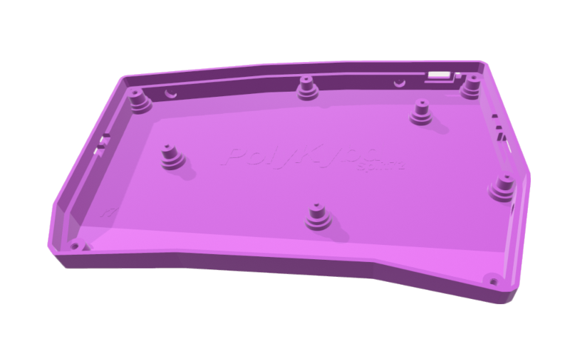
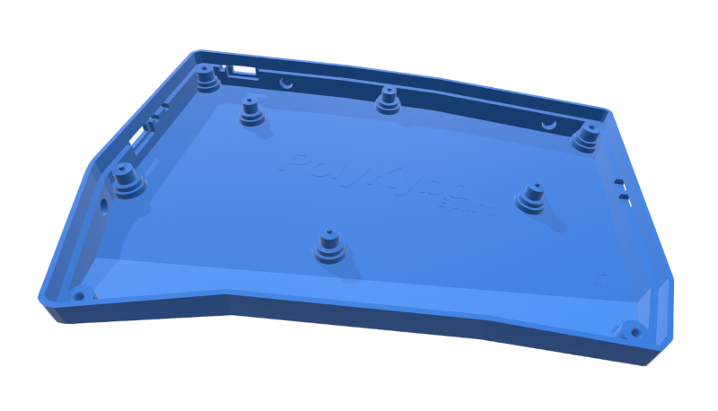
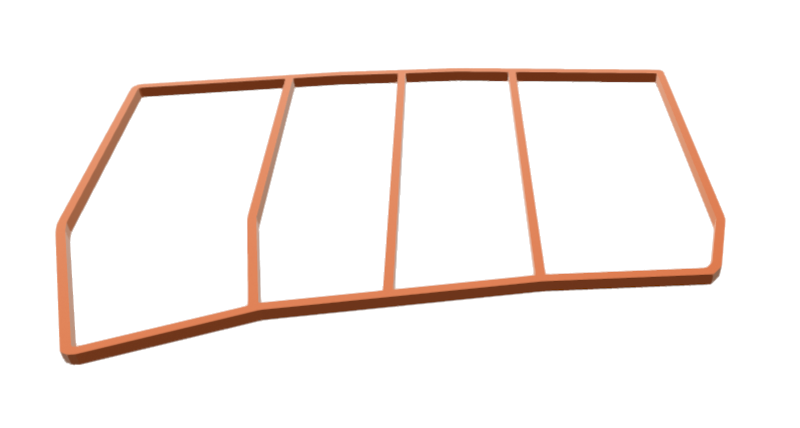

import { Aside } from '@astrojs/starlight/components';

The PolyKybd case and spacer can be 3D printed (resin SLA recommended) or CNC machined.

## STL files

| Part | File |
|---|---|
| Left case | `parts/export/case/case_polykybd_split72_left_r7.stl` |
| Right case | `parts/export/case/case_polykybd_split72_right_r7.stl` |
| Spacer (×2) | `parts/export/case/spacer.stl` |
| Spacer for the LED diffuser frame (×2) | `parts/export/case/spacer_diffuser_frame.stl` |

<Aside type="tip">
Always grab the **latest** revision from the repo — `r7` is current at the time of writing. Superseded revisions are no longer kept in the tree; they remain in the git history if you ever need one.
</Aside>

All files are in the [PolyKybd hardware repo](https://github.com/thpoll83/PolyKybd).

The spacer keeps the right distance between the plate and the PCB and is printed twice (once per half):

<Aside>
If you fit the [LED diffuser frame](/assembly/printed-extras/), print
`spacer_diffuser_frame.stl` instead — the plain spacer leaves nowhere for the frame's web to sit.
It is notched on **both** faces, so the same part works on either half, and
`spacer_diffuser_frame_4x.stl` puts four on one plate.
</Aside>

## Printing recommendations

Resin (SLA) printing gives the best results — the fine details of the case walls and display cutouts come out cleanly.

FDM printing is possible but the surface finish and dimensional accuracy are lower.

<Aside type="tip">
If your resin print has slight warping (common with large flat parts), use a **hair dryer** to gently warm the case, then press it flat under a heavy object for a few minutes. It reliably corrects minor deformations.
</Aside>

## CNC machining

If you have the case CNC machined instead of printed, add threaded inserts to the four corner screw holes — the M3 screws need something to bite into since CNC aluminium won't self-tap.

### Metal case

There is a dedicated **metal case** design, re-authored for machining rather than exported from
the printable one — so it ships as proper B-Rep STEP, which is what a machine shop actually wants
to quote and program from:

| Part | File |
|---|---|
| Left, STEP (B-Rep) | `parts/export/case/metal-case-left.step` |
| Right, STEP (B-Rep) | `parts/export/case/metal-case-right.step` |
| Mesh preview | `parts/export/case/case_polykybd_split72_metal.stl`, `.3mf`, and `..._metal-bottom.stl` |

<Aside type="caution">
The first machined set has just arrived and is being **fit-tested against a real build** —
plate, PCB, spacer and screws — so treat these files as not-yet-confirmed and expect the
dimensions to move if the test turns anything up. The printed `r7` case above is the validated
one.
</Aside>

The source is `parts/case/case_polykybd_split72_metal.scad`, with the STEP re-authoring pipeline
in `parts/case/step/`. The threaded-insert note above still applies.

## Screws and nuts

The current case revision (r7) uses:

- 8× M3×10 hex screws with rounded heads
- 8× M3 hex nuts (press-fit into the case corners)

<Aside>
The nuts are required from revision **r4 onward** (including r7). Older revisions (before r4) did not require nuts — the screws threaded directly into the resin.
</Aside>

## Felt case (alternative)

A simpler felt case design is also available for a softer, quieter desk feel. See `felt_case.jpg` in the repo for reference.
