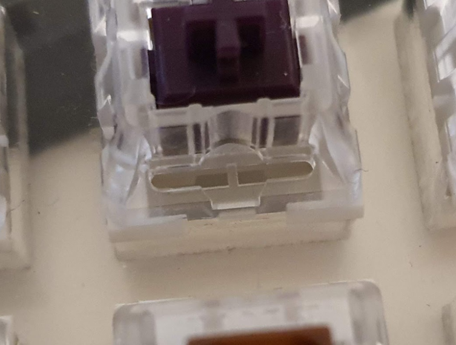

import { Aside } from '@astrojs/starlight/components';

PolyKybd uses 72 MX-compatible key switches (3-pin or 5-pin). The per-key display FPC cable threads through the LED slit of each switch, so the LED slit must be at least 7.5mm wide with no obstructions.

## Works out of the box

These switches have a sufficiently wide LED slit and need no modification:

| Switch | Type | Actuation |
|---|---|---|
| Aflion Tropical Waters | Linear | 68g |
| Ashkeebs Alexandrite | Linear | 58g |
| Blue Dusk Panda | Linear | 62g |
| CK × Haimu Pastel Lemon | Linear | 63.5g |
| CK × Haimu Pastel Thistle | Tactile | 63.5g |
| Gateron KS-9 (Pro) Blue | Clicky | 60g |
| Gateron KS-9 (Pro) Brown | Tactile | 55g |
| Gateron KS-9 (Pro) Green | Clicky | 80g |
| Gateron KS-9 (Pro) Red | Linear | 45g |
| Gateron KS-9 (Pro) Yellow | Linear | 50g |
| Geon Black | Tactile | 60g |
| Geon Clear | Linear | 60g |
| Geon Yellow | Linear | 63.5g |
| Glorious Panda | Tactile | 67g |
| GOJU Works × Tecsee Safety Switch | Linear | 65g |
| Kailh Novel Keys Cream | Linear | 55g |
| Kailh Purple Potato | Tactile | 63.5g |
| Kailh × Domikey Knight Saber | Tactile | 42g |
| LCET Grace | Linear | 50g |
| LCET Joker | Tactile | 58g |
| LCET Pink Queen | Tactile | 58g |
| LCET Sprout | Linear | 50g |
| Outemu (Dustproof) Black | Linear | 65g |
| Outemu (Dustproof) Blue | Clicky | 65g |
| Outemu (Dustproof) Brown | Tactile | 50g |
| Outemu (Dustproof) Red | Linear | 46g |
| Outemu Crystal Clear | Linear | 45g |
| Outemu Dust-proof Silver | Linear | 45g |
| Outemu Lemon | Silent Tactile | 35g |
| Outemu Panda | Tactile | 50g |
| Outemu Peach | Linear | 40g |
| Outemu Purple | Tactile | 45g |
| Outemu Ocean | Linear | 35g |
| Outemu Teal | Clicky | 70g |
| Owlab Neon | Linear | 62g |
| Tecsee Medium (low profile) | Linear & Tactile | 50g |

## Works after minor modification

Some switches have a plastic bar across the LED slit. Simply clip it away with a knife or flush cutters — takes about 10 seconds per switch.

<Aside>
Before buying in bulk, ask the vendor whether the specific batch has the plastic bar. Batches of the same switch name can differ.
</Aside>

| Switch | Type | Actuation |
|---|---|---|
| Gateron KS-9 (Pro 2.0) Red | Linear | 45g |
| Gateron KS-9 (Pro 2.0) White | Linear | 35g |
| Geon HG (Haimu × Geon) Black | Linear | 65g |
| Geon HG (Haimu × Geon) White | Tactile | 65g |
| Geon HG (Haimu × Geon) Red | Silent Linear | 65g |
| Geon HG (Haimu × Geon) Yellow | Silent Tactile | 65g |
| Kailh BOX V2 Red | Linear | 40g |
| Kailh Box Cream | Linear | 45g |
| Kailh Pro Purple | Tactile | 50g |
| Kailh Pro Burgundy | Linear | 50g |
| Kailh Pro Light Green | Clicky | 50g |
| Kailh Pro Plum | Tactile | 70g |
| Kailh Speed Gold | Clicky | 50g |
| Kailh Speed Silver | Linear | 50g |
| Kailh Speed Bronze | Clicky | 50g |
| Kailh Speed Copper | Tactile | 40g |
| Kailh Speed Burnt Orange | Linear/Tactile | 70g |

## Does not work

These switches have obstructions that cannot be cleared without damaging the switch:

| Switch | Reason |
|---|---|
| Cherry MX (most variants) | LED slit has a fixed internal post that blocks the FPC cable |
| Gateron G Pro 3.0 | Smaller LED slit opening |

<Aside type="tip">
If you have tested a switch not listed here, please [contribute](/development/contributing/) your findings to this page.
</Aside>
