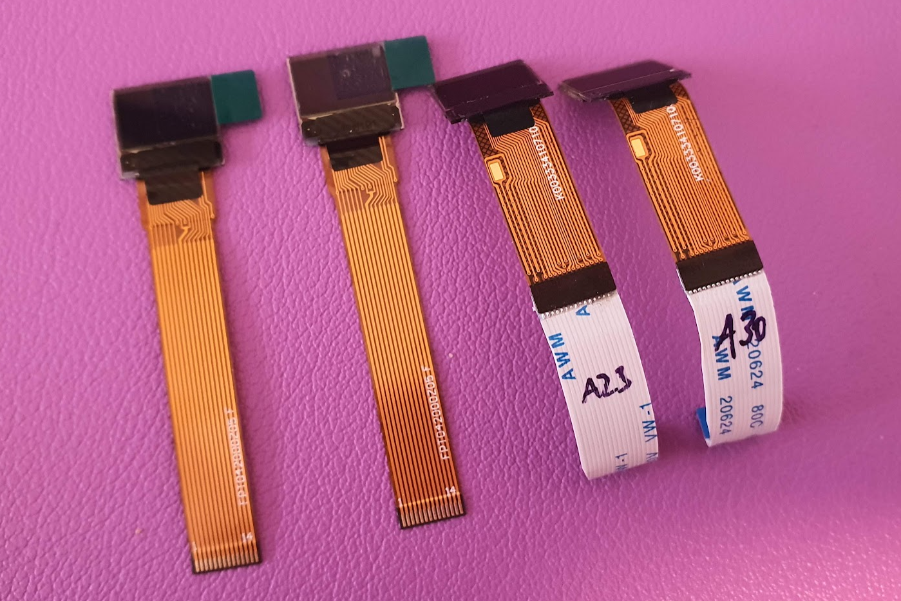

import { Aside, Steps } from '@astrojs/starlight/components';

Each of the 72 keys has a 0.42" OLED display connected to the PCB via a short FPC (flex printed circuit) cable. The displays ship with cables that are too short to reach the PCB sockets, so you need to extend them — or use displays from the kit which already have the correct cable length.

## The easy way: kit displays

Displays from the official kit have the matching cable length and pin count. Skip the FPC extension section below if you are using kit parts.

## Sourcing displays yourself

The displays are 0.42" OLED, 14-pin FPC. Known working part numbers:

- `FPT042W000Z01`
- `P34107`
- `ZJY042-7240TSWPG10` (requires a 40mm extension cable instead of 30mm)

<Aside>
Alibaba listings for these parts go stale. If a link is unavailable, search for "0.42 inch 72x40 OLED FPC" and verify the pin count and pitch before ordering. Get extras — not every display survives the FPC extension process.
</Aside>

You also need a 14-pin or 16-pin FPC extension cable with contacts on the same side (not reversed), approximately:

- 30mm for most displays
- 40mm for `ZJY042-7240TSWPG10`

## Extending the FPC cable

If you source displays yourself rather than using kit parts, their stock FPC tails are too short to reach the PCB sockets and must be extended — a fiddly process of soldering each short FPC strip to a longer extension cable with low-temperature solder and a heat gun. **Kit displays already have the correct cable length, so they skip this step entirely.**

<Aside type="caution">
Not every display survives the extension process. If you do it yourself, order **at least 10% more** displays than you need.
</Aside>

The full illustrated step-by-step (solder temperatures, alignment, heat-gun settings and photos) lives in the hardware repository — follow it there if you need it:

[FPC extension procedure on GitHub →](https://github.com/thpoll83/PolyKybd#displays)

## Status displays (optional)

Two 0.96" displays can be added as status displays — one on each half. Compatible part: `FPW096W001Z0` or pin-compatible alternative.

The FPC cable should be approximately 40mm long.

Pin reference for compatible status displays:

| PIN | Signal | PIN | Signal |
|---|---|---|---|
| 1, 30 | N/C (GND) | 14 | RES# |
| 2, 3 | C2P, C2N | 15 | D/C# |
| 4, 5 | C1P, C1N | 16 | R/W# |
| 6 | VDDB/VBAT | 17 | E/RD# |
| 7 | N/C | 18–25 | D0–D7 |
| 8 | VSS | 26 | IREF |
| 9 | VDD | 27 | VCOMH |
| 10–12 | BS0–BS2 | 28–30 | — |
| 13 | CS# | — | — |
