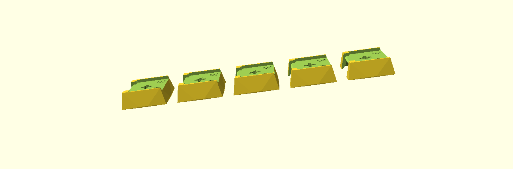
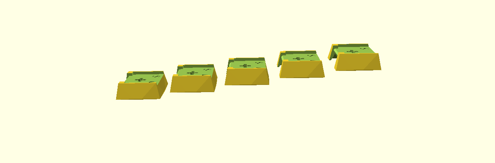
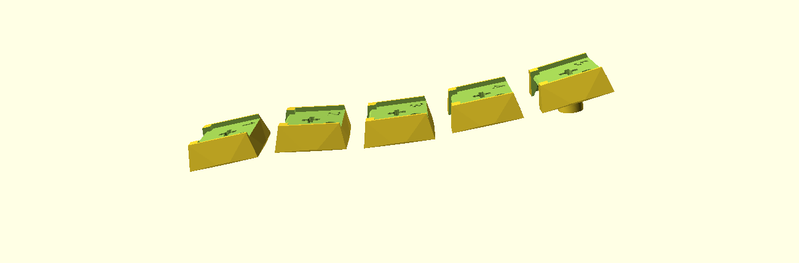

import { Aside } from '@astrojs/starlight/components';

Every PolyKybd key needs a **3D-printed stem** that carries its display and clicks into a
transparent relegendable keycap cover. A full Split72 build takes **72 stems** — 58× 1U and
14× 1.25U.

<Aside type="tip">
Resin (SLA) printing is strongly recommended. The stem's MX cross and the pocket the display
sits in are small features that FDM struggles to hold to tolerance.
</Aside>

## Choosing a profile

The stems come in three profiles. They are interchangeable — the keyboard, plate and PCB are
identical either way — so this is purely about how the keys feel under your fingers.

### Flat



Every row identical: the `R3` plates, 58× 1U and 14× 1.25U. The simplest to print and the
simplest to source, since there is only one plate design per width.

### Stepped


Rows are tilted rather than curved. Works best if the keyboard itself is inclined by 5 degrees
or more — see [tenting legs](/assembly/printed-extras/). There are two variations:

**Sculpted** (pictured above) — `S1` on the front row, `S5` on the back row, `S` on the three
rows between:

| Plate | 1.25U | 1U |
|---|---|---|
| `S1` (front row) | 4 | 10 |
| `S` (middle three rows) | 8 | 36 |
| `S5` (back row) | 2 | 12 |

**Uniform** — the `S` plates everywhere, 58× 1U and 14× 1.25U:



A flatter feel, and like the flat profile it is a single plate design per width.

### Curved



A different stem per row, `R1` at the front through `R5` at the back, so the rows follow a
curve the way a sculpted keycap set does:

| Plate | 1.25U | 1U |
|---|---|---|
| `R1` (front row) | 4 | 10 |
| `R2` | 4 | 12 |
| `R3` | 2 | 12 |
| `R4` | 2 | 12 |
| `R5` (back row) | 2 | 12 |

## Which files to print

The plates live in
[`parts/export/keycap_stem/`](https://github.com/thpoll83/PolyKybd/tree/master/parts/export/keycap_stem)
in the hardware repo, named:

```
keycap_stem_revAlpha_<width>_<profile>_10p.stl
```

where *width* is `1U` or `1U25` and *profile* is one of `R1`–`R5`, `S1`, `S`, `S5`. Each plate
holds **ten pieces**, so divide a count from the tables above by ten and round up to know how
many copies of that plate to print — e.g. curved needs one `..._1U25_R1_10p.stl` plate (4 of its
10 pieces) and one `..._1U_R1_10p.stl` plate.

<Aside>
Always take the **latest** revision. `revAlpha` is current at the time of writing; the revision
is engraved into every piece, so you can tell printed stems apart later.
</Aside>

## Making your own profile

The stems are generated from OpenSCAD, not hand-modelled. The shape lives in one shared library,
[`parts/keycap_stem/keycap_stem.scad`](https://github.com/thpoll83/PolyKybd/blob/master/parts/keycap_stem/keycap_stem.scad),
and each plate is a small file in `parts/keycap_stem/variants/` that sets the two parameters that
define a profile — the tilt `angle` and the `extra_len` that lifts the row:

```openscad
include <../keycap_stem.scad>
ten_connected_pieces_1U(angle = 10, extra_len = 4, txt = str("5    ", revision));
```

So a new profile is a new file in that directory. Then:

```bash
parts/keycap_stem/build_stems.sh          # export every variant
parts/keycap_stem/build_stems.sh 1U_R2    # or just the ones matching
```

The script walks the variants directory and needs no editing.
[`parts/README.md`](https://github.com/thpoll83/PolyKybd/blob/master/parts/README.md) covers the
rest, including the Noto font the engraved revision needs.
