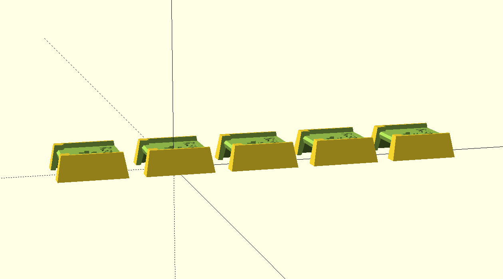
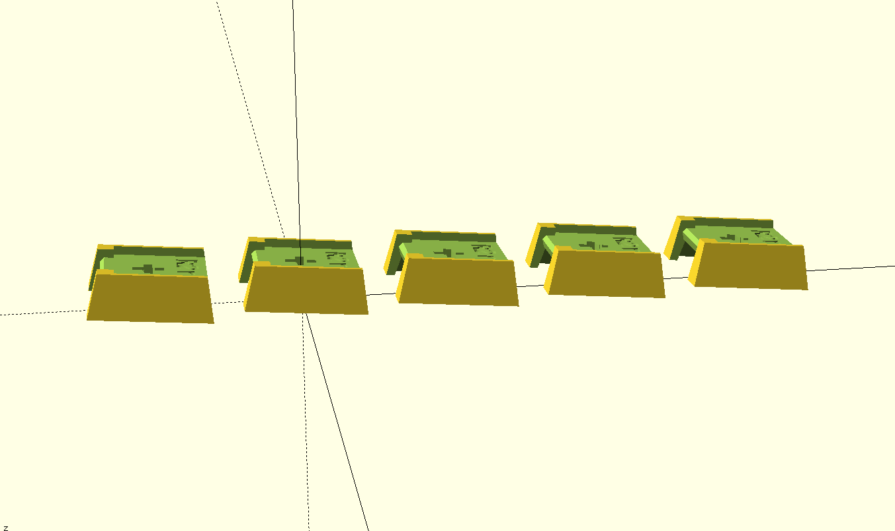

import { Aside } from '@astrojs/starlight/components';

This page lists every part needed for a complete PolyKybd Split72 build.

## Required parts

### PCBs

| Part | Quantity | Notes |
|---|---|---|
| Left PCB (assembled, 4-layer, 1.6mm) | 1 | See [PCB ordering](/assembly/pcb/) |
| Right PCB (assembled, 4-layer, 1.6mm) | 1 | See [PCB ordering](/assembly/pcb/) |

### Mechanical

| Part | Quantity | Notes |
|---|---|---|
| Left aluminum plate (1.2mm) | 1 | Order as 1.2mm aluminium PCB |
| Right aluminum plate (1.2mm) | 1 | Order as 1.2mm aluminium PCB |
| Left 3D-printed case | 1 | STL: `case/case_polysplit72_left2_r4.stl` |
| Right 3D-printed case | 1 | STL: `case/case_polysplit72_right2_r4.stl` |
| Spacer | 2 | STL: `case/spacer.stl` |
| M3×10 hex screws (rounded head) | 8 | — |
| M3 hex nuts | 8 | Required for case revision r4+ |

<Aside>
If you use CNC aluminium cases instead of resin-printed ones, add threaded inserts to the screw holes. Resin prints accept M3 screws directly.
</Aside>

<Aside type="tip">
If a resin case is slightly warped, use a hair dryer to soften it, then press it flat under a heavy object — it really works.
</Aside>

### Switches & keycaps

| Part | Quantity | Notes |
|---|---|---|
| MX-compatible key switches | 72 | See [Compatible Switches](/assembly/compatible-switches/) |
| 3D-printed key stems (1U) | 58 | SLA print recommended |
| 3D-printed key stems (1.25U) | 14 | SLA print recommended |
| Transparent relegendable keycap covers (1U) | 58 | e.g. AliExpress relegendable keycaps |
| Transparent relegendable keycap covers (1.25U) | 14 | — |

Key stem profiles available: **Flat** (R3), **Stepped** (R2), or **Curved** (R1–R5). See the build guide for quantities per profile.

### Displays

| Part | Quantity | Notes |
|---|---|---|
| 0.42" OLED displays with FPC | 72 | Must be 14-pin; see [Displays & FPC Extension](/assembly/displays/) |
| 0.96" status displays (FPW096W001Z0) | 2 | Optional; ~40mm FPC cable |
| Status display holder | 2 | STL: `parts/display_holder_r1.stl` |
| Dummy display holder (if no status display) | 2 | STL: `parts/display_holder_dummy_r1.stl` |

### Cables

| Part | Quantity | Notes |
|---|---|---|
| Short USB-C to USB-C cable | 1 | ~50cm, connects the two halves |
| USB-C to USB-A or USB-C cable | 1 | Connects to the host computer |

<Aside>
A USB-C to USB-A cable + USB-A to USB-C adapter combination only works in one orientation. Use a native USB-C to USB-C cable to avoid confusion.
</Aside>

## Optional parts

### Rotary encoder

Either of these fits the PCB footprint:

- **EVQWGD001** — Note: remove the last pin before soldering. This encoder is no longer in production.
- **Alps EC11 encoder**

### Pointing devices (choose one)

| Option | Part | Notes |
|---|---|---|
| Trackball | Pimoroni Trackball | Solder header without the plastic distance holder |
| Trackpad (small) | Cirque TM023023-2024-002 (23mm) | Remove R1 on back to switch to I2C; needs 12-pin FPC ~50–70mm |
| Trackpad (large, experimental) | Cirque TM035035-2024-003 (35mm) | Modify OpenSCAD source before printing the holder |

Only one pointing device can be installed per half.
