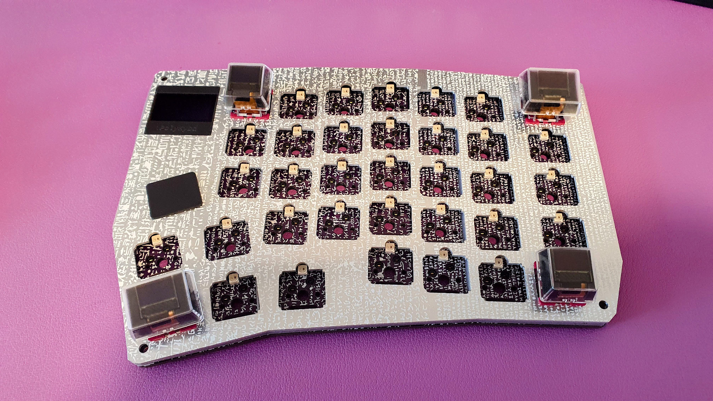
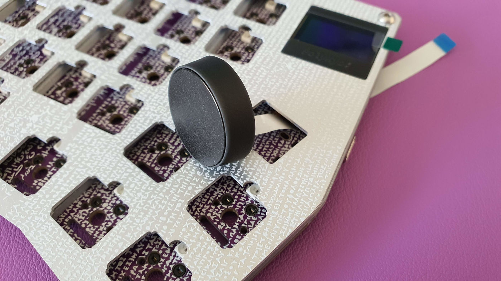
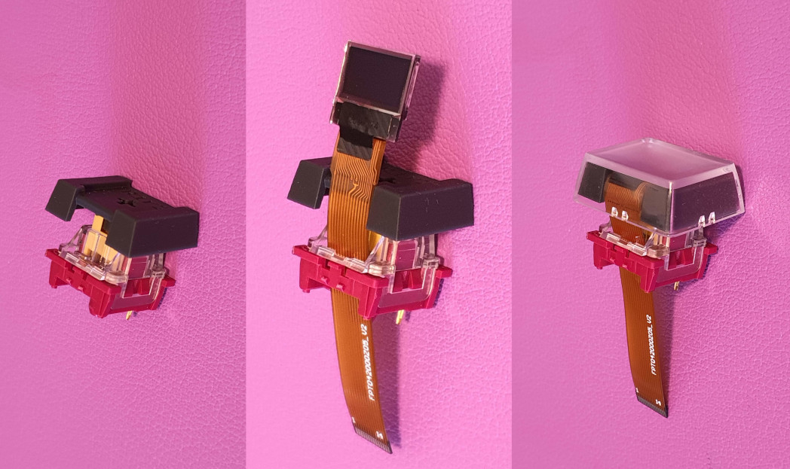
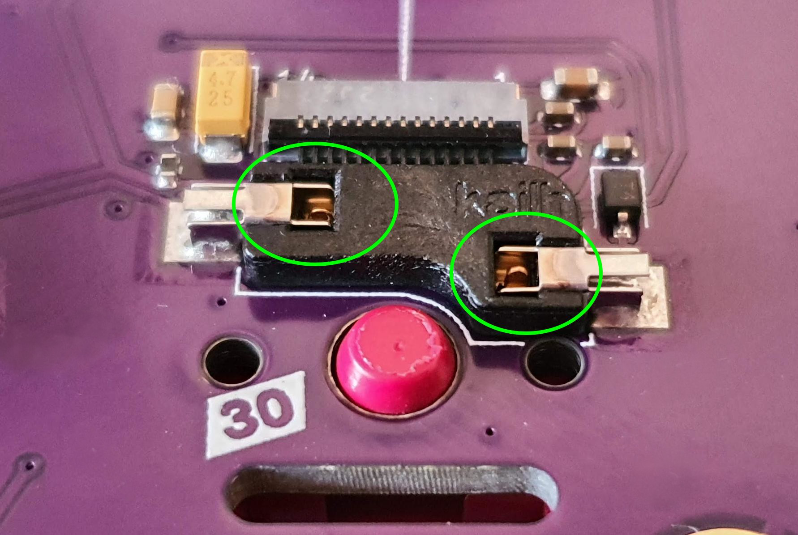
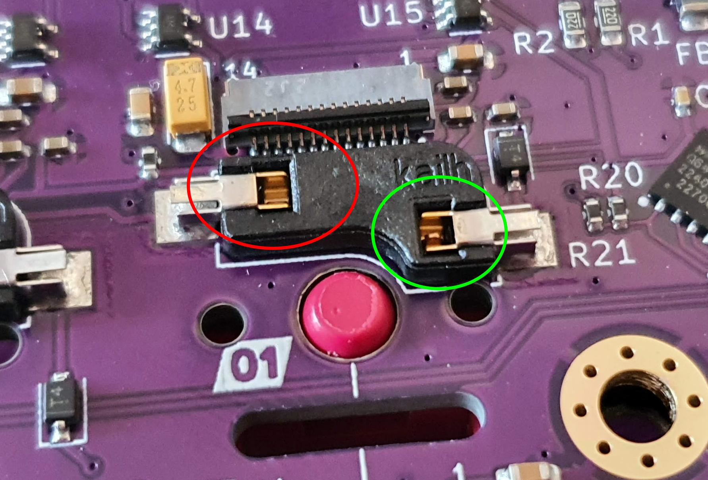
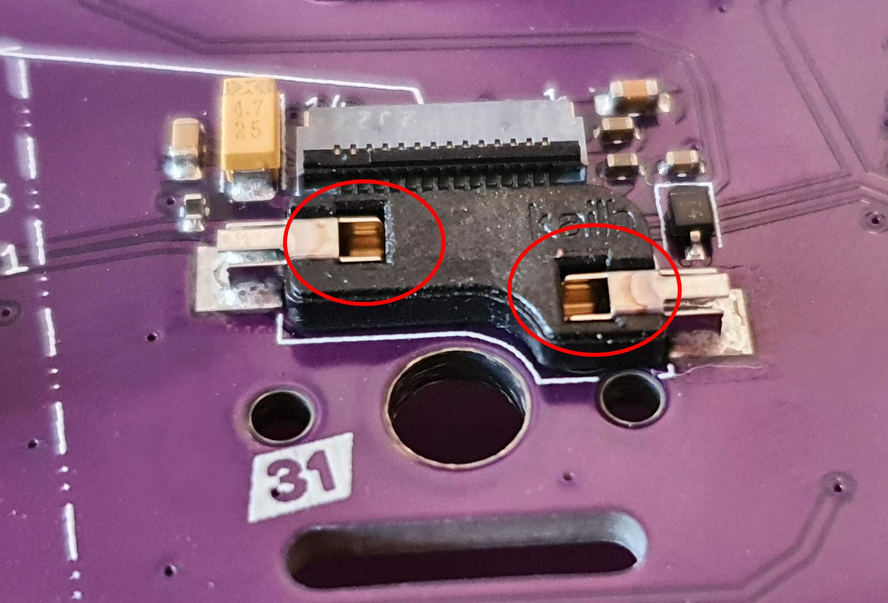
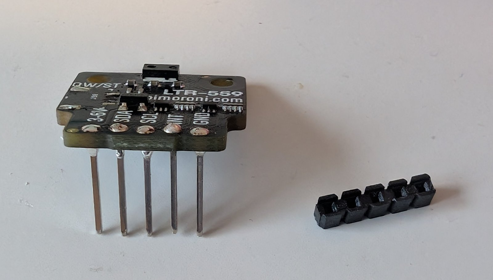
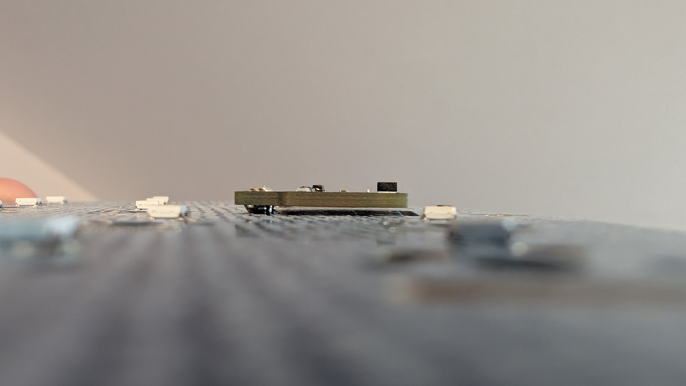
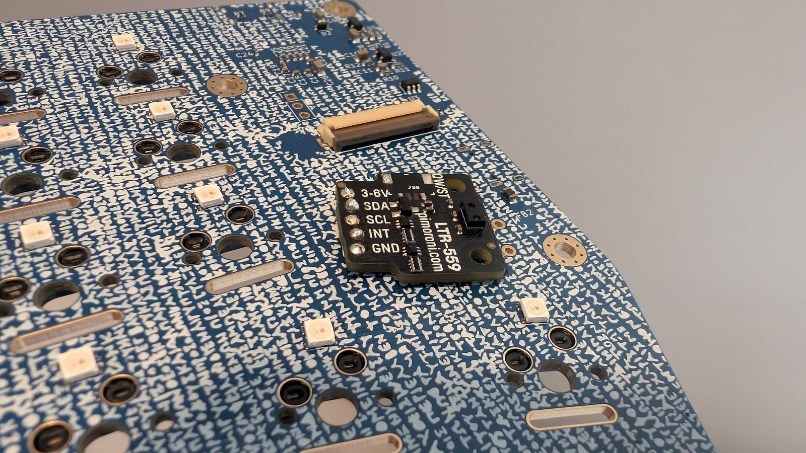
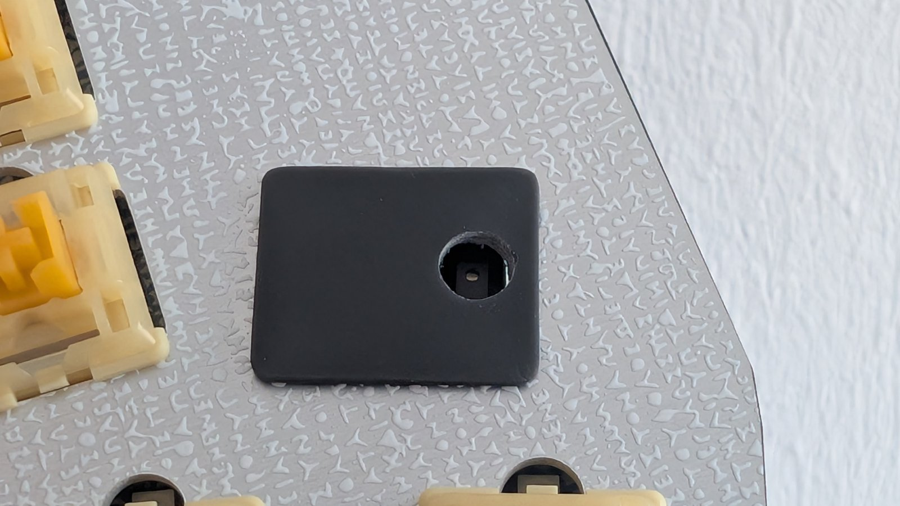

import { Aside, Steps } from '@astrojs/starlight/components';

This guide walks you through assembling a complete PolyKybd Split72 from parts. Have all required parts ready before you start.

A build video is also available: [Watch on YouTube](https://www.youtube.com/@polykb)

<Aside type="tip">
The photos throughout these docs are shown small — **click any photo to enlarge it** (press <kbd>Esc</kbd> or click again to close).
</Aside>

<Steps>
1. **Decide on your optional components — before you start**

   PolyKybd has **four fully optional components**. None of them is required to build a working
   keyboard, but a couple have to be fitted at specific points during assembly, so decide which (if
   any) you want on each half **now**:

   - **Light + proximity sensor** (Pimoroni LTR-559) — *highly recommended.* Auto-brightness and
     wake-on-approach.
   - **Rotary encoder** (Alps EC11 or EVQWGD001).
   - **Trackball** (Pimoroni).
   - **Cirque trackpad** (23mm, or the experimental 35mm).

   <Aside type="caution">
   Each half has a **single physical expansion slot**. The sensor header, the rotary-encoder header
   and the pointing-device connector (trackball / trackpad) are **three separate connectors** that
   share that one slot — different pinouts, so a part only fits its own header. You could wire all
   of them, but only **one component physically fits the slot at a time**. So pick at most one per
   half. Fitting a different one on each half is fine (e.g. the sensor on the left, a trackpad on
   the right).
   </Aside>

   Full per-component instructions are in [Optional components](#optional-components) at the end of
   this guide. Watch for the **(if using)** steps below — they tell you *when* each optional part
   goes in. The most important one: the **light sensor must be soldered first**, before the plate
   goes on (see step 2).

2. **Fit the under-plate optional components (if using)**

   These have to go on **before the aluminum plate**, because they don't fit through it later:

   - **Light + proximity sensor** — solder it now. It cannot be added after the plate without an
     almost complete disassembly. See [Light and proximity sensor](#light-and-proximity-sensor-ltr-559).
   - **Trackball** — solder it to the PCB now, flush to the front. See [Trackball](#trackball).
   - **Cirque trackpad** — do its *preparation* now (remove R1, attach the FPC, seat it in its
     holder). It gets mounted after the plate in step 5. See [Cirque trackpad](#cirque-trackpad).

   If you are fitting a **rotary encoder**, just check its clearance against the plate at step 4 —
   it is soldered later, at step 9.

3. **Install the status display**

   Insert the 0.96" status display into its holder (bend the holder back and let it snap around the display). Connect the FPC cable to the socket on the PCB and lock it by lowering the brown flap on the FPC socket.

   

   

   If you are not installing a status display, fit the dummy cover in its place.

4. **Place the spacer and fit the plate**

   Put the spacer on top of the PCB. Slide the plate down over the assembly, guiding the status display holder (or dummy) through the plate cutout from the back side. The plate rests on the spacer. Temporarily insert two screws at diagonal corners to align the plate and PCB.

   

   

   <Aside>
   Fitting a **rotary encoder**? Temporarily place it on the PCB and check it clears the plate now —
   add a strip of Kapton tape over its legs if they come close (see
   [Rotary encoder](#rotary-encoder)). Don't solder it yet.
   </Aside>

5. **Mount the Cirque trackpad (if using)**

   Feed the FPC cable through the slot in the plate, push the trackpad holder into place (press-fit, no glue needed), then insert the FPC into the trackpad socket on the PCB and lock it by lowering the flap. Verify pin 1 alignment. See [Cirque trackpad](#cirque-trackpad) for the full detail.

   

6. **Assemble all 72 keys**

   For each key:
   - Place the 3D-printed stem onto the key switch
   - Thread the display FPC cable through the LED slit of the switch
   - Align the display against the stem
   - Press the clear keycap cover over the stem — the display will slide into the stem pocket as you press it down

   <Aside type="caution">
   Do not pre-bend the FPC cable. Forcing a bend risks damaging it.
   </Aside>

   

   Repeat for all 72 keys. A fully prepared keyboard side of switches looks like this:

   

7. **Insert corner key switches**

   Insert one assembled switch at each corner first to lock the alignment of plate and PCB:
   - Feed the FPC into the PCB slot
   - Push the switch straight down into the hot-swap socket

   Check from the back that both pins are visible — they confirm the switch is fully seated:

   

   

   

8. **Insert remaining switches**

   Working from the corners inward, insert all remaining assembled switches. Feed each FPC cable through its PCB slot before seating the switch body.

   <Aside>
   If a switch does not seat fully, check that the FPC cable is not caught under the switch body.
   </Aside>

   

9. **Solder the rotary encoder (if using)**

   With all switches seated and the plate locked in position, solder the encoder pins and trim any excess lead length on the back. See [Rotary encoder](#rotary-encoder) for encoder-specific notes.

10. **Connect FPC cables to the PCB**

    For each switch, open the FPC socket flap (brown lever), insert the FPC cable with the contacts facing down, and close the flap to lock it. The display should light up when powered.

    

    

    <Aside type="tip">
    Connect all FPCs on one row before moving to the next — it is easier to keep track that way.
    </Aside>

11. **Install M3 nuts into case corners**

    Press the M3 hex nuts into the corner pockets in the 3D-printed case. They should be a firm press fit. If they are loose, a small drop of CA glue will secure them.

12. **Lower the PCB assembly into the case**

    Set the PCB+plate assembly into the case. The PCB should sit flush with the case interior walls. If it does not fit, check that all switch FPC cables are routed inside the case and not caught on the walls.

    

13. **Screw the case together**

    Insert one M3×10 screw at each corner and tighten until snug. Do not overtighten — resin can crack.

14. **Flash the firmware**

    See [Flashing the Firmware](/setup/flashing/) for the full procedure.

15. **Connect both halves**

    Connect the short USB-C cable between the two halves. Connect the long USB-C cable from the left half to your computer.

16. **Test all keys**

    Open a text editor and verify that every key registers. Use the QMK key tester (via PolyKybdHost or the QMK website) to check every key systematically.

17. **Install PolyKybdHost**

    See [Installation](/setup/installation/) to install the host software and bring the per-key displays to life.
</Steps>

## Optional components

All four are **fully optional** — the firmware treats each as a clean no-op when it isn't fitted,
and it is auto-detected (there is no option to enable). They are **Split72 only**; the Split42 has
no expansion port.

Remember the constraint from step 1: each half has **one** physical expansion slot. The sensor
header, the rotary-encoder header and the pointing-device connector are separate connectors that
share that one slot, so **only one component fits per half** (a different one on each half is
fine). Fit them at the points marked **(if using)** in the steps above:

| Component | Fit it at | Notes |
|---|---|---|
| Light + proximity sensor | Step 2 (before the plate) | Cannot be added later |
| Trackball | Step 2 (before the plate) | Soldered flush to the PCB |
| Cirque trackpad | Prep at step 2, mount at step 5 | FPC feeds through the plate |
| Rotary encoder | Check clearance at step 4, solder at step 9 | Soldered after the switches are seated |

### Light and proximity sensor (LTR-559)

*Highly recommended.* With the sensor fitted, the keyboard drives keycap brightness from the
measured light level and wakes the displays when your hand approaches — see
[Display Brightness](/using/brightness/). The sensor is auto-detected on whichever half you solder
it to.

<Aside type="caution">
The [Pimoroni LTR-559](/assembly/parts-list/#ambient-light--proximity-sensor-highly-recommended)
sensor board does **not** fit through the hole in the aluminum plate. It must be soldered on
**before** the plate goes on (step 2) — adding it later means an almost complete disassembly. It is
optional in firmware and costs nothing if you later decide not to use it, so fit it now if there is
any chance you will want it.
</Aside>

The Split72 PCB has a dedicated, labelled 5-pin footprint (`3-6V / SDA / SCL / INT / GND`) for the
sensor — its own connector, separate from the encoder and pointing-device connectors in the same
slot. Solder it like this:

<Steps>
1. Solder the 5-pin header into the PCB footprint.
2. Remove the plastic spacer strip from the header — it holds the sensor too high to clear the
   plate. Push it all the way down and off the pins.

   

3. Instead of the plastic spacer, use a piece of paper folded twice (~1–2mm) as a temporary shim
   to set the sensor at a low height while you solder the board onto the header pins.

   

4. After soldering, pull the paper back out. The sensor now sits low and flat, just above the PCB.

   

5. To expose the sensor to ambient light, drill a **5mm hole** into the 3D-printed cap on the far
   right, vertically centered.

   
</Steps>

### Rotary encoder

Either encoder fits the same PCB footprint. Check its clearance against the plate at step 4, then
solder it at step 9 (after all switches are seated and the plate is locked).

- **Alps EC11 encoder** — place it on the PCB and temporarily fit the plate on top to verify it
  clears. Add a strip of Kapton tape over the legs if they come close to the aluminum plate.
- **EVQWGD001** — clip away the last pin before fitting it. Do not solder it yet — fit the plate
  first to check alignment. This encoder is no longer in production.

### Trackball

Solder the header pins without the plastic distance spacer (push the spacer off with pliers after
soldering, or insert pins from the front and clip the plastic from the back). Apply Kapton tape to
the back of the trackball board, then solder it to the PCB flush to the front surface (expect a
1–2mm gap). Cover the front of the trackball with Kapton tape or other insulating material to
prevent shorts against the aluminum plate. Fit it before the plate goes on (step 2).

### Cirque trackpad

Prepare the trackpad before the plate (step 2), then mount it after the plate is on (step 5).

**Preparation (step 2):** Remove R1 from the back of the trackpad PCB to switch it from SPI to I2C.
Connect the 12-pin FPC cable to the trackpad (note the pin 1 marker). Place the trackpad in its
3D-printed holder and secure with a small amount of adhesive. Do not connect it to the PCB yet.

**Mounting (step 5):** Feed the FPC cable through the slot in the plate, push the holder into place
(press-fit, no glue needed), then insert the FPC into the trackpad socket on the PCB and lock it by
lowering the flap. Verify pin 1 alignment.

The 23mm trackpad needs a 3D-printed holder — see the [Parts List](/assembly/parts-list/#pointing-devices-choose-one)
for the holder STLs and the experimental 35mm option.
