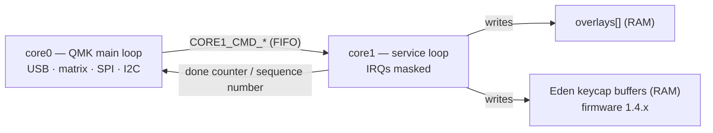

import { Aside, Steps } from '@astrojs/starlight/components';

Stock QMK runs on one core and leaves the RP2040's second core parked in the bootrom.
PolyKybd starts it at boot and uses it for work that is pure computation: decompressing
overlay images, rendering the Eden screensaver, and running DOOM.

The RP2040 has two cores. QMK runs on `core0`: USB, the matrix scan, the console, SPI to
the keycap displays and I2C to the status OLED. `core1` runs a small service loop with no
RTOS thread, no console and no interrupts. `core0` hands it jobs over the inter-core FIFO
and `core1` computes into RAM. The CPU-heavy part of an overlay upload runs there, so a
burst of compressed keycap images does not stall the matrix scan.



## How core1 is started

- During boot, `core0` launches `core1` with `multicore_launch_core1()` from the
  `polymod_core1` community module (`modules/polykybd/polymod_core1/`). The splash
  moves from step 4 to step 5 when it returns.
- `core1` runs on its own static stack of `CORE1_STACK_SIZE` bytes: 384 B up to
  firmware 1.4.0, and 512 B from the 1.4.x release that moves Eden onto `core1`.
- The first instruction `core1` executes is `cpsid i`, and `core1_entry()`
  (`keyboards/polykybd/multicore_exec.c`) masks interrupts again. They stay masked for
  the life of `core1`. ChibiOS's handler for the core1 FIFO interrupt ends by raising
  an NMI, and that NMI runs the RTOS context switch on a core that has no thread
  state, which hung `core1`. `core1` polls the FIFO, so it never needs an interrupt to
  wake.
- `core1_entry()` sets `g_core1_entered`. The boot breadcrumbs record it, so a crash
  record from a boot hang shows whether `core1` had started.
- The consequence: anything that needs an interrupt stays on `core0`. That is SPI to
  the keycaps, USB, I2C and the console. `core1` only computes into RAM.

## The commands

| Command | Sent for | What core1 does | How core0 knows it is done |
|---|---|---|---|
| `CORE1_CMD_DECOMPRESS` | Compressed overlay upload (HID `16`/`17`) | RLE-decompresses one fragment into the overlay pool, and requests a display refresh when that overlay is on screen | `core1_decomp_count` catches up with `core0_decomp_count` |
| `CORE1_CMD_ROI_UPDATE` | Region overlay upload (HID `18`/`19`) | Copies a rectangle into an overlay | Same counter |
| `CORE1_CMD_RESET_BIT_IDX` | Start of a new upload | Resets the fragment position to 0 | Not tracked |
| `CORE1_CMD_EDEN_KEY` + 1 argument word | Eden idle screensaver (firmware 1.4.x) | Computes one keycap's plasma, ripple and comet pixels into a 360 B buffer | The job writes its sequence number |
| `CORE1_CMD_CRASH_TEST` | `POLYKYBD_CRASH_TEST` builds only | Makes an unaligned store, to check that a `core1` fault is recorded | — |

While `core1` is still working on a fragment, `raw_hid_pre_receive_kb()` leaves the next
HID packet in the USB driver's queue (4 packets) for that main-loop pass, so the matrix
scan still runs. PRC overlays (HID `41`) are decoded on `core0`, inside the HID
handler, behind the same gate.

## Who owns core1, and when

- **The overlay service**, from boot. This is the normal state.
- **The Eden idle screensaver** (firmware 1.4.x). A keycap costs about 4.3 ms on
  `core0`, and 93 % of that is computing the pixels. `core1` now computes them, two
  keycaps at a time, while `core0` collects each finished keycap, cuts the legend out
  and pushes it over SPI.
  - On the rig, `core0` spends 40 ms per Eden frame instead of 115 ms, and Eden runs
    at 32 frames per 5 s instead of 25.
  - The status OLED's idle screen draws every 75 ms instead of 150 ms while Eden runs
    on `core1`.
  - An overlay upload, a firmware write and a font-pack write all end the idle session
    first, so they never share `core1` with Eden.
  - If a keycap job does not finish within 100 ms, the rest of the session renders on
    `core0`. Later sessions use `core1` again only once it has finished every job it
    was handed, so a stalled `core1` can never fill the FIFO and block `core0`.
- **DOOM.** `doom_enter()` resets `core1` through the power-state machine and hands it
  to the engine, with a 4 KB stack carved from the overlay pool. The game renders on
  `core1` alone; `core0` blits finished frames and passes keys through a ring buffer.
  Eden never uses `core1` while DOOM runs. On exit, `core1` is reset and the overlay
  service relaunched with a bounded handshake (100 ms, up to three tries). If that
  fails, overlay decompression stays off until the next reboot, but the keyboard keeps
  working.

<Aside type="note">
Eden on `core1` ships in the first firmware release after 1.4.0. On 1.4.0 and earlier,
the Eden screensaver renders entirely on `core0`, `core1` runs only the overlay service,
and its stack is 384 B.
</Aside>

## Stack budget and diagnostics

- The overlay and region jobs peak at about 164 B of `core1` stack. The Eden keycap job
  is the deepest path: 300 B measured with `-fstack-usage`, plus about 96 B if a fault
  is taken at that depth. That is why the stack grew to 512 B with it.
- `OPT_DEFS += -DCORE1_STACK_HWM` in `rules.mk` fills the stack with a marker at launch
  and logs the deepest point reached. Pass it that way, not as
  `-e EXTRAFLAGS=-DCORE1_STACK_HWM`: a command-line `EXTRAFLAGS` replaces the flags
  `rules.mk` adds, which drops the `-Wcast-align` guard and breaks DOOM builds.
- After adding a `core1` command, measure the stack again and raise
  `CORE1_STACK_SIZE` if the peak climbs.

## Running your own job on core1

The pattern every existing job follows is in `keyboards/polykybd/multicore_exec.c`. A job
is a FIFO command word, optionally followed by one argument word, and a `case` in the
`switch` inside `core1_entry()`.

### What core1 may do

`core1` has no RTOS thread, no console and interrupts masked. That rules out most of
QMK. A job may:

- read from flash and RAM, and write into RAM buffers that `core0` is not touching at the
  same time;
- call plain C functions that do not wait on an interrupt.

A job must not:

- call `uprintf` or anything else that writes to the console;
- touch SPI, I2C, USB, the shift registers or any other peripheral `core0` drives;
- call ChibiOS functions (`chThdSleep`, mutexes, events). They need thread state that
  `core1` does not have;
- write to flash.

`core1`'s code runs from XIP flash. While `core0` erases or writes flash, it holds
`core1` in reset (`fw_staging_core1_lockout_begin()`), so a job in flight at that moment
is lost. Font-pack and firmware writes, and overlay uploads, end the idle session first
for this reason.

### Adding a command

<Steps>
1. **Add a command word** to `fifo_command_t`, continuing the `0xcafe00NN` series.

2. **Publish the inputs before pushing the command.** Write them into `volatile` statics,
   call `dmb()`, and then call `multicore_fifo_push_blocking()`. The FIFO only carries
   32-bit words, so anything bigger goes through shared memory. For one small argument,
   push it as a second word, as `core1_eden_key()` does.

3. **Handle it in `core1_entry()`.** Read the argument with `multicore_fifo_pop_blocking()`
   if you sent one. Do the work, write the result, then publish completion: bump a
   counter or write a sequence number, followed by `dmb()`.

4. **Never block `core0` on the result.** `core0` is the core that scans the key matrix,
   so a long wait there drops keystrokes. Use one of the two existing shapes:
   - **Backpressure.** Poll a "busy" predicate and defer new work until `core1` catches
     up. The overlay path does this through `raw_hid_pre_receive_kb()`, which leaves the
     next HID packet in the USB queue for one main-loop pass.
   - **Deadline with a fallback.** Give up after a fixed time and do the work on `core0`.
     Eden falls back after 100 ms and does not use `core1` again until it has drained
     every job it was given.

   If `core0` has to spin at all, wrap the spin in
   `crash_phase_enter(CRASH_PHASE_CORE1_WAIT, …)` / `crash_phase_leave()`. A hang then
   produces a [crash record](/beyond-qmk/crash-handler/) that says "core0 waiting on
   core1" instead of an anonymous watchdog reset.

5. **Check that core1 is yours.** DOOM takes `core1` over completely. Gate your job on a
   predicate like `core1_eden_available()`, which is true only once `core1` has reached
   `core1_entry()` and DOOM is not running.

6. **Add the `!USE_CORE1` stub** in the `#else` branch at the bottom of the file, so a
   build without `core1` still links. Decide what the stub does: run the job on `core0`,
   or report it as unavailable.

7. **Measure the stack.** Build once with `OPT_DEFS += -DCORE1_STACK_HWM` in `rules.mk`
   and raise `CORE1_STACK_SIZE` if the new peak, plus about 96 B for a fault taken at
   that depth, no longer fits.
</Steps>

A minimal sketch of the shape (not code from the tree):

```c
// multicore_exec.c
static volatile uint32_t my_job_seq;            // written by core1 when done
static volatile uint8_t  my_job_out[64];        // result buffer

typedef enum {
    /* ...existing commands... */
    CORE1_CMD_MY_JOB = 0xcafe0005,              // followed by ONE argument word
} fifo_command_t;

// in core1_entry()'s switch:
case CORE1_CMD_MY_JOB: {
    uint32_t seq = multicore_fifo_pop_blocking();
    compute_into(my_job_out, seq);              // RAM only: no I/O, no printf
    my_job_seq = seq;
    dmb();
} break;

// called from core0:
void core1_my_job(uint32_t seq) {
    multicore_fifo_push_blocking(CORE1_CMD_MY_JOB);
    multicore_fifo_push_blocking(seq);
}
bool core1_my_job_done(uint32_t seq) {
    dmb();
    return my_job_seq == seq;
}
```

<Aside type="caution">
Do not unmask interrupts on `core1` to make a job easier to write. Masking them is what
stopped `core1` from hanging inside the RTOS context switch. The root cause is described
above, but the fix was found empirically, so treat it as load-bearing.
</Aside>
