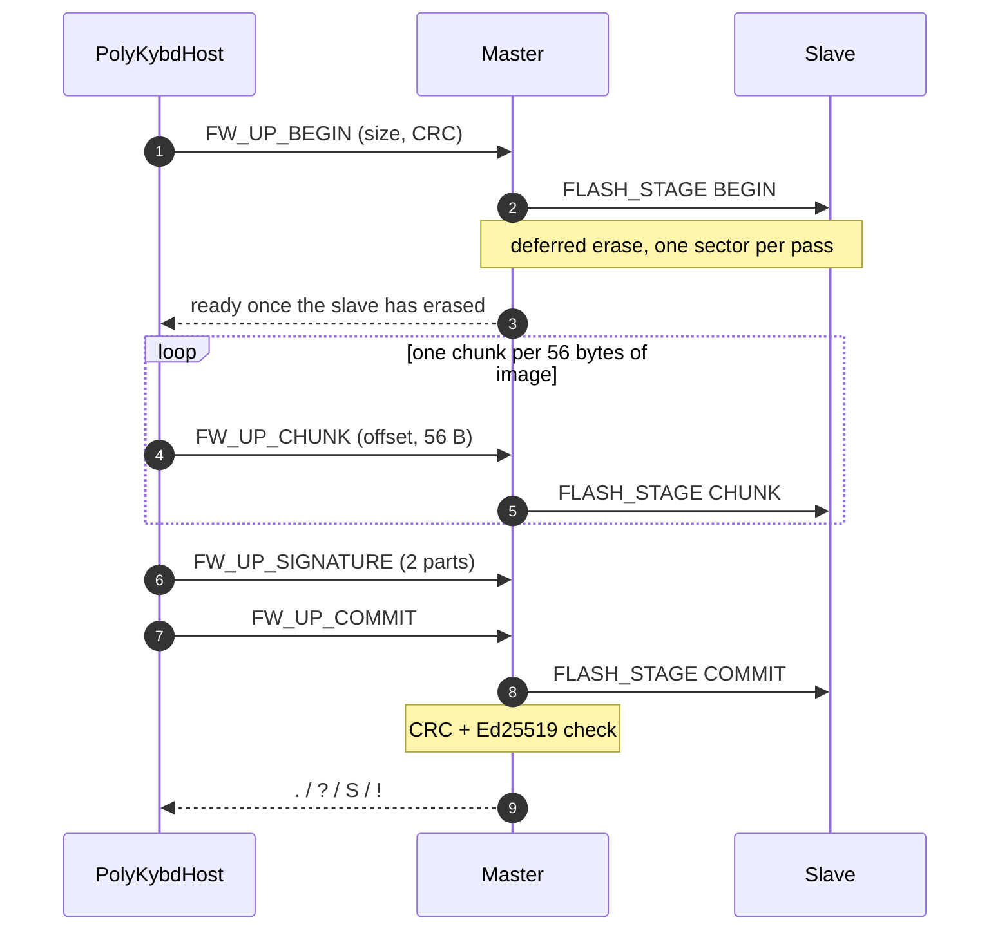

import { Aside, Steps } from '@astrojs/starlight/components';

A stock QMK keyboard on an RP2040 is updated through the bootloader: hold BOOTSEL (or
double-tap reset), wait for the `RPI-RP2` drive, copy a `.uf2`. On a split keyboard that
is two halves, two cables and two drag-and-drops.

PolyKybd updates itself from the running firmware instead. The host streams the new image
over the same raw HID channel it uses for overlays. Both halves store it in a spare flash
area, check it, and then copy it over their own firmware and reboot together. The user
sees the [tray app](/setup/flashing/) or `polyctl fw flash --apply` and nothing else.

## The flash layout that makes it possible

The keyboard carries 8 MB of external flash. The update needs a second 2 MB area next to
the running firmware:

| Range | Use |
|---|---|
| 0–2 MB | Running firmware. The linker caps the image at 2 MB, so a build that grows past it fails to link instead of overwriting the staging area. |
| 2–4 MB | Staging: a 4 KB header, the staged image (at most `0x1F5000` bytes), and three sectors carved off the top: the apply log, the [crash archive](/beyond-qmk/crash-handler/) and the handedness stamp. |
| 4–8 MB | [Font packs](/firmware/font-packs/) and other resources, with QMK's emulated EEPROM in the top 8 KB. |

## The commands

| ID | Command | What it does |
|---|---|---|
| `0x43` | `FW_UP_GET_VERSION` | Returns the running version string, image size and CRC. `polyctl fw version` asks this live, every time. |
| `0x40` | `FW_UP_BEGIN` | Announces the size and CRC32, and starts erasing the staging area on both halves. |
| `0x41` | `FW_UP_CHUNK` | One 56-byte piece of the image at a given offset. |
| `0x45` | `FW_UP_SIGNATURE` | The 64-byte Ed25519 signature, in two parts, before COMMIT. See [Firmware Signing](/beyond-qmk/signing/). |
| `0x42` | `FW_UP_COMMIT` | Checks the CRC and the signature and stamps the staging header. Answers `.`, `?`, `S` or `!`. |
| `0x44` | `FW_UP_APPLY` | Installs the staged image on both halves and reboots them. |

The firmware-update commands are not gated on `PROTOCOL_VERSION`. A host can always update
a keyboard, even one whose protocol it does not otherwise support. That is the way out of
a mismatch, so the host gates these actions only on "a device is present".

## Staging: both halves at once

The master writes each chunk into its own staging area and relays it to the slave in one
split transaction (`USER_SYNC_FLASH_STAGE`). The slave never talks to the host.

**The erase is deferred.** Erasing a 4 KB sector blocks the flash for tens of
milliseconds, and erasing all of staging in one go would starve the split link. So each
half erases one sector per main-loop pass, at a limited rate, and the master polls the
slave until it reports ready. QMK's `SPLIT_MAX_CONNECTION_ERRORS` is raised to 200 so the
erase does not make QMK declare the link lost.

**The keyboard stays usable during the transfer.** Housekeeping that would compete for
the split link (EEPROM saves, state pushes, slave display refreshes) pauses, and the RGB
matrix breathes cyan. You can keep typing.

**COMMIT checks what arrived.** It compares a CRC32 over the received bytes with the one
announced at BEGIN. On the master it then checks the signature. Only an image that passes
both gets its staging header stamped. An unsigned image raises the
[on-keycap prompt](/beyond-qmk/signing/#flashing-your-own-unsigned-build) and COMMIT answers
`?` until you press a key.

## Applying: the self-flash

APPLY first tells the slave to apply as well (`USER_SYNC_RESET`, 20 retries, and the
whole round sent once more if the slave did not acknowledge). Both halves then run the
same four stages from their main loops. Each stage returns to the main loop before the
next one, so its console line goes out and a log shows which stage stopped.

<Steps>
1. **Release and blank.** `clear_keyboard()` releases any held key. From here on the
   matrix is never scanned again, so a key held at that moment would otherwise repeat on
   the host until USB drops. The RGB matrix turns solid orange, every keycap goes blank,
   and the status OLED shows *Applying Firmware*.

2. **Flush settings.** Unsaved settings are written to EEPROM with `core1` held in reset,
   because an EEPROM write can trigger a flash erase.

3. **Check the staged image in flash.** COMMIT only checked the bytes as they arrived in
   RAM. This stage reads the staged image back from flash and checks its CRC again,
   because the next stage erases the only working firmware. On a failure the board stays
   on its current firmware, shows *Update FAILED* with the reason for 5 seconds, and gives
   the keycaps their legends back.

4. **Copy and reset.** A routine that runs from RAM halts `core1`, disarms the
   [watchdog](/beyond-qmk/crash-handler/), turns interrupts off and copies the image
   sector by sector. It writes sector 0, which holds the vector table, last. It then
   compares what it wrote against the source, records the result in flash, and resets
   the chip.
</Steps>

Two halves that run new firmware boot together, as after a replug. A master that reboots
alone would wait on the boot splash for a slave still running the old code, which is why
the slave hand-off is retried so hard.

### What the board shows

| State | RGB | Keycaps | Status OLED |
|---|---|---|---|
| Transfer | breathing cyan | normal legends | *Staging…* and a progress bar |
| Unsigned image, waiting for you | breathing orange | blank except **A** / **R** | the question |
| Applying | solid orange | blank | *Applying Firmware* |
| Apply refused | orange fades out | legends restored | *Update FAILED* and the reason, for 5 s |

Orange always means "you cannot type". A refused apply names one of two reasons, and they
call for different actions:

- **not staged**: nothing reached the staging area. Sending APPLY again cannot help;
  upload the image again.
- **bad checksum**: bytes arrived but are damaged. The right half shows the size and both
  CRCs. A second attempt usually works.

## When it goes wrong

<Aside type="tip">
BOOTSEL and UF2 do not go through any of this. Holding BOOTSEL and copying a `.uf2`
always works, whatever state the HID update left the board in. See
[Flash the Firmware](/setup/flashing/).
</Aside>

Two records survive that recovery, because they live in the staging area, which a UF2
copy does not touch:

- **The apply log** in the top 32 KB of staging. Each apply erases it first and then
  writes one page per sector copied, plus markers around the first sector. An empty log
  means the copy never started. A partial one names the last sector written.
- **The post-copy compare** in the staging header: whether the bytes written to the
  running area match the source, and the first word that differed.

Nothing the firmware prints during the copy reaches the host: interrupts are off and the
console only drains from the main loop. A gap in the console timestamps across the apply
is expected.

## Design notes for contributors

- **The copy buffer is `uint32_t page_buf[]`, and the type is the fix.** It was once a
  `uint8_t` array copied with word instructions. An unrelated change moved it to an odd
  address, and the unaligned store HardFaulted the core with interrupts off, in a function
  that never returns. Boards were bricked until reflashed over BOOTSEL. Declaring the
  buffer as words means no later edit can reintroduce it.
- **Nothing in the copy may call into flash.** The routine erases the code it would
  call. GCC turns a fill loop into a call to `memset` and a compare loop into `memcmp`,
  and both live in flash. The routine uses `volatile` accesses to stop that.
- **COMMIT must not wait for the keypress.** It runs inside `raw_hid_receive()` on the
  loop that scans the matrix, so a wait would guarantee the key is never seen. It answers
  `?` and the host polls about once a second.
- **Every cue on the apply path is pushed out at once.** The RGB matrix, the status OLED
  and the keycaps are normally updated by periodic tasks, and on a path that never
  returns there is no next task. The firmware writes all three directly.
