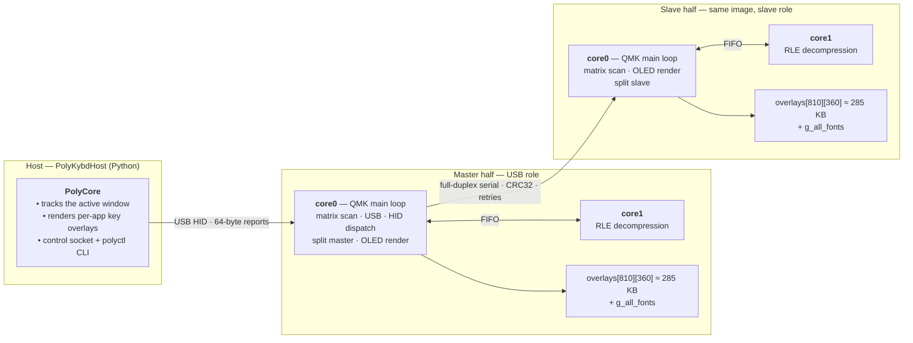
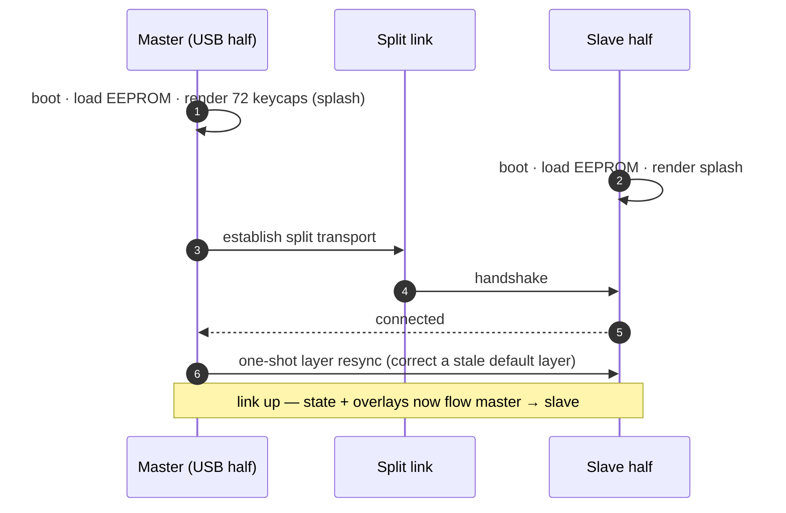
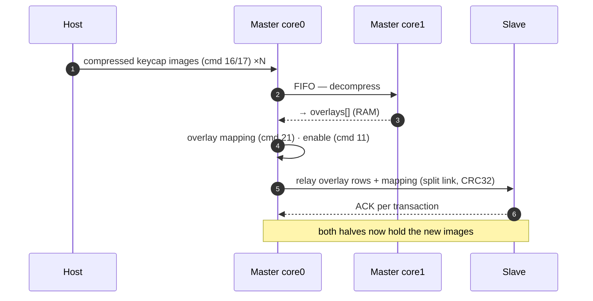
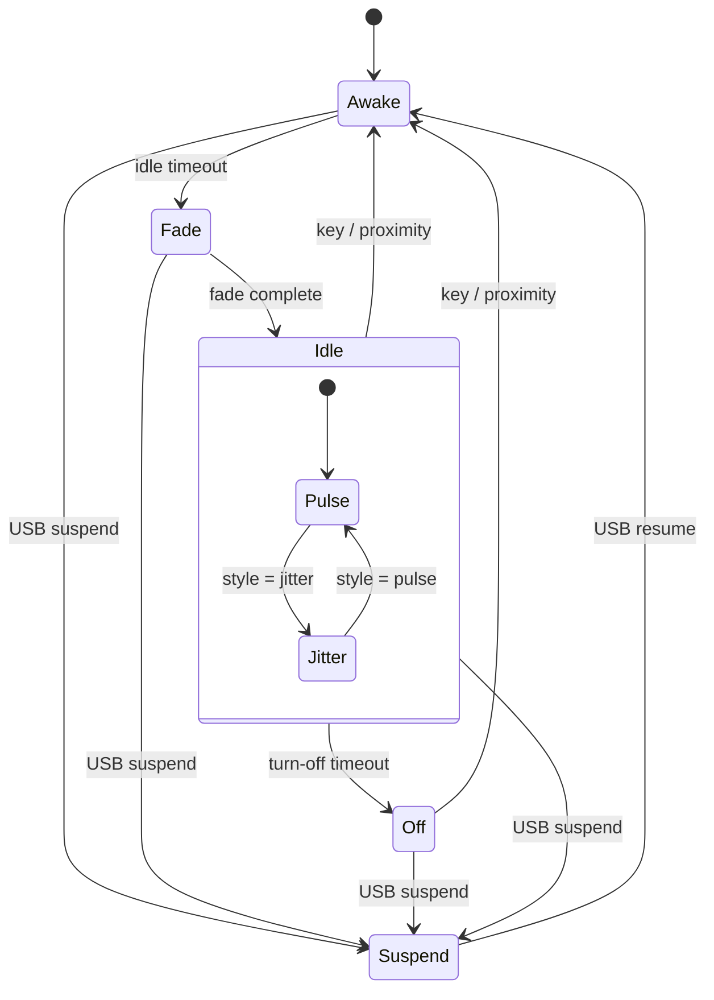
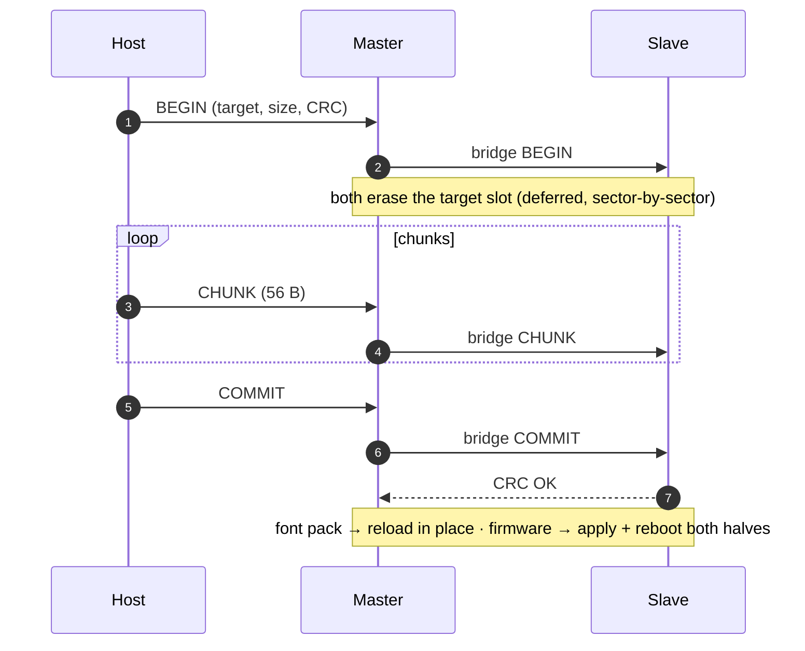
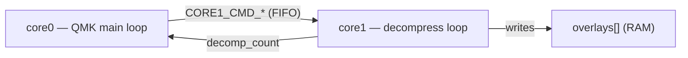

import { Aside } from '@astrojs/starlight/components';

PolyKybd has a lot of moving parts: a host application, two keyboard halves that
run the **same** firmware image in different roles, a custom HID protocol, and 8 MB
of external flash carved into regions. This page is a single mental model of how it
all fits together — the topology, the command surface, where resources live, and the
handful of runtime processes worth understanding before you change any of them.

## Topology — who talks to whom

Three actors, two links. The host only ever speaks to the **master** (the USB half).
The master owns the HID device and is the only one that relays to the **slave** over
the split serial link. Both halves run the identical firmware — including a second
core (`core1`) used to offload RLE decompression — and differ only in role, decided
at runtime from which half has USB.

<Aside type="note">
The slave has **no idea the host exists**. Everything it displays was relayed by the
master over the split link. Each half keeps its **own** copy of the overlay images in
RAM, which is why an image change has to be sent to both halves.
</Aside>

## The HID command surface

Every report is `[report-id][command][payload…]`, 64 bytes. Replies are prefixed
`P\xNN.` (ACK) or `P\xNN!` (NACK). Commands live under the VIA-reserved
`ID_POLYKYBD = 80` channel. Newer commands are gated by `PROTOCOL_VERSION` — the host
connects only on an **exact** version match.

### Overlays — the bulk data path

| Cmd | Name | Notes |
|----|------|-------|
| `10` / `0x0A` | SEND_OVERLAY | Plain 60-byte segment (6 per keycap). |
| `16` / `17` | START / SEND_COMPRESSED_OVERLAY | RLE-compressed keycap in 1–2 packets → `core1` decompress. The common case. |
| `18` / `19` | START / SEND_ROI_OVERLAY | Partial refresh of a keycap region. |
| `21` / `0x15` | SEND_OVERLAY_MAPPING | pool→display map: which slot each keycap draws. |
| `11` / `12` | OVERLAY_FLAGS on / off | Enable/disable overlay rendering. |
| `26` / `0x1A` | SAVE_MRU | Persist the most-recently-used overlay cache. |

### Identity & language

| Cmd | Name | Notes |
|----|------|-------|
| `6` | GET_ID | id string + per-bundle font-pack version block (after the NUL). The connect handshake. |
| `7` | GET_LANG | Current language code. |
| `27` / `0x1B` | GET_LANG_LIST_PACKED | Language list as 2-byte ISO index pairs. |
| `9` | CHANGE_LANG | Select active language. |
| `22` | GET_DEFAULT_LAYER | Read the persisted default layer. |

### Configuration & display

| Cmd | Name | Notes |
|----|------|-------|
| `13` | SET_BRIGHTNESS | Contrast; a flags byte selects volatile / host-auto. |
| `14` | KEYPRESS | Host-injected key event. |
| `15` | IDLE_STATE | Start / stop the idle anti-burn-in animation. |
| `20` | SET_UNICODE_MODE | Linux / Mac / Windows / WinCompose / BSD input mode. |
| `24` | DISPLAY_OFF | Blank the keycaps. |
| `28` / `0x1C` | IDLE_STYLE | pulse / jitter / screensaver. |
| `29` / `0x1D` | SET_OS | Active host OS → modifier legends. |
| `30` / `0x1E` | GLYPH_SCRIPT | Override legends with a fantasy/retro script (open-ended index). |
| `23` / `25` | BOOTLOADER / HANDEDNESS | Enter bootloader; set which half is which. |

### Resource flash transport — BEGIN / CHUNK / COMMIT

| Cmd | Name | Notes |
|----|------|-------|
| `0x50` | FONTPACK_BEGIN | Erase the target slot; a byte selects the target (font bundle, firmware, DOOM data). |
| `0x51` | FONTPACK_CHUNK | 56-byte sequential chunks; deferred sector erase; bridged to the slave. |
| `0x52` | FONTPACK_COMMIT | Verify CRC32, mark the slot present. |

The same three-command flow, with a different target, drives **firmware update**,
**font-pack bundles**, and the **DOOM** data — see [Resource flashing](#resource-flashing-firmware--font-packs) below.

## Where resources live — the 8 MB flash

Custom hardware: 8 MB external QSPI, hard-partitioned. The authoritative map is
`base/fw_staging.h`.

| Range | Size | Contents |
|-------|------|----------|
| `0x000000–0x200000` | 2 MB | Running firmware (linker `flash1` XIP window) |
| `0x200000–0x400000` | 2 MB | Firmware-update staging (4 KB header + staged image) |
| `0x400000–0x600000` | 2 MB | Font pack — independently-versioned bundles, each in its own slot |
| `0x600000–0x7C0000` | 1.75 MB | DOOM WAD (pinned to the engine's XIP address) |
| `0x7C0000–0x800000` | 256 KB | DOOM engine pack |

The **firmware partition** is the budget that matters for adding languages and fonts:
`split72:default` uses roughly a third of its 2 MB. `FW_STAGING_OFFSET` is kept equal
to the linker's `flash1` length, so a build that exceeds 2 MB fails to **link** rather
than silently growing into the staging area.

### The RAM working set

| | |
|---|---|
| `overlays[810][360]` | ≈ 285 KB — the live keycap images (90 slots × 9 modifier variants × 360 B) |
| overlay index | `slot + 90 × modifier_variant` (9 variants: bare … GUI) |
| `g_all_fonts` | resident fonts ++ the flashed font-pack bundles, assembled at boot |

## Runtime processes

### Boot & split-link establishment

Each half boots independently and loads its own state from EEPROM. The USB half
becomes the master; it renders all keycaps and brings up the split link to the slave.
Until the link establishes, the master retries; if it never comes up it runs solo.

<Aside type="note">
There is a brief **boot-time busy window** on the master (the initial 72-keycap
render plus the first sync to a slave that may still be coming up). It clears within a
couple of seconds; a person never notices it, but automated tooling that pokes the
keyboard immediately after power-on can.
</Aside>

### Overlay data path — an app switch

When the active window changes, the host sends the new keycap images. The master
decompresses them (on `core1`) into its overlay RAM, then relays each keycap to the
slave over the split link so both halves show the same thing.

Frequently-used apps are also cached (the MRU path), so a return to a recent app
replays from cache rather than re-sending every image.

### Display power states

To avoid burning the OLED legends in, the keycaps fade and then either pulse or
migrate their legends while idle, and turn off entirely after a longer timeout. Any
key activity (or proximity, if the light sensor is fitted) wakes them.

Only the **style bit** (pulse vs jitter) crosses the split link; each half runs its
own idle animation on its own keys from the shared pulse value.

### Resource flashing (firmware & font packs)

Firmware images, font-pack bundles, and the DOOM data all ride the same BEGIN / CHUNK
/ COMMIT transport. The master streams chunks to its own staging flash **and** bridges
them to the slave, so both halves end up with byte-identical data. A firmware apply
reboots both halves in lockstep.

<Aside type="caution">
Heavy work never runs inside a split-transaction handler. A font-pack COMMIT verifies
the whole pack, which is too slow for the transaction window, so the slave ACKs on the
fast transport CRC and defers the full reload to its main loop.
</Aside>

### Multicore offload (core0 ↔ core1)

RLE decompression of overlays is offloaded to `core1` so the QMK main loop on `core0`
stays responsive. `core0` posts a job over the inter-core FIFO and reads back a
completion count; `core1` loops on the FIFO, decompresses, and updates the count.

This is why a compressed-overlay burst does not stall matrix scanning on `core0` — the
CPU-heavy part happens on the second core.

## Where to go next

- [Firmware Development](/development/firmware/) — build the firmware and set up the toolchain.
- [HID Protocol](/reference/hid-protocol/) — the full command reference.
- [Display Graphics & Fonts](/development/display-graphics/) — how keycap images and fonts are generated.
