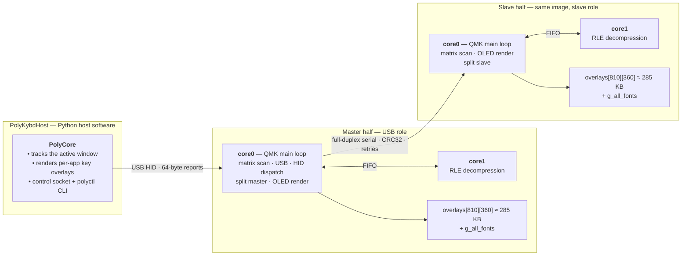
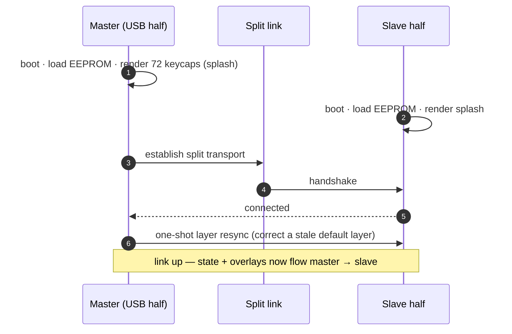
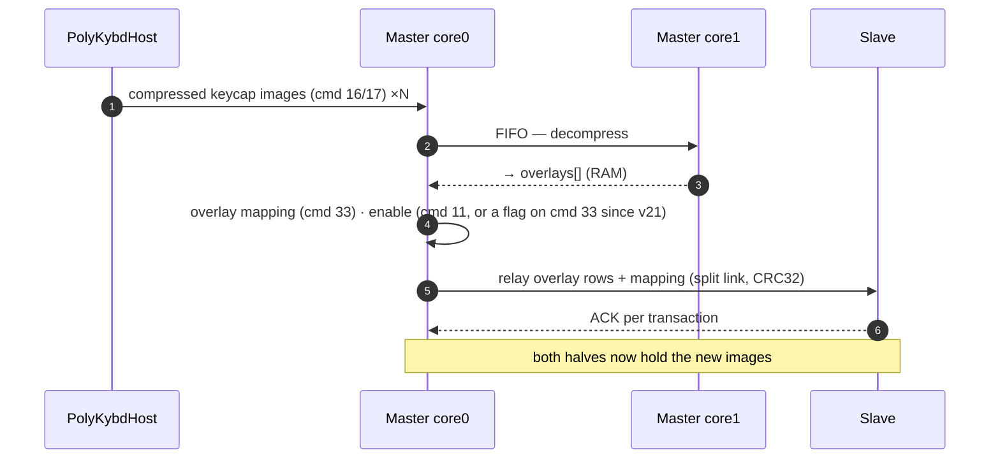
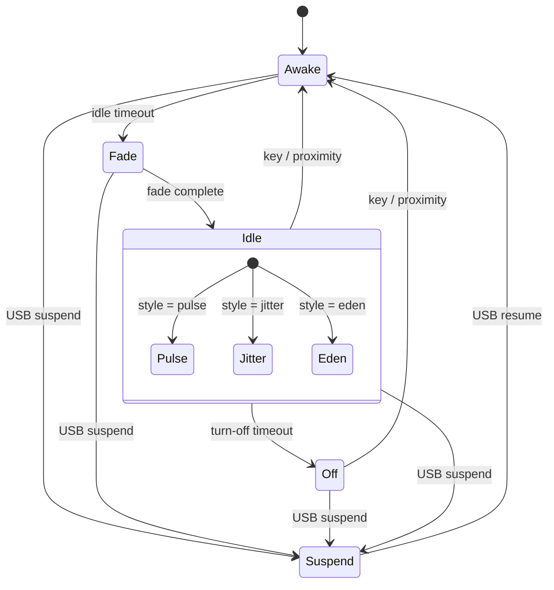
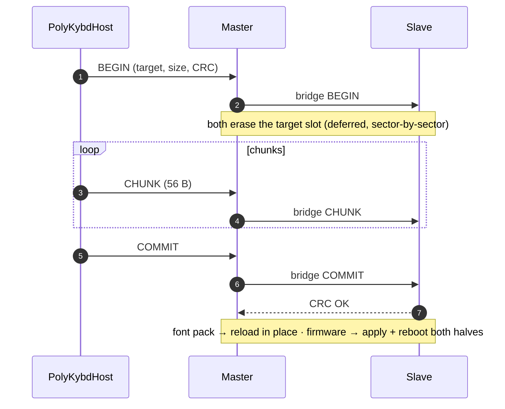
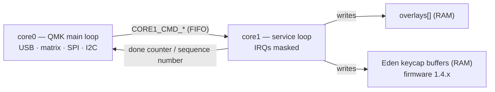

import { Aside } from '@astrojs/starlight/components';

PolyKybd has a lot of moving parts: a host application (**PolyKybdHost**), two keyboard halves that
run the **same** firmware image in different roles, a custom HID protocol, and 8 MB
of external flash carved into regions. This page is a single mental model of how it
all fits together — the topology, the command surface, where resources live, and the
handful of runtime processes worth understanding before you change any of them.

## Topology — who talks to whom

Three actors, two links. **PolyKybdHost** only ever speaks to the **master** (the USB half).
The master owns the HID device and is the only one that relays to the **slave** over
the split serial link. Both halves run the identical firmware — including a second
core (`core1`) used to offload RLE decompression — and differ only in role, decided
at runtime from which half has USB.

```mermaid
flowchart LR
  subgraph HOST["PolyKybdHost — Python host software"]
    PC["<b>PolyCore</b><br/>• tracks the active window<br/>• renders per-app key overlays<br/>• control socket + polyctl CLI"]
  end
  subgraph MASTER["Master half — USB role"]
    MC0["<b>core0</b> — QMK main loop<br/>matrix scan · USB · HID dispatch<br/>split master · OLED render"]
    MC1["<b>core1</b><br/>RLE decompression"]
    MRAM["overlays[810][360] ≈ 285 KB<br/>+ g_all_fonts"]
    MC0 <-->|FIFO| MC1
    MC0 --> MRAM
  end
  subgraph SLAVE["Slave half — same image, slave role"]
    SC0["<b>core0</b> — QMK main loop<br/>matrix scan · OLED render<br/>split slave"]
    SC1["<b>core1</b><br/>RLE decompression"]
    SRAM["overlays[810][360] ≈ 285 KB<br/>+ g_all_fonts"]
    SC0 <-->|FIFO| SC1
    SC0 --> SRAM
  end
  PC -->|"USB HID · 64-byte reports"| MC0
  MC0 -->|"full-duplex serial · CRC32 · retries"| SC0
```

<Aside type="note">
The slave has **no idea PolyKybdHost exists**. Everything it displays was relayed by the
master over the split link. Each half keeps its **own** copy of the overlay images in
RAM, which is why an image change has to be sent to both halves.
</Aside>

## The HID command surface

Every report is `[report-id][command][payload…]`, 64 bytes. Replies are prefixed
`P\xNN.` (ACK) or `P\xNN!` (NACK). Commands live on the keyboard-specific
`ID_POLYKYBD = 80` channel. Newer commands are gated by `PROTOCOL_VERSION`, but the host
does **not** require an exact match — it connects to any firmware reporting protocol **2 or
newer** (the floor at which it can still enumerate languages) and then enables each feature
individually:

| Keyboard vs host protocol | What happens |
|---|---|
| Below the floor | Refused — *"please update the keyboard firmware"* |
| Older than the host | Connects; features the firmware lacks are greyed out |
| Same as the host | Fully supported |
| Newer than the host | Connects in a restricted **safe mode**, and offers to update the host app |

So a keyboard and a host app from different releases still work together, with only the
newer features unavailable — rather than refusing to connect at all.

### Overlays — the bulk data path

| Cmd | Name | Notes |
|----|------|-------|
| `10` / `0x0A` | SEND_OVERLAY | Plain 60-byte segment (6 per keycap). |
| `16` / `17` | START / SEND_COMPRESSED_OVERLAY | RLE-compressed keycap in 1–2 packets → `core1` decompress. The common case. |
| `18` / `19` | START / SEND_ROI_OVERLAY | Partial refresh of a keycap region. |
| `41` / `0x29` | SEND_PRC_OVERLAY | **v19+.** [PRC](/reference/hid-protocol/#prc-predictive-range-coding)-coded keycaps, several per report; decoded on `core0`. |
| `21` / `0x15` | SEND_OVERLAY_MAPPING | pool→display map: which slot each keycap draws. |
| `33` / `0x21` | SEND_OVERLAY_MAPPING_W | **v12+.** The same map with a variable value width; **v21+** its width byte also carries the prepare / enable [flags](/reference/hid-protocol/#mapping-flags). |
| `11` / `12` | OVERLAY_FLAGS on / off | Enable/disable overlay rendering. |
| `26` / `0x1A` | SAVE_MRU | Persist the keyboard's most-recently-used emoji / language picks. |

### Identity & language

| Cmd | Name | Notes |
|----|------|-------|
| `6` | GET_ID | id string + per-bundle font-pack version block (after the NUL). The connect handshake. |
| `7` | GET_LANG | Current language code. |
| `27` / `0x1B` | GET_LANG_LIST_PACKED | Language list as 2-byte ISO index pairs. |
| `9` | CHANGE_LANG | Select active language. |
| `22` | GET_DEFAULT_LAYER | Read the persisted default layer. |

### Configuration & display

| Cmd | Name | Notes |
|----|------|-------|
| `13` | SET_BRIGHTNESS | Contrast; a flags byte selects volatile / host-auto. |
| `14` | KEYPRESS | Host-injected key event. |
| `15` | IDLE_STATE | Start / stop the idle anti-burn-in animation. |
| `20` | SET_UNICODE_MODE | Linux / Mac / Windows / WinCompose / BSD input mode. |
| `24` | DISPLAY_OFF | Blank the keycaps. |
| `28` / `0x1C` | IDLE_STYLE | Idle anti-burn-in style: pulse / jitter / screensaver. |
| `29` / `0x1D` | SET_OS | Active host OS → modifier legends. |
| `30` / `0x1E` | GLYPH_SCRIPT | Override legends with a fantasy/retro script (open-ended index). |
| `23` / `25` | BOOTLOADER / HANDEDNESS | Enter bootloader; set which half is which. |

### Resource flash transport — BEGIN / CHUNK / COMMIT

| Cmd | Name | Notes |
|----|------|-------|
| `0x50` | FONTPACK_BEGIN | Erase the target slot; a byte selects the target (font bundle, firmware, engine data). |
| `0x51` | FONTPACK_CHUNK | 56-byte sequential chunks; deferred sector erase; bridged to the slave. |
| `0x52` | FONTPACK_COMMIT | Verify CRC32, mark the slot present. |

The same three-command flow, with a different target, drives **firmware update**,
**font-pack bundles**, and the **engine packs** — see [Resource flashing](#resource-flashing-firmware--font-packs) below.

## Where resources live — the 8 MB flash

Custom hardware: 8 MB external QSPI, hard-partitioned. The authoritative map is
`base/fw_staging.h`.

| Range | Size | Contents |
|-------|------|----------|
| `0x000000–0x200000` | 2 MB | Running firmware (linker `flash1` XIP window) |
| `0x200000–0x400000` | 2 MB | Firmware-update staging (4 KB header + staged image) |
| `0x400000–0x600000` | 2 MB | Font pack — independently-versioned bundles, each in its own slot |
| `0x600000–0x7C0000` | 1.75 MB | DOOM WAD (pinned to the engine's XIP address) |
| `0x7C0000–0x7FE000` | 248 KB | DOOM engine pack |
| `0x7FE000–0x800000` | 8 KB | Emulated EEPROM (wear-levelling backing store) |

The last 8 KB is not the keyboard's to spend: QMK's RP2040 wear-levelling driver
places the emulated EEPROM at the very top of flash, so everything you configure —
keymap, brightness, language, idle style, glyph script — lives there, and the DOOM
engine-pack slot deliberately stops short of it.

The **firmware partition** is the budget that matters for adding languages and fonts:
`split72:default` uses roughly a third of its 2 MB. `FW_STAGING_OFFSET` is kept equal
to the linker's `flash1` length, so a build that exceeds 2 MB fails to **link** rather
than silently growing into the staging area.

Font-pack bundles are **`.plyf`** files carrying **ABI version 2** — column-native
(OLED page) glyph bitmaps (see [Column-native glyph bitmap format](/development/display-graphics/#column-native-glyph-bitmap-format)). A keyboard rejects a bundle whose ABI does not match its firmware and falls back to its resident fonts, so the host, firmware, and shipped bundles are versioned together.

### The RAM working set

| | |
|---|---|
| `overlay_pool[600][360]` | ≈ 211 KiB — the live keycap images, addressed indirectly so variants sharing artwork share a slot |
| `display_to_pool[1440]` | display position → pool slot (90 slots × 16 modifier variants) |
| display position | `slot + 90 × modifier_variant`; since v12 the variant is the modifier bitmask (Ctrl/Shift/Alt/GUI), so all 16 combinations are addressable |
| `g_all_fonts` | resident fonts ++ the flashed font-pack bundles, assembled at boot |

## Runtime processes

### Boot & split-link establishment

Each half boots independently and loads its own state from EEPROM. The USB half
becomes the master; it renders all keycaps and brings up the split link to the slave.
Until the link establishes, the master retries; if it never comes up it runs solo.

```mermaid
sequenceDiagram
  autonumber
  participant M as Master (USB half)
  participant L as Split link
  participant S as Slave half
  M->>M: boot · load EEPROM · render 72 keycaps (splash)
  S->>S: boot · load EEPROM · render splash
  M->>L: establish split transport
  L->>S: handshake
  S-->>M: connected
  M->>S: one-shot layer resync (correct a stale default layer)
  Note over M,S: link up — state + overlays now flow master → slave
```

<Aside type="note">
There is a brief **boot-time busy window** on the master (the initial 72-keycap
render plus the first sync to a slave that may still be coming up). It clears within a
couple of seconds; a person never notices it, but automated tooling that pokes the
keyboard immediately after power-on can.
</Aside>

### Overlay data path — an app switch

When the active window changes, PolyKybdHost sends the new keycap images. The master
decompresses them (on `core1`) into its overlay RAM, then relays each keycap to the
slave over the split link so both halves show the same thing.

```mermaid
sequenceDiagram
  autonumber
  participant H as PolyKybdHost
  participant M0 as Master core0
  participant M1 as Master core1
  participant S as Slave
  H->>M0: compressed keycap images (cmd 16/17) ×N
  M0->>M1: FIFO — decompress
  M1-->>M0: → overlays[] (RAM)
  M0->>M0: overlay mapping (cmd 33) · enable (cmd 11, or a flag on cmd 33 since v21)
  M0->>S: relay overlay rows + mapping (split link, CRC32)
  S-->>M0: ACK per transaction
  Note over M0,S: both halves now hold the new images
```

Frequently-used apps are also cached (the MRU path), so a return to a recent app
replays from cache rather than re-sending every image.

### Display power states

To avoid burning the OLED legends in, the keycaps fade and then run the configured
[idle style](/using/idle/) — pulsing, migrating their legends, or a full screensaver —
and turn off entirely after a longer timeout. Any key activity (or proximity, if the
light sensor is fitted) wakes them.

```mermaid
stateDiagram-v2
  [*] --> Awake
  Awake --> Fade: idle timeout
  Fade --> Idle: fade complete
  state Idle {
    [*] --> Pulse: style = pulse
    [*] --> Jitter: style = jitter
    [*] --> Eden: style = eden
  }
  Idle --> Off: turn-off timeout
  Awake --> Suspend: USB suspend
  Fade --> Suspend: USB suspend
  Idle --> Suspend: USB suspend
  Off --> Suspend: USB suspend
  Idle --> Awake: key / proximity
  Off --> Awake: key / proximity
  Suspend --> Awake: USB resume
```

Only the **style value** crosses the split link; each half runs its own idle animation
on its own keys from that and the shared pulse value. The Eden screensaver is drawn by
split72-only code, so selecting it on a split42 leaves the legends dimmed and static —
see [Idle & Burn-in Protection](/using/idle/).

### Resource flashing (firmware & font packs)

Firmware images, font-pack bundles, and the engine packs all ride the same BEGIN / CHUNK
/ COMMIT transport. The master streams chunks to its own staging flash **and** bridges
them to the slave, so both halves end up with byte-identical data. A firmware apply
reboots both halves in lockstep.

```mermaid
sequenceDiagram
  autonumber
  participant H as PolyKybdHost
  participant M as Master
  participant S as Slave
  H->>M: BEGIN (target, size, CRC)
  M->>S: bridge BEGIN
  Note over M,S: both erase the target slot (deferred, sector-by-sector)
  loop chunks
    H->>M: CHUNK (56 B)
    M->>S: bridge CHUNK
  end
  H->>M: COMMIT
  M->>S: bridge COMMIT
  S-->>M: CRC OK
  Note over M,S: font pack → reload in place · firmware → apply + reboot both halves
```

<Aside type="caution">
Heavy work never runs inside a split-transaction handler. A font-pack COMMIT verifies
the whole pack, which is too slow for the transaction window, so the slave ACKs on the
fast transport CRC and defers the full reload to its main loop.
</Aside>

### Multicore: what runs on core1

The RP2040 has two cores. QMK runs on `core0`: USB, the matrix scan, the console, SPI to
the keycap displays and I2C to the status OLED. `core1` runs a small service loop with no
RTOS thread, no console and no interrupts. `core0` hands it jobs over the inter-core FIFO
and `core1` computes into RAM. The CPU-heavy part of an overlay upload runs there, so a
burst of compressed keycap images does not stall the matrix scan.

```mermaid
flowchart LR
  C0["core0 — QMK main loop<br/>USB · matrix · SPI · I2C"] -->|"CORE1_CMD_* (FIFO)"| C1["core1 — service loop<br/>IRQs masked"]
  C1 -->|"writes"| OV["overlays[] (RAM)"]
  C1 -->|"writes"| EB["Eden keycap buffers (RAM)<br/>firmware 1.4.x"]
  C1 -->|"done counter / sequence number"| C0
```

#### How core1 is started

- During boot, `core0` launches `core1` with `multicore_launch_core1()` from the
  `polymod_core1` community module (`modules/polykybd/polymod_core1/`). The splash
  moves from step 4 to step 5 when it returns.
- `core1` runs on its own static stack of `CORE1_STACK_SIZE` bytes: 384 B up to
  firmware 1.4.0, and 512 B from the 1.4.x release that moves Eden onto `core1`.
- The first instruction `core1` executes is `cpsid i`, and `core1_entry()`
  (`keyboards/polykybd/multicore_exec.c`) masks interrupts again. They stay masked for
  the life of `core1`. ChibiOS's handler for the core1 FIFO interrupt ends by raising
  an NMI, and that NMI runs the RTOS context switch on a core that has no thread
  state, which hung `core1`. `core1` polls the FIFO, so it never needs an interrupt to
  wake.
- `core1_entry()` sets `g_core1_entered`. The boot breadcrumbs record it, so a crash
  record from a boot hang shows whether `core1` had started.
- The consequence: anything that needs an interrupt stays on `core0`. That is SPI to
  the keycaps, USB, I2C and the console. `core1` only computes into RAM.

#### The commands

| Command | Sent for | What core1 does | How core0 knows it is done |
|---|---|---|---|
| `CORE1_CMD_DECOMPRESS` | Compressed overlay upload (HID `16`/`17`) | RLE-decompresses one fragment into the overlay pool, and requests a display refresh when that overlay is on screen | `core1_decomp_count` catches up with `core0_decomp_count` |
| `CORE1_CMD_ROI_UPDATE` | Region overlay upload (HID `18`/`19`) | Copies a rectangle into an overlay | Same counter |
| `CORE1_CMD_RESET_BIT_IDX` | Start of a new upload | Resets the fragment position to 0 | Not tracked |
| `CORE1_CMD_EDEN_KEY` + 1 argument word | Eden idle screensaver (firmware 1.4.x) | Computes one keycap's plasma, ripple and comet pixels into a 360 B buffer | The job writes its sequence number |
| `CORE1_CMD_CRASH_TEST` | `POLYKYBD_CRASH_TEST` builds only | Makes an unaligned store, to check that a `core1` fault is recorded | — |

While `core1` is still working on a fragment, `raw_hid_pre_receive_kb()` leaves the next
HID packet in the USB driver's queue (4 packets) for that main-loop pass, so the matrix
scan still runs. PRC overlays (HID `41`) are decoded on `core0`, inside the HID
handler, behind the same gate.

#### Who owns core1, and when

- **The overlay service**, from boot. This is the normal state.
- **The Eden idle screensaver** (firmware 1.4.x). A keycap costs about 4.3 ms on
  `core0`, and 93 % of that is computing the pixels. `core1` now computes them, two
  keycaps at a time, while `core0` collects each finished keycap, cuts the legend out
  and pushes it over SPI.
  - On the rig, `core0` spends 40 ms per Eden frame instead of 115 ms, and Eden runs
    at 32 frames per 5 s instead of 25.
  - The status OLED's idle screen draws every 75 ms instead of 150 ms while Eden runs
    on `core1`.
  - An overlay upload, a firmware write and a font-pack write all end the idle session
    first, so they never share `core1` with Eden.
  - If a keycap job does not finish within 100 ms, the rest of the session renders on
    `core0`. Later sessions use `core1` again only once it has finished every job it
    was handed, so a stalled `core1` can never fill the FIFO and block `core0`.
- **DOOM.** `doom_enter()` resets `core1` through the power-state machine and hands it
  to the engine, with a 4 KB stack carved from the overlay pool. The game renders on
  `core1` alone; `core0` blits finished frames and passes keys through a ring buffer.
  Eden never uses `core1` while DOOM runs. On exit, `core1` is reset and the overlay
  service relaunched with a bounded handshake (100 ms, up to three tries). If that
  fails, overlay decompression stays off until the next reboot, but the keyboard keeps
  working.

<Aside type="note">
Eden on `core1` ships in the first firmware release after 1.4.0. On 1.4.0 and earlier,
the Eden screensaver renders entirely on `core0`, `core1` runs only the overlay service,
and its stack is 384 B.
</Aside>

#### Stack budget and diagnostics

- The overlay and region jobs peak at about 164 B of `core1` stack. The Eden keycap job
  is the deepest path: 300 B measured with `-fstack-usage`, plus about 96 B if a fault
  is taken at that depth. That is why the stack grew to 512 B with it.
- `OPT_DEFS += -DCORE1_STACK_HWM` in `rules.mk` fills the stack with a marker at launch
  and logs the deepest point reached. Pass it that way, not as
  `-e EXTRAFLAGS=-DCORE1_STACK_HWM`: a command-line `EXTRAFLAGS` replaces the flags
  `rules.mk` adds, which drops the `-Wcast-align` guard and breaks DOOM builds.
- After adding a `core1` command, measure the stack again and raise
  `CORE1_STACK_SIZE` if the peak climbs.

## Where to go next

- [Firmware Development](/development/firmware/) — build the firmware and set up the toolchain.
- [HID Protocol](/reference/hid-protocol/) — the full command reference.
- [Display Graphics & Fonts](/development/display-graphics/) — how keycap images and fonts are generated.
