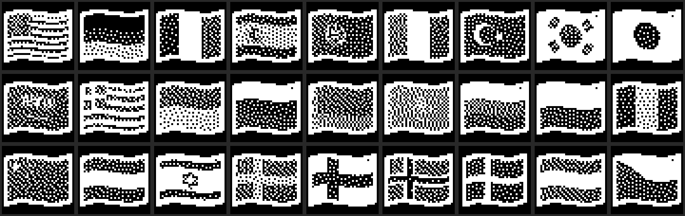
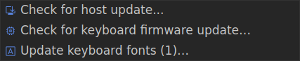

import { Aside } from '@astrojs/starlight/components';
import SupportedSince from '../../../components/SupportedSince.astro';
import AiSkill from '../../../components/AiSkill.astro';

<SupportedSince protocol={6} note="per-bundle versioning & auto-flash" />

PolyKybd can draw an enormous range of glyphs on its keycaps — Latin of course, but also
symbols, CJK, emoji, country flags and the [glyph scripts](/using/glyph-scripts/). That
glyph set is far too big to compile into the firmware image, so it's split in two.

## Resident fonts vs the font pack

- **Resident fonts** are compiled into the firmware. They cover ASCII text and the essential
  UI chrome, so the keyboard always renders basic legends **even with no font pack flashed**.
- **The font pack** lives in the keyboard's **external QSPI flash** (the 4–6 MB resource
  region) and holds everything else. It's flashed separately from the firmware and survives a
  firmware update.

The pack isn't one big blob — it's a set of independently-versioned **bundles**
(symbols, Middle-Eastern, syllabic, Asian, flags, emoji, and the `fantasy` script bundle).



## Flashed automatically on connect

You normally never manage the pack by hand. When PolyKybdHost connects, the keyboard reports
the version of each bundle it holds, and the host **flashes only the bundles that are missing or
out of date**. That's what the *"Updating fonts — do not unplug"* screen is: a font-pack bundle
being written. It's quick, and it only happens when something is actually stale.

<Aside type="tip">
Because bundles are versioned, adding a new language flag or a new glyph script only reships the
one bundle that changed — the rest are left untouched.
</Aside>

## Checking and updating it yourself

The tray's **Updates** menu carries a **Keyboard fonts** row that already knows the
answer: it reads *"Keyboard fonts: up to date"* when nothing is stale, or
*"Update keyboard fonts (2)…"* when something is — with the outdated bundles named in
its tooltip. Clicking it flashes exactly those.



For troubleshooting you can also drive the pack from the CLI:

```sh
polyctl fontpack status        # show device-vs-shipped versions per bundle
polyctl fontpack sync          # flash every stale bundle
polyctl fontpack flash <id>    # force-flash one bundle
polyctl fontpack wipe [id]     # empty one bundle (or all)
```

Wiping a bundle is harmless — the host re-flashes it on the next connect. The same
per-bundle view and a wipe are available in the tray under **Developer → Font Pack**
(see [developer mode](/software/usage/#developer-mode)).

<Aside type="note">
Where the pack sits in the 8 MB flash map, and how the resident + pack fonts are merged at
boot, is covered in [System Model & Data Flow](/development/system-model/#where-resources-live--the-8-mb-flash).
Generating the fonts themselves is a development task — see
[Display Graphics & Fonts](/development/display-graphics/).
</Aside>

<AiSkill name="reship-fontpack-bundle">
The **`reship-fontpack-bundle`** skill refreshes a bundle's shipped
`.plyf` from the committed firmware headers when the host and firmware bytes have drifted — no
`fontconvert` build needed. To make a single glyph render with **no** pack flashed, the
companion **`make-font-resident`** skill moves it into the compiled-in resident set.
</AiSkill>
