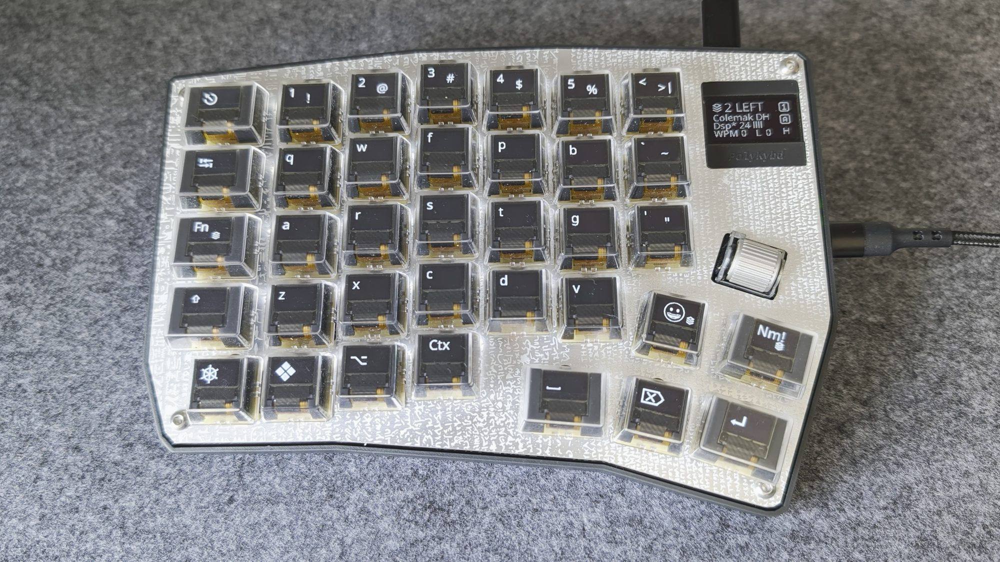
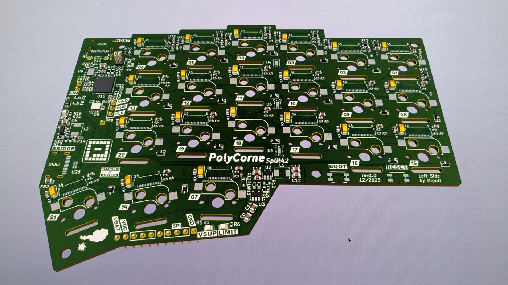

import { Aside } from '@astrojs/starlight/components';

PolyKybd ships in two hardware variants. They run **one firmware codebase**, so a feature added to
the keyboard lands on both at once.

## split72 vs split42

| | **split72** | **split42** |
|---|---|---|
| Keys | 72 | 42 |
| Footprint | PolyKybd full-size split | CRKBD / Corne 42-key |
| RGB matrix | Yes (72 LEDs) | No |
| Pointing device | Cirque trackpad | No |
| Status OLED | 128×64 | 128×32 |
| Per-keycap OLEDs | 72×40 px monochrome | 72×40 px monochrome |
| Build target | `polykybd/split72` | `polykybd/split42` |

A split72 half — 36 keys, the 128×64 status OLED (here naming the active layout, Colemak DH), and a
rotary encoder fitted in the expansion slot:



The split42 board, which carries 21 keys per half and no RGB or pointing device (KiCad render of
the `PolyCorne Split42` rev1.0 left side):



<Aside>
**split42 was renamed from `corne42` in 2026-06.** Same hardware, PID and `LAYOUT_crkbd`; the old
`corne42` paths are gone. If you see `corne42` referenced anywhere, read it as `split42`.
</Aside>

## One shared keymap

All behaviour lives in the keyboard-level **`poly_keymap.c`** (compiled for both variants via
`rules.mk`'s `SRC`): rendering, HID/overlay handling, language selection, idle/suspend, split-sync
glue, the firmware-update state machine, and the QMK `*_user` / `*_kb` callbacks.

Each variant's default keymap file is **data only** — it holds the `keymaps[]` array, the
`encoder_map[]`, and (on RGB variants) the LED config:

```
keyboards/polykybd/
├── poly_keymap.c                      ← shared logic, both variants
├── split72/
│   └── keymaps/default/keymap.c       ← split72 data only
└── split42/
    └── keymaps/default/keymap.c       ← split42 data only
```

Variant differences resolve at **compile time**: `polykybd.h` includes the active variant header
(selected by QMK's `-DKEYBOARD_polykybd_<variant>`), and `RGB_MATRIX_ENABLE` /
`POINTING_DEVICE_ENABLE` guard the RGB and trackpad code paths.

<Aside type="tip">
Because the logic is shared, the two keyboards can't silently drift apart in language support or
features. When customising, edit the per-variant `keymap.c` for *data*, and `poly_keymap.c` for
*behaviour*.
</Aside>

## Building a specific variant

The build target selects the variant:

```sh
qmk compile -kb polykybd/split72 -km default
# or
qmk compile -kb polykybd/split42 -km default
```

See [Firmware Development](/development/firmware/) for the full toolchain setup.
