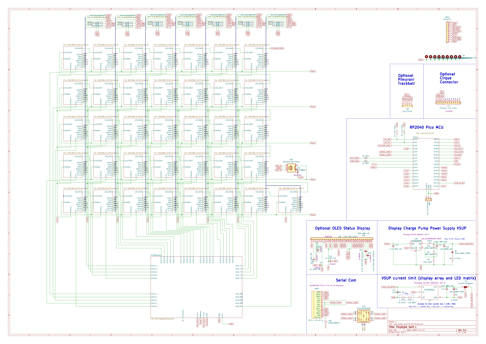
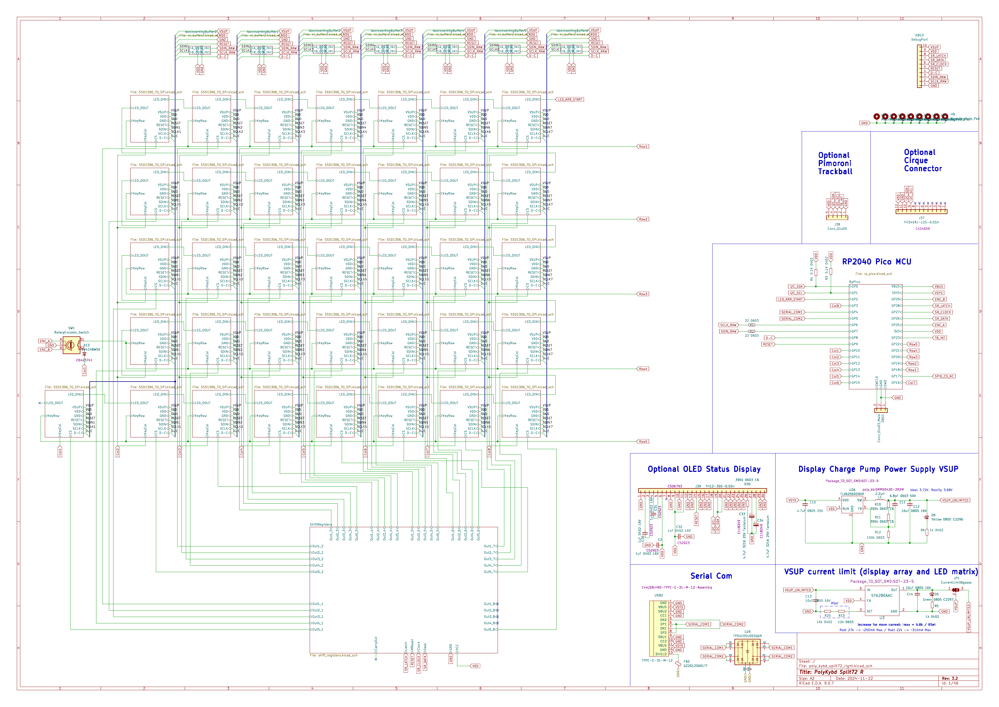
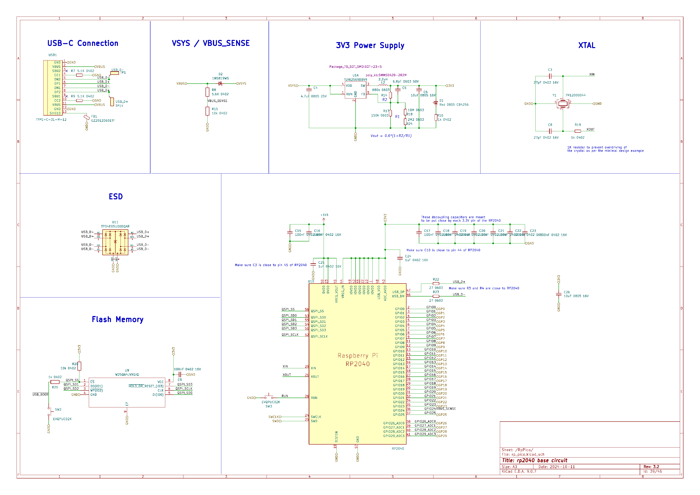
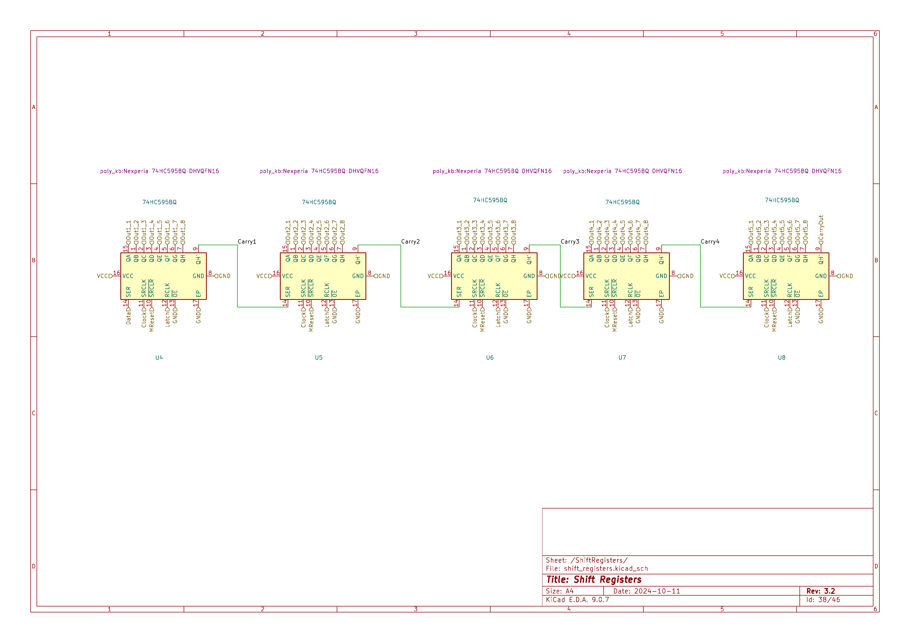
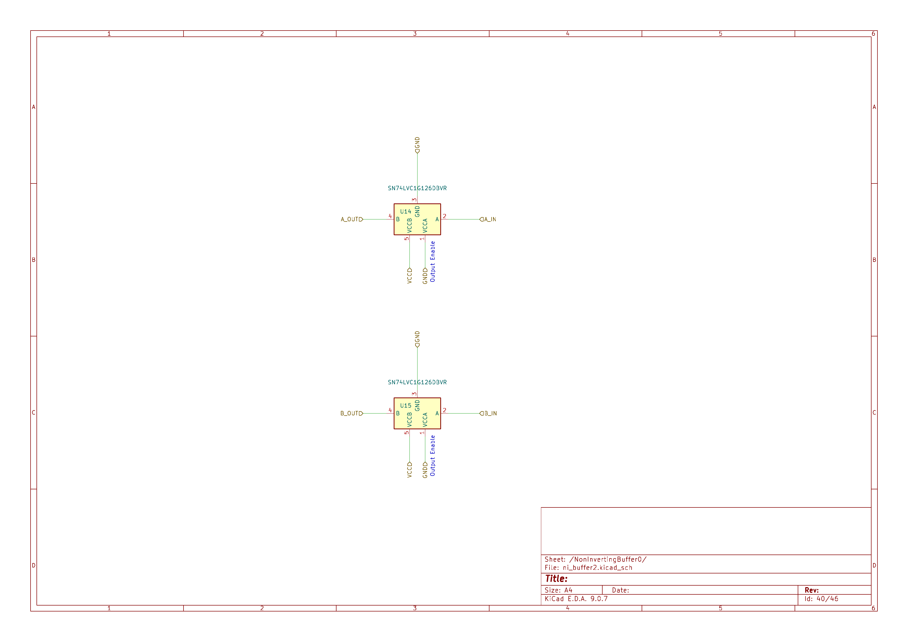

import { Aside } from '@astrojs/starlight/components';

This page is a guided tour of the PolyKybd Split72 electronics, sheet by sheet. The schematics
below are the individual sheets of the KiCad project (Rev 3.2) — the same set bundled in the PDF
documentation. Repeated per-key and buffer sheets are shown once, because every instance is
identical.

<Aside type="tip">
These images are for **reading and understanding** the board. The editable KiCad sources, gerbers
and BOM — and how to change and re-manufacture the board — are on
[PCB & Case Modification](/hardware/modification/).
</Aside>

## The big picture

Each half is one 4-layer PCB carrying **36 identical key units**, a shared **RP2040** core, a
**shift-register** block that expands a handful of MCU pins into the ~40 control lines the key
array needs, a chain of **non-inverting buffers** that keep those signals clean as they cross the
large board, and the **power path** (USB-C in, a 3.3 V regulator, and a separate display supply).
The two halves are wired together over a USB-C link and talk to each other over a UART split
connection; only the half plugged into the computer acts as the USB host side.

## Board overview — left & right root sheets

The top-level sheet of each board ties everything together: the 36 key units (each an instance of
the *Display Adapter, LED & Switch* sub-sheet), the RP2040 block, the shift-register block, the
display charge-pump supply (VSUP) with its current limiter, the USB-C link between the two halves,
and the optional peripherals — the Pimoroni trackball / Cirque trackpad connector and the optional
0.96″ OLED status display.

**Left half** ("PolyKybd Split L"):

**Right half** ("PolyKybd Split72 R") — structurally the same as the left, wiring up its own 36 key
units, the shared control and power nets, and the non-inverting buffer blocks along the signal
chain:

<Aside type="note">
The two halves run the **same firmware image**; the master/slave role is decided at runtime from
which half is plugged into USB. See [Keyboard Variants](/firmware/variants/) and
[System Model & Data Flow](/development/system-model/) for the firmware side.
</Aside>

## RP2040 — the microcontroller core

The heart of the keyboard. This sheet contains the Raspberry Pi **RP2040** (U10) with its
decoupling network, the **8 MB QSPI flash** (W25Q64, U9) and the BOOT button, the **12 MHz crystal**
(Y1), and the **3.3 V step-down regulator** (TLV62569, U1) with its SMMS0420 inductor. It also holds
the **USB-C connector** (USB1) with its ESD protection (TPD4E05, U11) and the VBUS-sense / VSYS
network (including the 1N5819WS diode, D2) — so all of the power, USB, clock and boot circuitry lives
on this one sheet.

<Aside type="tip">
The QSPI flash is **8 MB**, not the stock 2 MB — it's partitioned into the running firmware, a
firmware-update staging area, and the resource region that holds the [font pack](/firmware/font-packs/).
</Aside>

## Key block — one key unit (×36 per side)

A single key unit, repeated 36 times per side. It contains the **FH34SRJ FPC socket** for the 0.42″
OLED display, the addressable **RGB LED** (XL-3030RGBC / WS2812B), the MX-compatible **Kailh
hot-swap switch** with its **1N4148 matrix diode**, and the local decoupling capacitors — i.e. the
display, LED and switch of one key, all on one small repeated block.

This is what makes every key independent: each has its own OLED to draw a legend on and its own RGB
LED, addressed through the shift-register block below.

## Shift registers — pin expansion

Five **74HC595** 8-bit shift registers (U4–U8) are daisy-chained together — each register's `QH'`
output feeds the next one's `SER` input via `Carry1`–`Carry4` — and driven by the MCU's Data /
Clock / Latch lines. They expand a handful of MCU pins into **40 control outputs** used to address
the per-key hardware across the array.

## Non-inverting buffers — clean signals across the array

A pair of **SN74LVC1G126** single non-inverting buffers with 3-state outputs and separate A/B supply
rails (U14, U15). This sheet is instantiated several times (NonInvertingBuffer0…5) to buffer and
repeat the control/data signals as they travel across the large key array, keeping the signal edges
clean over the distance.

## Where to go next

- [PCB & Case Modification](/hardware/modification/) — the KiCad sources, gerbers, BOM and how to
  re-manufacture a modified board.
- [PCB & Gerber Files](/assembly/pcb/) — ordering the boards as-is.
- [System Model & Data Flow](/development/system-model/) — how the firmware drives all of the above.
- [Displays & FPC Extension](/assembly/displays/) — the 0.42″ OLEDs that plug into each key unit.
