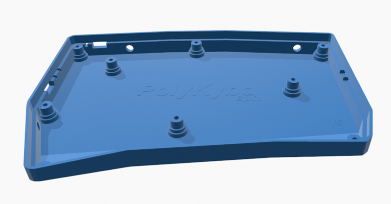

import { Aside } from '@astrojs/starlight/components';
import AiSkill from '../../../components/AiSkill.astro';

## Tools required

- [KiCad 7](https://www.kicad.org/) — the PCB design is a KiCad 7 project
- A PCB manufacturer account (JLCPCB, PCBWay, etc.)

## KiCad project files

All design files are in the [PolyKybd hardware repo](https://github.com/thpoll83/PolyKybd):

| File | Description |
|---|---|
| `poly_kybd/poly_kybd_split72_right.kicad_pro` | Right PCB schematic + layout |
| `poly_kybd/poly_kybd_split72_left.kicad_pro` | Left PCB schematic + layout |
| `poly_kybd/poly_kybd_split72_plate_right.kicad_pro` | Right aluminum plate |
| `poly_kybd/poly_kybd_split72_plate_left.kicad_pro` | Left aluminum plate |

The `backup/` directory contains older revisions for reference.

## Exporting gerbers for manufacture

After making changes in KiCad:

1. Open the PCB editor
2. **File → Plot** — select Gerber format, output to a new folder
3. **File → Fabrication Outputs → Drill Files** — generate drill files into the same folder
4. Zip the folder contents and upload to your PCB manufacturer

<Aside type="caution">
After exporting, verify the hot-swap socket orientation. The KiCad footprint for the key switch may place the hot-swap socket on the front copper layer. For manufacturing it must be on the back side. Check this in the 3D viewer before ordering.
</Aside>

## Exporting BOM and pick-and-place

Python scripts in the root of the repo assist with JLCPCB-format exports:

```sh
python bom_csv_jlcpcb.py           # generate BOM
python kicad_csv_pos_to_jlcpcb_cpl_csv.py  # generate CPL (pick and place)
```

## 3D case modification



The case source files are in the `case/` and `parts/` directories. Some are OpenSCAD `.scad` files which can be modified parametrically:

- `parts/cirque23_insert_slim.scad` — slim Cirque 23mm trackpad insert
- `parts/cirque23_insert.scad` — high Cirque 23mm trackpad insert
- `parts/cirque35_insert.scad` — experimental 35mm trackpad insert (modify source before printing)

Render to STL with OpenSCAD: **Design → Render**, then **File → Export → Export as STL**.

<AiSkill name="investigate-kicad-pcb">
The **`investigate-kicad-pcb`** skill inspects the KiCad boards with
Python — trace what sits on a net, compare two variants or revisions, hunt a suspected design
fault (short/open/routing/BOM), or run DRC — which is handy when deciding whether a bring-up
symptom is firmware or the board.
</AiSkill>
