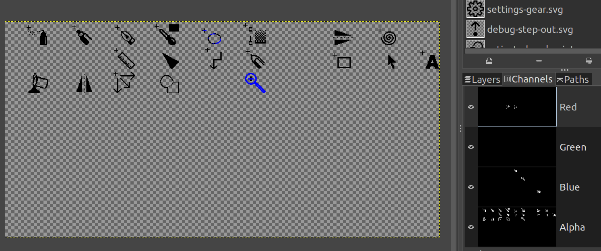
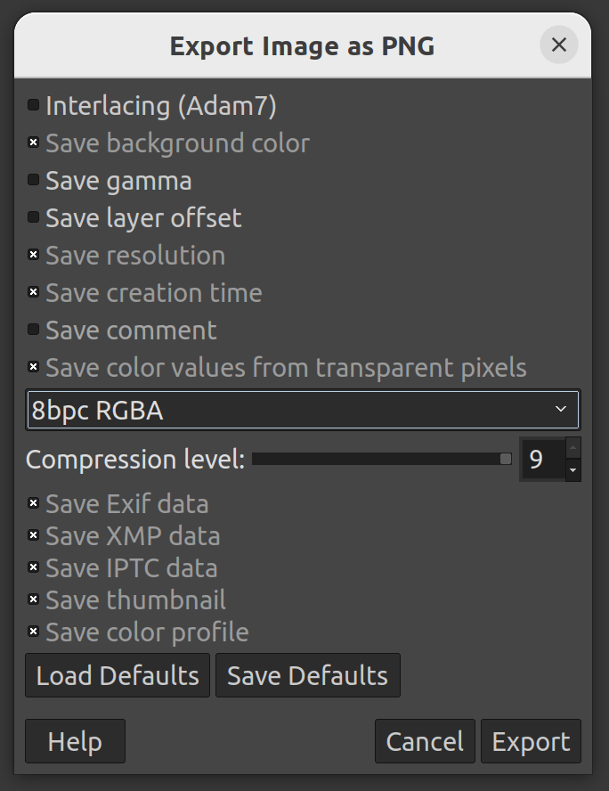

import { Aside, Steps } from '@astrojs/starlight/components';
import AiSkill from '../../../components/AiSkill.astro';

PolyKybd can draw a **shortcut icon on each keycap OLED** for whichever app is focused — see
[Context-Aware Overlays](/using/overlays/) for the user-facing side. This HowTo builds a new
overlay set for an application **by hand**, the same way the shipped overlays were made.

An overlay is just an **image** you paint in an editor like [GIMP](https://www.gimp.org/), plus a
one-line entry telling the host which app it belongs to. The editable source files for every
built-in overlay live in the host repo under
[`polyhost/res/overlays/src/`](https://github.com/thpoll83/PolyKybdHost/tree/main/polyhost/res/overlays) —
a great starting point (and `template.xcf` there is a blank grid). The authoritative format spec is
`polyhost/res/overlay_specification.md`.

## How an overlay image is laid out

The host loads one or two PNGs per app. Each PNG is a **720×360 image = a 10×9 grid of 72×40 keycap
cells**, in row-major key order, and — this is the clever part — **each colour channel of a cell is
a different modifier variant** of that key:

| File | Red | Green | Blue | Alpha |
|---|---|---|---|---|
| `*.mods.png` (primary) | Ctrl | Alt | Shift | no modifier |
| `*.combo.mods.png` (combo) | Ctrl+Shift | Ctrl+Alt | Alt+Shift | GUI *(dropped)* |
| `*.png` (plain) | — | — | — | grayscale → no modifier only |

So one RGBA image holds four layers of the same keyboard at once — you can see it in GIMP's
**Channels** panel, each of Red / Green / Blue / Alpha carrying the icons for a different modifier:



**White pixels are drawn (lit) on the OLED; everything else is ignored.** Encode as **straight
(non-premultiplied) RGBA** — a transparent pixel must still carry its R/G/B bytes, because those
channels are the Ctrl/Alt/Shift variants, independent of alpha (see the export step below).

A few hard limits baked into the firmware — don't fight them:

- **Ctrl+Alt+Shift can't be shown**, and **GUI/Win-key overlays are dropped** — skip those shortcuts.
- Cells are **72×40, 1-bit monochrome** on the OLED — draw simple, high-contrast icons.
- Only the **90 mapped keys** carry a cell (`A`–`Z`, `0`–`9`, `F1`–`F12`, punctuation, the nav
  cluster, modifiers). Keypad and media keys have none.
- Put the icon in the **bottom-right** of the cell so it never covers the firmware-drawn key letter
  in the top-left.

## Build it by hand

<Steps>

1. **Start from the template.** Copy `polyhost/res/overlays/src/template.xcf` (the blank 720×360
   grid) — or an existing app's `…_template-RGBA.xcf` that's close to what you want — and open it in
   GIMP. Working from a shipped source is the quickest way to see how the channels and cell grid are
   organised.

2. **Look up the app's real shortcuts.** From the app's own menus, help, or shortcut reference. Note
   the modifier each one uses, and drop the ones the hardware can't show (Ctrl+Alt+Shift, and
   GUI/Win).

   <Aside type="caution">
   Mind app-specific quirks — don't assume the obvious meaning. Outlook `Ctrl+F` is *Forward*, not
   Find; Excel `Ctrl+-` deletes cells. If a key has no default in that app, leave it blank rather
   than inventing one.
   </Aside>

3. **Draw an icon per shortcut.** For each shortcut, place a small, clear icon into that key's cell,
   on the channel for its modifier (Ctrl → red, Alt → green, Shift → blue, no-modifier → alpha).
   Keep it bottom-right. Reuse of the app's own iconography reads best; simple monochrome art
   survives the 1-bit OLED far better than a detailed logo.

4. **Export the PNG(s).** Export the image to `polyhost/res/overlays/<app>_template.mods.png` as
   720×360 RGBA. Add a `<app>_template.combo.mods.png` only if you drew combo (Ctrl+Shift / Ctrl+Alt
   / Alt+Shift) layers. If you only need plain, unmodified icons, a single grayscale
   `<app>_template.png` is enough.

   <Aside type="caution">
   In GIMP's *Export Image as PNG* dialog, set the format to **8bpc RGBA** and **tick "Save color
   values from transparent pixels"** — otherwise GIMP throws away the R/G/B bytes under transparent
   pixels and your Ctrl/Alt/Shift channels come out blank.

   
   </Aside>

   <Aside type="tip">
   Working channel-by-channel is easiest with GIMP's **`decompose`** (split an image into its R/G/B/A
   channels to draw each modifier separately) and **`compose`** (merge them back into one image
   before export). `compose` fails if any extra channel is left over, so keep it to R/G/B/A. The
   shipped `.xcf` files in `polyhost/res/overlays/src/` are the reference.
   </Aside>

5. **Tell the host which app it's for.** Add an entry to `polyhost/res/overlay-mapping.poly.yaml`,
   keyed on the app's **window class / process name** (comma-separate aliases), pointing `overlay:`
   at your PNG(s):

   ```yaml
   myapp,myapp.exe:
     overlay: [myapp_template.mods.png, myapp_template.combo.mods.png]
   ```

   When one process serves many contexts (a browser hosting several web apps, an IDE), narrow it by
   window title with `title:` (a regex) or the `titles-startswith` / `titles-contains` /
   `titles-endswith` maps — see the existing Chrome and JetBrains entries for the pattern.

6. **Test it.** Focus the app with the keyboard connected — the overlay loads automatically. Run
   PolyKybdHost with `--debug 2` to watch the overlay HID traffic if a key doesn't show.

</Steps>

<Aside type="tip">
**Commit your editable source, not just the exported PNG.** The shipped overlays keep their GIMP
`.xcf` in `polyhost/res/overlays/src/` so anyone can tweak them later — do the same with yours.
</Aside>

See [Contributing](/development/contributing/) for how to open the pull request, and
[Display Graphics & Fonts](/development/display-graphics/) for how overlays are rendered on the
device.

<AiSkill name="generate-app-overlays">
Prefer to automate it? The **`generate-app-overlays`** skill produces the same channel-packed PNGs
without an image editor — it researches the app's shortcuts, sources a licensed icon per shortcut
(committing each one for reproducibility), packs them via `scripts/generate_app_overlays.py`, and
writes the `overlay-mapping.poly.yaml` entry. Handy for bulk or AI-assisted overlay generation.
</AiSkill>
