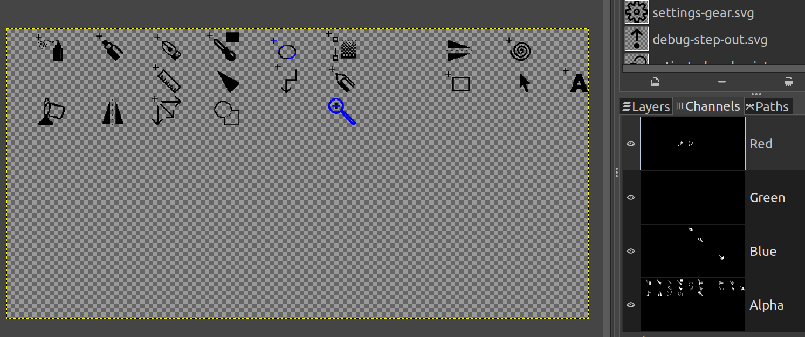
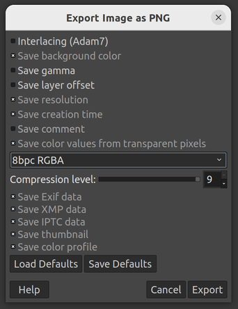

import { Aside, Steps } from '@astrojs/starlight/components';
import AiSkill from '../../../components/AiSkill.astro';

PolyKybd can draw a **shortcut icon on each keycap OLED** for whichever app is focused — see
[Context-Aware Overlays](/using/overlays/) for the user-facing side. This HowTo builds a new
overlay set for an application **by hand**, the same way the shipped overlays were made.

An overlay is just an **image** you paint in an editor like [GIMP](https://www.gimp.org/), plus a
one-line entry telling the host which app it belongs to. The editable source files for every
built-in overlay live in the host repo under
[`polyhost/res/overlays/src/`](https://github.com/thpoll83/PolyKybdHost/tree/main/polyhost/res/overlays) —
a great starting point (and `template.xcf` there is a blank grid). The authoritative format spec is
`polyhost/res/overlay_specification.md`.

## How an overlay image is laid out

The host loads one or two PNGs per app. Each PNG is a **720×360 image = a 10×9 grid of 72×40 keycap
cells**, in row-major key order, and — this is the clever part — **each colour channel of a cell is
a different modifier variant** of that key:

| File | Red | Green | Blue | Alpha |
|---|---|---|---|---|
| `*.mods.png` (primary) | Ctrl | Alt | Shift | no modifier |
| `*.combo.mods.png` (combo) | Ctrl+Shift | Ctrl+Alt | Alt+Shift | GUI |
| `*.extra.mods.png` (extra) | Ctrl+Alt+Shift | GUI+Shift | GUI+Alt | GUI+Ctrl |
| `*.gui.mods.png` (GUI combos) | GUI+Ctrl+Shift | GUI+Alt+Shift | GUI+Ctrl+Alt | GUI+Ctrl+Alt+Shift |
| `*.png` (plain) | — | — | — | grayscale → no modifier only |

So one RGBA image holds four layers of the same keyboard at once — you can see it in GIMP's
**Channels** panel, each of Red / Green / Blue / Alpha carrying the icons for a different modifier:



**White pixels are drawn (lit) on the OLED; everything else is ignored.** Encode as **straight
(non-premultiplied) RGBA** — a transparent pixel must still carry its R/G/B bytes, because those
channels are the Ctrl/Alt/Shift variants, independent of alpha (see the export step below).

A few hard limits baked into the firmware — don't fight them:

- **All sixteen modifier combinations work** — every mix of Ctrl, Shift, Alt and GUI. Until
  recently GUI could not be *combined* with another modifier: `GUI+Shift`, `GUI+Alt` and so on
  all drew the plain GUI icon instead of their own. That mattered most on macOS, where `Cmd+Shift`
  chords are everywhere (`Cmd+Shift+P` opens the command palette in a lot of editors). If you
  skipped those shortcuts before, you can draw them now — see the `extra` and `GUI combos` rows
  above.
- Repeating the **same icon across several variants is free**: the host spots byte-identical
  images and stores them once on the keyboard, so only genuinely different artwork costs space.
- Cells are **72×40, 1-bit monochrome** on the OLED — draw simple, high-contrast icons.
- Only the **90 mapped keys** carry a cell (`A`–`Z`, `0`–`9`, `F1`–`F12`, punctuation, the nav
  cluster, modifiers). Keypad and media keys have none.
- Put the icon in the **bottom-right** of the cell so it never covers the firmware-drawn key letter
  in the top-left.

## Build it by hand

<Steps>

1. **Start from the template.** Copy `polyhost/res/overlays/src/template.xcf` (the blank 720×360
   grid) — or an existing app's `…_template-RGBA.xcf` that's close to what you want — and open it in
   GIMP. Working from a shipped source is the quickest way to see how the channels and cell grid are
   organised.

2. **Look up the app's real shortcuts.** From the app's own menus, help, or shortcut reference. Note
   the modifier each one uses — every combination of Ctrl, Shift, Alt and GUI can be drawn, so
   nothing has to be dropped for lack of a channel.

   <Aside type="caution">
   Mind app-specific quirks — don't assume the obvious meaning. Outlook `Ctrl+F` is *Forward*, not
   Find; Excel `Ctrl+-` deletes cells. If a key has no default in that app, leave it blank rather
   than inventing one.
   </Aside>

3. **Draw an icon per shortcut.** For each shortcut, place a small, clear icon into that key's cell,
   on the channel for its modifier (Ctrl → red, Alt → green, Shift → blue, no-modifier → alpha).
   Keep it bottom-right. Reuse of the app's own iconography reads best; simple monochrome art
   survives the 1-bit OLED far better than a detailed logo.

4. **Export the PNG(s).** Export the image to `polyhost/res/overlays/<app>_template.mods.png` as
   720×360 RGBA. Add each further tier **only if you drew for it** — `<app>_template.combo.mods.png`
   for the combo layers (Ctrl+Shift / Ctrl+Alt / Alt+Shift / GUI),
   `<app>_template.extra.mods.png` for Ctrl+Alt+Shift and the two-modifier GUI chords, and
   `<app>_template.gui.mods.png` for the three- and four-modifier GUI chords. Most apps never need
   that last one. If you only need plain, unmodified icons, a single grayscale
   `<app>_template.png` is enough.

   <Aside type="caution">
   In GIMP's *Export Image as PNG* dialog, set the format to **8bpc RGBA** and **tick "Save color
   values from transparent pixels"** — otherwise GIMP throws away the R/G/B bytes under transparent
   pixels and your Ctrl/Alt/Shift channels come out blank.

   
   </Aside>

   <Aside type="tip">
   Working channel-by-channel is easiest with GIMP's **`decompose`** (split an image into its R/G/B/A
   channels to draw each modifier separately) and **`compose`** (merge them back into one image
   before export). `compose` fails if any extra channel is left over, so keep it to R/G/B/A. The
   shipped `.xcf` files in `polyhost/res/overlays/src/` are the reference.
   </Aside>

5. **Tell the host which app it's for.** Add an entry to `polyhost/res/overlay-mapping.poly.yaml`,
   keyed on the app's **window class / process name** (comma-separate aliases), pointing `overlay:`
   at your PNG(s):

   ```yaml
   myapp,myapp.exe:
     overlay: [myapp_template.mods.png, myapp_template.combo.mods.png]
   ```

   When one process serves many contexts (a browser hosting several web apps, an IDE), narrow it
   with a sub-map. The host tries them in a fixed order and the first match wins:

   | Key | Matches on | How |
   | --- | --- | --- |
   | `urls-contains:` | the focused tab's URL | plain substring |
   | `titles-startswith:` | the **first word** of the title | whole word |
   | `titles-endswith:` | the **last word** of the title | whole word |
   | `titles-contains:` | **any word** in the title | whole word |

   ```yaml
   chrome,google-chrome,chromium:
     overlay: [chrome_template.mods.png]      # plain browsing
     urls-contains:
       atlassian.net: { overlay: [jira_template.mods.png] }
     titles-contains:
       Jira: { overlay: [jira_template.mods.png] }     # used when no URL is known
   ```

   See the existing Chrome and JetBrains entries for the full pattern.

   <Aside type="caution">
   The title maps are **word-based, not substring-based** — the title is split on whitespace and
   each key is compared against a whole word. Two consequences catch people out:

   - `titles-contains: Doc` matches `My Doc here` but **not** `My Docs here`.
   - A key containing a space (`titles-contains: My Doc`) can never match, because no single word
     ever equals it.

   `titles-startswith` is likewise the whole first *word*, not an arbitrary prefix string.
   For anything finer, use `title:` — but note it works differently from the four maps above
   (see below).
   </Aside>

   <Aside type="note">
   **`title:` is a filter, not a fifth sub-map.** The four keys in the table *route* — each one
   selects a nested entry with its own overlay. `title:` (a regex over the whole title, and its
   sibling `url:`) instead acts as a **constraint on the entry that declares it**, checked only
   *after* every sub-map above has been tried: if the regex does not match, that entry is rejected
   outright and matching moves on. So it can veto an entry, never redirect to a different overlay.

   Use `title:` to stop an entry firing on the wrong window, and the maps in the table to pick
   between overlays. One wrinkle worth knowing: when the title is empty or unknown, a `title:`
   regex is skipped rather than treated as a failure, so the entry still applies.
   </Aside>

   <Aside type="note">
   **A known URL outranks the title.** `urls-contains` is checked first because a URL identifies a
   web app far more reliably than a window title. For an entry that declares `urls-contains`, the
   `titles-contains` map is a fallback for when the URL is *unknown* (no browser extension
   reporting, or a non-browser window) — not merely when it matched no key.

   So while the extension is reporting, searching Google for "jira" keeps the plain browser
   overlay: the URL is positive evidence that this is not Jira, and a stray word in the title
   must not overrule it. `titles-startswith` / `titles-endswith` and entries with no
   `urls-contains` are unaffected.
   </Aside>

   If the app's shortcuts differ per platform, give it an `os:` branch. Sublime Text does exactly
   this — `Cmd` on macOS, `Ctrl` elsewhere:

   ```yaml
   sublime_text:
     overlay: [sublime_template.mods.png, sublime_template.combo.mods.png]   # the default
     os:
       macos:
         overlay: [sublime_mac_template.mods.png, sublime_mac_template.combo.mods.png,
                   sublime_mac_template.extra.mods.png, sublime_mac_template.gui.mods.png]
   ```

   Accepted keys are `windows`, `macos`, `linux`, plus `linux_gnome` / `linux_kde` when a desktop
   environment needs its own artwork (a plain `linux:` branch still covers those two). Anything the
   host can't identify falls back to the entry's own `overlay:`, so the default is never skipped.

   <Aside type="caution" title="Repeat title:/url: constraints inside an os: branch">
   A matched `os:` branch **replaces** the outer entry rather than adding to it. So if the entry
   carries a `title:` or `urls-contains:` constraint, repeat it inside the branch — otherwise the
   macOS case matches every window of that app. (The generator below does this for you.)
   </Aside>

   ### One file for both platforms: `CMDCTRL`

   Writing the two sets by hand means maintaining the same shortcut list twice, and they drift.
   Instead, a binding file for `scripts/generate_app_overlays.py` can use **`CMDCTRL`** — the
   OS-relative command modifier, `Ctrl` on Windows/Linux and `Cmd` on macOS:

   ```yaml
   bindings:
     - { key: P, mods: [CMDCTRL, SHIFT], icon: palette.png, label: command palette }
   ```

   One spec, two artwork sets: the generator renders `<output>.*` with `CMDCTRL` as Ctrl and
   `<output>_mac.*` with it as Cmd, then emits the `os: macos:` branch selecting between them.
   Spellings `CMDCTRL`, `CMD_OR_CTRL` and `CMDORCTRL` all work — GTK calls the same idea
   `<Primary>` and Electron calls it `CmdOrCtrl`.

   A plain `CTRL` binding stays **literal Ctrl on every platform**, which matters: macOS keeps real
   Ctrl chords of its own, and apps do too. Both spellings coexist in one file.

   <Aside type="caution" title="It swaps a modifier — it cannot remap a shortcut">
   Reach for `CMDCTRL` when an app's macOS keymap is its Windows keymap with a different modifier.
   Scope the individual binding ([below](#when-one-platform-diverges-only--except)) when only a
   shortcut or two diverges. Hand-author two specs when it is genuinely a *different* keymap. All
   three shapes ship in the repo:

   - **VS Code — one spec.** It registers most chords as `KeyMod.CtrlCmd`, so 22 bindings are
     `CMDCTRL` and 3 stay literal Ctrl (macOS keeps `⌃G`, `` ⌃` ``, `⌃F5`). Eight genuinely
     remapped actions are left out rather than approximated.
   - **Sublime Text — two specs.** `CMDCTRL` would reproduce only 21 of its 40 macOS bindings, and
     `Cmd+Shift+[`/`]` is fold/unfold on Windows but *cycle tab* on macOS — so it would draw a
     confident, wrong icon on a real key.

   A missing overlay is a blank keycap; a wrong one actively misleads.
   </Aside>

   ### When one platform diverges: `only:` / `except:`

   `CMDCTRL` splits Windows from macOS — but **Windows and Linux share one PNG**, so an action an
   app remaps on only *one* of them has nowhere to go. Two optional keys scope a binding to the
   platforms it is actually correct on:

   ```yaml
   bindings:
     # Right on Windows and macOS; Linux moves this one to a two-stroke chord.
     - { key: U, mods: [CMDCTRL, SHIFT], icon: output.png, label: Output, except: [linux] }

     # The other shape: one icon, a different chord per platform.
     - { key: LEFT, mods: [ALT],       icon: goback.png, label: Go back, only: [windows, macos] }
     - { key: "-",  mods: [CTRL, ALT], icon: goback.png, label: Go back, only: [linux] }
   ```

   Valid platforms are `windows`, `macos` and `linux`. A binding with **neither** key applies
   everywhere — which is every binding in every other example on this page, so scoping is
   opt-in and nothing you have already written changes. Use `only:` **or** `except:`, never both.

   VS Code's **Show Output** is the real case: `Ctrl+Shift+U` on Windows and `⇧⌘U` on macOS, but
   Linux moves it to the chord `Ctrl+K Ctrl+H` (Ubuntu reserves `Ctrl+Shift+U` for unicode input),
   which a keycap cannot draw at all. Scoping it out leaves Linux a blank key instead of a wrong
   one, while Windows and macOS keep the icon — deleting the binding would have cost all three.

   A **third** artwork set (`<output>_linux.*`, plus a matching `os: linux:` branch) is generated
   only when a binding actually distinguishes Linux from the default. Both scoped bindings above
   do — `except: [linux]` drops one there, and the `only:` pair puts *Go back* on a different key —
   so that spec gets one. `CMDCTRL` alone never does, since it is `Ctrl` on Windows and Linux
   alike: an app that scopes nothing keeps emitting exactly the two sets it always did.

   <Aside type="note">
   Every key the mapping file understands — and the traps, like app names being an exact match and
   the title maps comparing whole words — is documented in
   [`polyhost/res/overlay-mapping.md`](https://github.com/thpoll83/PolyKybdHost/blob/main/polyhost/res/overlay-mapping.md).
   </Aside>

6. **Test it.** Focus the app with the keyboard connected — the overlay loads automatically. Run
   PolyKybdHost with `--dev 2` to watch the overlay HID traffic if a key doesn't show.

</Steps>

<Aside type="tip">
**Commit your editable source, not just the exported PNG.** The shipped overlays keep their GIMP
`.xcf` in `polyhost/res/overlays/src/` so anyone can tweak them later — do the same with yours.
</Aside>

See [Contributing](/development/contributing/) for how to open the pull request, and
[Display Graphics & Fonts](/development/display-graphics/) for how overlays are rendered on the
device.

<AiSkill name="generate-app-overlays">
Prefer to automate it? The **`generate-app-overlays`** skill produces the same channel-packed PNGs
without an image editor — it researches the app's shortcuts, sources a licensed icon per shortcut
(committing each one for reproducibility), packs them via `scripts/generate_app_overlays.py`, and
writes the `overlay-mapping.poly.yaml` entry. Handy for bulk or AI-assisted overlay generation.
</AiSkill>
