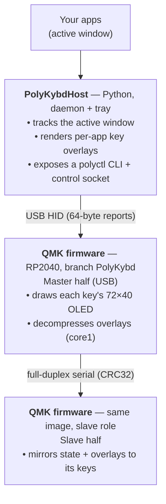

import { Aside, Card, CardGrid } from '@astrojs/starlight/components';

PolyKybd is not a single program — it is a small stack of open-source projects that each own one layer of the system. Understanding how they connect makes the rest of these docs easier to navigate.

## The big picture

The two keyboard halves run the **same firmware image**; which half is master is decided at runtime (the half with USB power). They stay in sync over a CRC32-validated full-duplex serial link.

<Aside type="tip">
Want the deeper version? [System Model & Data Flow](/development/system-model/) expands this
picture with the full HID command surface, the 8 MB flash map, and diagrams of the key
runtime processes — boot & split-link establishment, the overlay data path on an app switch,
display power states, resource flashing, and the core0/core1 offload.
</Aside>

## The repositories

<CardGrid>
  <Card title="Hardware" icon="seti:cpp">
    [thpoll83/PolyKybd](https://github.com/thpoll83/PolyKybd) — KiCad PCBs, aluminium plates, 3D-printable case and key stems, and the build documentation source.
  </Card>
  <Card title="Firmware" icon="seti:c">
    [thpoll83/qmk_firmware](https://github.com/thpoll83/qmk_firmware) (branch `PolyKybd`) — a customised QMK fork for the RP2040. Two variants, **split72** and **split42**, share one keymap codebase.
  </Card>
  <Card title="Host software" icon="seti:python">
    [thpoll83/PolyKybdHost](https://github.com/thpoll83/PolyKybdHost) — the Python app that drives the displays. Runs as a background daemon with a tray GUI client and a `polyctl` command-line tool.
  </Card>
  <Card title="Rendering & fonts" icon="seti:image">
    [thpoll83/adafruit-gfx-library](https://github.com/thpoll83/adafruit-gfx-library) — the GFX fork the firmware draws with, plus the `fontconvert` tool that builds the keycap fonts.
  </Card>
</CardGrid>

A fifth repository, [thpoll83/polykybd-ctnd](https://github.com/thpoll83/polykybd-ctnd), is a Raspberry Pi **hardware-in-the-loop** rig that flashes and tests firmware on real hardware as part of CI. It is development infrastructure rather than something you need to use the keyboard — see [Test Rig & CI](/development/test-rig/).

## How the layers talk

| Link | Transport | Notes |
|---|---|---|
| Host ⇄ keyboard | USB HID, 64-byte reports | Command protocol with a versioned `PROTOCOL_VERSION`; see the [HID Protocol Reference](/reference/hid-protocol/) |
| Master ⇄ slave half | Full-duplex serial (UART/PIO) | CRC32-validated split transactions carry state and overlay data |
| Firmware ⇄ displays | SPI + shift-register mux | One 72×40 OLED per key, plus a status OLED per half |
| Host ⇄ host (multi-machine) | TCP | A forwarder relays the active window from a second computer — see [Multi-Machine Setup](/using/multi-machine/) |

## What works without the host

The keyboard is a complete QMK keyboard on its own: every key types, layers work, and the displays show the static labels baked into the firmware. **PolyKybdHost is what makes the displays dynamic** — context overlays, live language switching, adaptive brightness and the keymap editor. You can also flash firmware straight from the host over HID, with no bootloader button.

<Aside type="tip">
New here? Read [Firmware Overview](/firmware/overview/) for the keyboard side and [What is PolyKybdHost?](/software/overview/) for the computer side. The [Glossary](/reference/glossary/) defines the project-specific terms used throughout.
</Aside>
