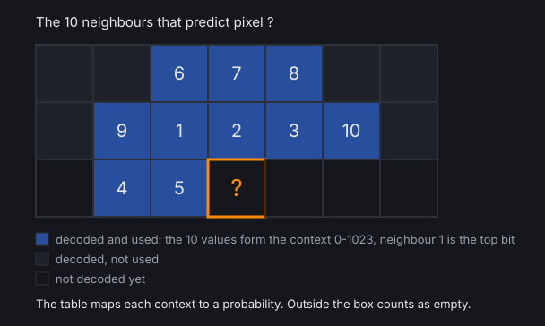
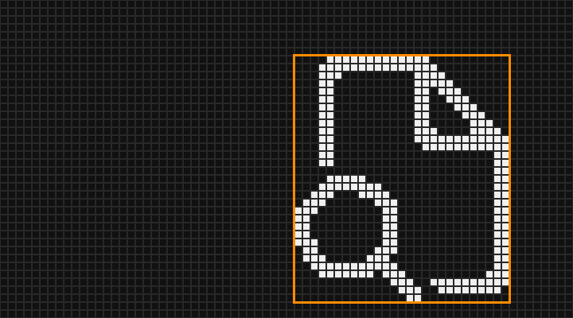

import { Aside } from '@astrojs/starlight/components';

PolyKybdHost talks to the firmware over a custom **raw HID** report protocol. The same protocol is used by the [HIL test rig](/development/test-rig/) to exercise the firmware in CI.

<Aside type="tip">
For a bird's-eye grouping of these commands by purpose (overlays, identity & language,
configuration, resource flashing) and how they fit the wider system, see the
[System Model & Data Flow](/development/system-model/#the-hid-command-surface) page.
</Aside>

## Report format

- **64-byte** raw HID reports.
- **Byte 0** — Report ID
- **Byte 1** — Command ID
- **Byte 2+** — payload

Responses are prefixed with the command echo plus a status marker:

- `"P\xNN."` — **ACK** (success), where `NN` is the command ID
- `"P\xNN!"` — **NACK** (rejected / unsupported / out of bounds)

The main dispatcher lives in the firmware's `hid_com.c` (`raw_hid_receive()`); a separate range
(`0x50`+) handles the resource-flash transport. The `PROTOCOL_VERSION`, reported inside the
**GET_ID** identity string, tells the host which commands this keyboard understands, so each
feature can be enabled or greyed out individually.

## Command areas

The commands are grouped below by purpose. IDs are shown in hex, with the decimal form where the
source commonly uses it.

### Identity & language

| Command | ID | Notes |
|---|---|---|
| **GET_ID** | `0x06` | Identity string incl. `PROTOCOL_VERSION` and firmware version, plus (v6+) a per-bundle [font-pack](/firmware/font-packs/) version block after the string's NUL. The connect handshake and liveness check. |
| **GET_LANG** | `0x07` | Query the active keyboard language. |
| **CHANGE_LANG** | `0x09` | Select the active language. |
| **GET_LANG_LIST_PACKED** | `0x1b` (27) | **v2+.** Language list as a count byte plus one 2-byte `(ISO 639-1 index, ISO 3166-1 alpha-2 index)` pair per language. The only language-list command on current firmware. |
| **GET_LANG_LIST (ASCII)** | `0x08` | **Retired.** Returned 4 ASCII chars per language; now NACKs (`P\x08!`). |
| **GET_DEFAULT_LAYER** | `0x16` (22) | Read/select the persisted default layer. |

### Overlays — the bulk data path

| Command | ID | Notes |
|---|---|---|
| **SEND_OVERLAY** | `0x0A` | Plain overlay: each 360-byte keycap in 6 × 60-byte segments. (v11 packs modifier + segment into one header byte so a 60-byte segment fits the report exactly.) |
| **START / SEND_COMPRESSED_OVERLAY** | `0x10` / `0x11` | RLE-compressed keycap in 1–2 packets; decompressed in firmware (optionally on RP2040 core1). The common case. |
| **START / SEND_ROI_OVERLAY** | `0x12` / `0x13` | Partial refresh of a region of a keycap's display. |
| **SEND_PRC_OVERLAY** | `0x29` (41) | **v19+.** [PRC](#prc-predictive-range-coding)-coded keycap images, several records per report. A typical icon codes to about a third of the bytes of the best older encoding. |
| **SEND_OVERLAY_MAPPING** | `0x15` (21) | Maps overlay pool slots to displays / usage bits, at a fixed 10 bits per index. **Silent since v3** (no per-chunk ACK). The only mapping command a pre-v12 keyboard understands. |
| **SEND_OVERLAY_MAPPING_W** | `0x21` (33) | **v12+.** The same mapping stream, but a width byte says how many bits each index uses (8–11), so the host packs each group of pairs as tightly as it fits. Also silent. |
| **OVERLAY_FLAGS on / off** | `0x0B` / `0x0C` | Enable/disable overlay rendering; enable force-syncs overlay state to the slave. |
| **SAVE_MRU** | `0x1A` (26) | Persist the keyboard's most-recently-used emoji / language picks. Unrelated to the host's overlay cache. |

### Configuration & display

| Command | ID | Notes |
|---|---|---|
| **SET_BRIGHTNESS** | `0x0D` (13) | Keycap OLED contrast; a flags byte selects volatile / host-auto (**v5+**). |
| **KEYPRESS** | `0x0E` (14) | Host-injected key event. |
| **IDLE_STATE** | `0x0F` (15) | Start / stop the [idle](/using/idle/) animation. |
| **SET_UNICODE_MODE** | `0x14` (20) | Select the OS unicode-input mode. Since **v17** a flag byte can apply it for this session only, leaving the stored mode alone. |
| **DISPLAY_OFF** | `0x18` (24) | Blank the keycaps. |
| **IDLE_STYLE** | `0x1C` (28) | **v4+.** Get/set the idle style (pulse / jitter). |
| **SET_OS** | `0x1D` (29) | Active host OS → modifier legends. |
| **GLYPH_SCRIPT** | `0x1E` (30) | **v9+.** Get/set the [glyph-script](/using/glyph-scripts/) override (open-ended index since v10). |
| **GLYPH_SIZE** | `0x22` (34) | **v13+.** Get/set the [legend size](/using/legend-size/) — how large a key's main legend is drawn. A closed range (0 small / 1 medium / 2 large); anything else NACKs. |
| **GET_LAYER_NAMES** | `0x23` (35) | **v14+.** Read-only. The keyboard reports how many layers it lets you remap and what each is called — the labels the [layout editor](/using/keymap-editor/) puts on its layer tabs. The reply leads with its own total length, then the count, then one NUL-terminated name per layer. |
| **MACRO_INFO** | `0x24` (36) | **v15+.** How many [macros](/using/macros/) the keyboard holds, how long a label may be, and how much of the shared body buffer is used. Read-only. |
| **MACRO_BODY** | `0x25` (37) | **v15+.** Read or write a window of the shared macro body buffer — offset, count, bytes. The bodies are NUL-separated, so the host reads the whole buffer, edits one and writes it back. |
| **MACRO_LABEL** | `0x26` (38) | **v15+.** Get/set one macro's label — the short text the keycap spells out along its bottom edge. |
| **CRASH_RECORD** | `0x27` (39) | **v16+.** Read the keyboard's last [crash record](/software/reporting-problems/#when-the-keyboard-firmware-crashes) — `0` this half, `1` the link-side half (pulled over the split link), `2` clears it. The reply is a flags byte (present / fresh) and the 48-byte record: crash kind, core, the faulting `pc`/`lr`/`sp`, what the firmware was doing, uptime and firmware version. |
| **IDLE_TIMEOUT** | `0x28` (40) | **v18+.** Get/set how long the keyboard waits before it starts [fading into the idle style](/using/idle/#how-long-before-it-idles) — a preset index (0 = 15 sec … 5 = 5 min), or `0xFF` to query. A closed range like `GLYPH_SIZE`: anything else NACKs. The reply carries both the preset **and** its duration in seconds, so a host older than the keyboard can still label a preset it has never heard of. |
| **BOOTLOADER / HANDEDNESS** | `0x17` / `0x19` | Enter bootloader; set which half is which. |

### Layer names — the reply format

`GET_LAYER_NAMES` answers with a payload that describes its own length, so a reader
knows when it has the whole thing without waiting for a timeout:

| Offset | Bytes | Meaning |
| --- | --- | --- |
| `0` | 1 | **total** — the whole payload length, this byte included |
| `1` | 1 | **count** — how many layers are named |
| `2…` | rest | `count` NUL-terminated ASCII names, at most 8 characters each |

With today's eight remappable layers that is 54 bytes, which fits a single 64-byte
report (three of which are the `P`, command and status header). A longer set simply
spans more reports; the reader concatenates each report's payload and stops once it
holds `total` bytes.

Two details follow from carrying the total rather than padding each name to a fixed
width. The zero fill at the end of the final report is never examined, because the
total already says where the names stop — so it can't be mistaken for a separator.
And a layer with **no** name is expressible: it is simply an empty entry, which stays
distinguishable from that fill.

### Resource-flash transport — BEGIN / CHUNK / COMMIT

| Command | ID | Notes |
|---|---|---|
| **FONTPACK_BEGIN** | `0x50` | Erase the target slot; a byte selects the target (font-pack bundle, firmware, resource pack). |
| **FONTPACK_CHUNK** | `0x51` | Sequential data chunks; deferred sector erase; bridged to the slave. |
| **FONTPACK_COMMIT** | `0x52` | Verify CRC32 and mark the slot present. |

The same three-command flow, with a different target byte, drives **firmware update**,
**font-pack bundles**, and other resource packs.

A firmware update may additionally carry an **Ed25519 image signature** (command `0x45`, sent
before COMMIT) that the keyboard verifies against a key built into its firmware. It is **additive**
— older hosts simply never send it, so there is no `PROTOCOL_VERSION` bump — and it is now
**enforced**. See [Firmware signing](/development/firmware/#firmware-signing).

Enforcement gives the firmware COMMIT four status bytes rather than two:

| Byte | Meaning |
|---|---|
| `.` | Accepted — the staged image verified. |
| `?` | Awaiting a physical **ACCEPT/REJECT** on the keycaps (unsigned image). Re-poll COMMIT until it changes; the staged image and its CRC are untouched between polls. |
| `S` | Refused — not validly signed (rejected at the prompt, timed out, or the signature failed to verify). |
| `!` | Staged-CRC mismatch. |

`?` and `S` are why the refusal reason is no longer guessed from a bare NACK. A COMMIT carrying
`'x'` in `data[2]` **cancels** a pending prompt — safe to expose over HID because it can only ever
deny, whereas accepting stays a keypress on the board.

<Aside type="caution">
A host that predates `?` has no case for it, falls into its generic failure branch and leaves the
progress dialog stalled while the keyboard stays modal for its full 60 s window. Update
PolyKybdHost before flashing an unsigned image.
</Aside>

<Aside type="note">
The bulk overlay commands (`0x0A`, `0x10`/`0x11`, `0x12`/`0x13`, `0x29`, and mapping on v3) are **not** ACK'd per chunk — the host follows a burst with a `GET_ID` liveness check rather than waiting for replies.
</Aside>

## PRC: Predictive Range Coding

Since **v19** the host has a fifth encoding for keycap images: **PRC**, short for
*Predictive Range Coding*. Host and firmware must both be on v19 or later; with an older
keyboard the host keeps using the four older encodings.

PRC is a context-model binary arithmetic coder, the scheme JBIG uses for fax images:

- **Context model.** Before a pixel is decoded, 10 already-decoded pixels in a fixed causal
  template (two rows above, two columns to the left) form a 10-bit context, 0–1023. A fixed
  1 KB table maps each context to P(pixel is clear). Keycap icons are mostly clear area and
  clean stroke edges, so for most pixels the table's prediction is near 0% or 100%.
- **Range coding.** A binary range coder turns those probabilities into bits. A pixel's code
  length is its information content, −log₂ p, where p is the probability the table gave its
  actual value: a correctly predicted pixel costs a fraction of a bit, a mispredicted one
  several bits. The table was trained once on the shipped overlay templates and is compiled
  into the firmware.



Only the bounding box (ROI) of the set pixels is coded. A typical icon's coded payload is about
28 bytes, against about 87 for the best of the older encodings. Each record adds a 6-byte header,
and a report carries 62 bytes after its `P` and command byte. So most icons need one report, and
two records share one when together they fit in 62 bytes. Across the 118 shipped templates, the image reports of an uncached app
switch fall to 40% (4348 → 1753); a JetBrains IDE goes from 205 to 81.

The host decides per image: an image goes out as PRC only if its record fits one report, which
is never more reports than an older encoding would take. Larger images keep the old path.

### Worked example: a 10 × 10 square

Take a solid 10 × 10 square: a 100-pixel ROI with every pixel set. Uncoded, it takes 100 bits
(13 bytes). The coder visits the pixels in raster order. Context pixels outside the ROI count
as clear.

| Pixel (row, column) | Context | P(set) from the table | Code length |
|---|---|---|---|
| (0, 0), first pixel | all 10 outside the ROI, so all clear | 1.6% | 6.0 bits |
| (0, 1) | left neighbour set | 86% | 0.21 bits |
| (1, 0) | row above set, left neighbours clear | 80% | 0.31 bits |
| (1, 5) | row above and left neighbours set | 99.6% | 0.006 bits |
| (5, 5) | all 10 set | 95% | 0.075 bits |
| (9, 9), last pixel | set, but the upper-right context pixels lie outside the ROI | 80% | 0.32 bits |

The figure shows the code length of all 100 pixels. The colour scale runs from dark blue
(predicted, near zero bits) to red (mispredicted):


Only the first pixel is mispredicted. Every later pixel matches the prediction, so the 100
pixels together carry 19.2 bits of information. The coder's initial and flush bytes bring the
payload to **6 bytes**, and the record to 12.

The table was trained on real icons, which are mostly 1–2 px strokes. So a pixel whose whole
context is set (95%) is predicted less confidently than one continuing a stroke edge (99.6%):
large filled areas are rare in the training set.

### Worked example: a real icon

VS Code's `Ctrl+P` (*Quick Open*) shows the Fluent *Document Search* icon. Its set pixels fit a
27 × 31 px ROI (orange) in the top-right corner of the 72 × 40 px keycap:



| Encoding | Bytes | Reports |
|---|---|---|
| Plain (`0x0A`) | 360 | 5 (all-clear segments are skipped) |
| RLE, whole keycap (`0x10`/`0x11`) | 154 | 3 |
| ROI, uncompressed (`0x12`/`0x13`) | 105 | 2 |
| ROI, RLE (`0x12`/`0x13`) | 139 | 3 |
| **PRC** (`0x29`) | **26 + 6-byte header** | **1, with 30 bytes left** |

The best older encoding needs 2 reports. The PRC record is 32 bytes, which leaves 30 of the
report's 62 bytes. The next record joins it if its whole record, header included, fits in those
30 bytes; otherwise it starts a new report.

Where do the 26 bytes go? The next figure colours each of the ROI's 837 pixels by its code
length, on the same scale as the square; set pixels have a white outline:


- **A** is set where the table gave P(set) = 1.6%: the page's bottom edge resumes after the gap
  for the magnifier's handle, and no context pixel indicates it. 6 bits, the same as the
  square's first pixel.
- **B** is clear where the table gave P(set) = 94.9%: the context matches a continuing stroke,
  but the handle ends there. 4.3 bits.
- **C** lies inside the page's right edge. The context is unambiguous, P(set) = 99.2%, and the
  pixel costs 0.01 bits.

Most of the ROI behaves like C. 610 of the 837 pixels (73%) cost under 0.1 bit each, 18 bits
in total. 43 pixels (5%), the stroke starts, ends and corners, carry 61% of the 185.6 bits.
That is why PRC gains the most on line icons: long strokes, few stroke ends.

**Report layout.** After `P` and `0x29`, the report carries records back to back. A keycode byte
of 0 (the zero padding) ends the list.

| Field | Bits | Content |
|---|---|---|
| keycode | 8 | Addresses the image like the other upload commands |
| modifier | 4 | Modifier variant 0–15 |
| top, left | 6, 7 | Top-left corner of the ROI |
| height − 1, width − 1 | 6, 7 | ROI size |
| length | 6 | Payload bytes that follow |
| reserved | 4 | Must be 0 |
| payload | length × 8 | The range-coded ROI |

<Aside type="caution">
The table is part of the format. Host and keyboard must use the identical 1 KB table, or the
keycaps show garbage and nothing reports an error. A retrained table would be a new protocol
version, never a change to table v1.
</Aside>

## Overlay addressing

A keycap image is addressed by **90 keycap slots × 16 modifier variants**:

```
overlay_index = keycode_slot + 90 * modifier_variant
```

Since **v12** the modifier variant is simply the modifier bitmask — bit 0 Ctrl, bit 1 Shift,
bit 2 Alt, bit 3 GUI — so all 16 combinations are addressable and the numbering is self-describing
(variant 0 = bare, 5 = Ctrl+Alt, 10 = GUI+Shift, 15 = all four). Before v12 there were 9 variants
and GUI could not be combined with anything.

That index is an **address, not storage**. It selects an entry in a lookup table that points at
one of **600 slots** in the image pool (360 bytes each, ≈ 211 KiB). Variants that share the same
artwork share a slot, so adding variants costs address space rather than image memory — which is
why v12 grew the addressable set from 810 to 1440 without needing more room for pixels.

## Protocol versions

The firmware advertises a `PROTOCOL_VERSION` (in the GET_ID string) that the host reads to decide
which commands to use. **The versions do not have to match.** The host connects to any keyboard
from v2 onwards and then gates each feature on its own:

- **Same version** — everything works.
- **Keyboard older than the host** — it still connects, and only the features that keyboard is too
  old for are greyed out, with a *"some features need a firmware update"* hint.
- **Keyboard newer than the host** — the host asks what you want to do, defaulting to a safe
  connect that sticks to the stable command set until you update the host app.
- **Older than v2** — refused, with *"Firmware too old… please update the keyboard firmware"*.
  The host cannot even list the keyboard's languages below that.

Selected milestones:

- **v2** — the **packed language list** (`0x1b`): a count byte plus one 2-byte ISO index pair per language, replacing the 4-ASCII-char legacy list. The legacy list (`0x08`) is retired and NACKs.
- **v3** — the **overlay-mapping** command (`0x15`) made **silent** (no per-chunk ACK), matching the other bulk overlay commands and removing a frequent source of stale replies.
- **v4** — **IDLE_STYLE** (`0x1c`): choose the idle anti-burn-in style (pulse / jitter).
- **v5** — a **brightness flags** byte on `SET_BRIGHTNESS` (`0x0d`): volatile vs host-auto.
- **v6** — a **per-bundle font-pack version block** appended to the GET_ID reply, so the host flashes only the bundles a keyboard is missing or behind on.
- **v9** — **GLYPH_SCRIPT** (`0x1e`): override the letter/digit legends with an alternative script.
- **v10** — the glyph script became an **open-ended index** (an unknown script renders the normal legend), so new scripts ship without a protocol bump.
- **v11** — the **plain overlay upload** (`0x0a`) packs modifier + segment into one header byte, so a full 60-byte segment fits a 64-byte report exactly.
- **v12** — **GUI combines with the other modifiers** for [app overlays](/howto/app-overlays/): `Cmd+Shift`, `Cmd+Alt` and the rest each get their own artwork instead of all falling back to the plain GUI icon, taking the addressable modifier variants from 9 to 16. The upload commands are unchanged, but the wider index space no longer fits the fixed 10-bit fields of `0x15`, so **SEND_OVERLAY_MAPPING_W** (`0x21`) was added alongside it.
- **v13** — **GLYPH_SIZE** (`0x22`): the [legend size](/using/legend-size/) — draw a key's main legend at one of three sizes, leaving the Shift/AltGr previews alone. Unlike the glyph script, the range is closed: the keyboard refuses a size it doesn't know, because an accepted-but-unrenderable size would look like a setting that does nothing.
- **v14** — **GET_LAYER_NAMES** (`0x23`): the keyboard names its own remappable layers, so the [layout editor](/using/keymap-editor/) labels its tabs from the board in front of you rather than from a list baked into the host at build time. It reports the same layer count as the existing count command, so the editor can never draw a tab it has no name for.
- **v15** — **macros** (`0x24`–`0x26`): store text or a short key sequence on the keyboard and type it back with one key, with a short **label the keycap spells out** so a row of macro keys reads `push`, `work mail`, `sign off` rather than M0, M1, M2. All three commands sit behind a single feature gate — a host that could read the macro list but not the bodies would draw an editor over data it cannot fetch. See [Macros](/using/macros/).
- **v16** — **CRASH_RECORD** (`0x27`): the firmware records a hardware fault, an unexpected exception or a watchdog restart, reboots through it, and announces it on its next boot — on the console (which the host turns into an alert) and over this command. See [when the keyboard firmware crashes](/software/reporting-problems/#when-the-keyboard-firmware-crashes).
- **v17** — a **volatile** flag on `SET_UNICODE_MODE` (`0x14`): apply a unicode mode for this session only, without storing it. It exists for the Windows logon screen, where the host cannot yet tell *WinCompose is not installed* from *WinCompose has not started yet* — so it applies its first reading volatile and only writes the mode down once it can tell the two apart. Before this, every logon on a WinCompose machine stored `Windows` and then wrote `WinCompose` back over it.
- **v18** — **IDLE_TIMEOUT** (`0x28`): how long the keyboard waits before it starts fading into the [idle style](/using/idle/#how-long-before-it-idles) becomes a setting — six presets from 15 seconds to 5 minutes — where it used to be fixed at 2 minutes when the firmware was built. 2 minutes stays the default, so a keyboard nobody touches behaves as it always did. Like the legend size and unlike the glyph script, the range is closed: a keyboard refuses a preset it doesn't know, because an accepted one would be stored and then silently resolved to some other duration.
- **v19** — **SEND_PRC_OVERLAY** (`0x29`): [PRC](#prc-predictive-range-coding) (Predictive Range Coding), a fifth keycap-image encoding that codes a typical icon to a payload of about 28 bytes. The host uses it per image, only where it saves a report; the older encodings stay.

<Aside type="note">
Not every version number above is a separate feature listed here — the list highlights the
milestones that changed the command surface. Host and firmware are still released together at the
same `PROTOCOL_VERSION`, so keeping both current is the simplest way to have everything available —
but a mismatch costs you only the newer features, not the connection.
</Aside>

<Aside type="tip">
Run PolyKybdHost with `--dev 2` to log the raw HID traffic — the cleanest way to see these commands and their ACK/NACK responses on the wire.
</Aside>
