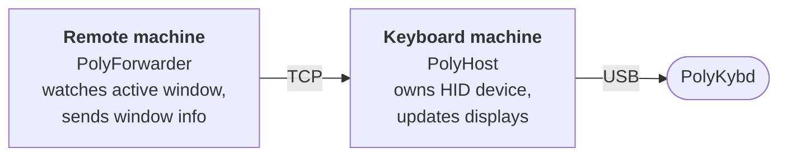

import { Aside } from '@astrojs/starlight/components';

PolyKybdHost supports a forwarder mode that lets a single PolyKybd serve multiple computers. The keyboard is physically connected to one machine, but the key displays reflect the active window on whichever machine you are currently using.

## How it works



- **Keyboard machine**: running PolyKybdHost in normal mode, physically connected to the keyboard
- **Remote machine(s)**: running PolyKybdHost in forwarder mode (`--host <IP>`), no keyboard attached

When focus changes on a remote machine, it sends the window title and app info over TCP to the keyboard machine, which then updates the key displays.

## Setup

1. **On the keyboard machine:** run PolyKybdHost normally:
   ```sh
   python -m polyhost
   ```

2. **On each remote machine:** run PolyKybdHost in forwarder mode, pointing at the keyboard machine's IP address:
   ```sh
   python -m polyhost --host 192.168.1.100
   ```

   Or use a file containing the IP (useful if the address changes):
   ```sh
   python -m polyhost --host-file /path/to/host.txt
   ```

By default the forwarder uses the legacy plaintext TCP relay on **port 50162**. Make sure the keyboard machine's firewall allows inbound TCP on that port.

<Aside>
Check the Settings dialog or logs for the port number in use if you have changed it from the default.
</Aside>

## Advanced: secured window-report RPC

For setups where you'd rather not expose the device-control surface over the network, there is an opt-in, authenticated **`window.report` RPC** path on **port 50163**. It is a *separate* listener from the default plaintext relay: it serves only window reports — it carries no device-control, firmware-flash, or bootloader access — and is gated by its own authentication key.

It is **off by default**. Enable it on the keyboard machine (via the `window_report_network_enabled` setting) and have the forwarder push to it with `--report-rpc`. The plaintext relay on port 50162 remains the default unless you switch.

## Use case

A common setup: a desktop (with the keyboard) and a laptop. When you switch to the laptop and start typing, the forwarder detects the focus change and notifies the desktop. The keyboard displays update to reflect the laptop's active app — all while the keyboard stays physically on the desk connected to the desktop.
