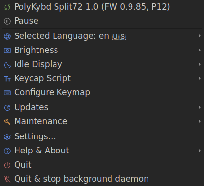
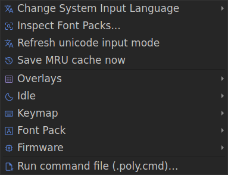

import { Aside } from '@astrojs/starlight/components';

Once PolyKybdHost is running, it lives in your system tray (Windows) or menu bar (macOS). A small PolyKybd icon indicates it is active and connected. The tray app is a client of the background daemon that owns the keyboard — see [Daemon & Client Model](/software/architecture/).

## System tray menu

Right-click the tray icon. The menu is deliberately short — everything you need for
normal use, and nothing else:



| Entry | What it does |
|---|---|
| *Status line* | The connected keyboard and its firmware. Clicking it is a shortcut for **Pause** below. |
| **Pause** | Stop talking to the keyboard — it keeps typing, the overlays just stop updating. Reads **Resume** while paused. |
| **Language** | Pick the keyboard's layout language, grouped by region. |
| **Brightness** | Keycap brightness presets, plus **Back to automatic** — see [Display Brightness](/using/brightness/). |
| **Idle Display** | What the keycaps do while you're away — see [Idle & Burn-in Protection](/using/idle/). |
| **Keycap Script** | Theme the letter legends — see [Glyph Scripts](/using/glyph-scripts/). |
| **Configure Keymap** | Remap keys without reflashing — see [Keymap Editor](/using/keymap-editor/). |
| **Updates** | Host app, keyboard firmware, keyboard fonts, and [WinCompose](/software/wincompose/) (Windows). |
| **Maintenance** | Fix left/right sides, reset overlays or the keymap, flash a firmware file, enter the bootloader. |
| **Settings** | Brightness, unicode mode, daemon mode and the rest. |
| **Help & About** | About, the log viewer, and **Open config folder**. |
| **Quit** | Close the tray app. The daemon keeps running, so the keyboard stays live. |

Two entries only appear when they apply: **Install WinCompose…** while
[WinCompose](/software/wincompose/) is not running, and a **Firmware newer than this
app** warning if the keyboard is running firmware this version of PolyKybdHost doesn't
fully know yet (click it to choose how to handle that).

<Aside type="tip">
**Updates → Keyboard fonts** tells you the answer before you click: it reads either
*"Keyboard fonts: up to date"* or *"Update keyboard fonts (2)…"* with the outdated
bundles named in its tooltip. See [Font Packs](/firmware/font-packs/).
</Aside>

### Developer mode

Diagnostic and power-user tools — overlay resets, font-pack inspection, staged
firmware, keymap dumps — live in a separate **Developer** submenu that is hidden by
default. Turn it on in **Settings → Developer → Mode** (then restart the app), or start
with `--dev` for one session.



Switching it on **only adds** the Developer submenu; nothing else in the menu moves,
so you can leave it on without relearning where things are.

<Aside type="note">
The screenshots on this page are rendered from the app itself, so they show the real
labels and order. Your desktop draws its own menu style, and a couple of entries are
conditional — "Quit && stop background daemon" appears when a daemon owns the keyboard
(the default), and the in-process-only debugging entries are absent in that mode.
</Aside>

## What the app drives

The tray app is the front-end for the keyboard's live features — each has its own page under
**Using the Keyboard**:

- [Context-Aware Overlays](/using/overlays/) — the keycaps follow your active window automatically.
- [Display Brightness](/using/brightness/) — presets in the **Brightness** submenu, adaptive daylight (**Settings → Brightness**), or the optional light sensor.
- [Languages & Unicode Input](/using/languages/) — the OS unicode mode selected on the keyboard is synced here, and settable from the Settings dialog.
- [Glyph Scripts](/using/glyph-scripts/) — theme the legends from the **Keycap Script** submenu.

## Firmware updates

You can flash new firmware directly from the tray: **Updates → Check for keyboard firmware
update…** fetches the latest release for you, and **Maintenance → Flash firmware file
(.bin)…** takes a `.bin` you already have. Flashing works over HID and is available even when the keyboard is on a protocol version the rest of PolyKybdHost doesn't fully support, so a mismatched keyboard can always be updated. The same operation is available from the command line with `polyctl fw flash` — see [Command Line](/software/cli/) and [Flashing Firmware](/setup/flashing/).

## Installing WinCompose (Windows)

[WinCompose](/software/wincompose/) is what lets the keyboard type arbitrary unicode
on Windows — emoji, accents and the language layers all go through it. When it is not
running, the tray menu offers **Install WinCompose…**: it downloads PolyKybd's build
from GitHub and starts the installer (Windows asks you to confirm the elevation).

The entry appears only on Windows, and only while WinCompose is not running — it
disappears by itself once WinCompose is up. At that point the keyboard is switched to
compose mode straight away; the unicode input mode is otherwise only sent when the
keyboard connects, so no replug is needed. `polyctl unicode-mode` does the same
re-detection from the command line.

## Debug logging

If something is not working as expected:

```sh
python -m polyhost --dev        # developer mode + basic logging
python -m polyhost --dev 2      # developer mode + verbose HID traffic logging
python -m polyhost --dev 0      # force developer mode off for this run
```

`--dev` turns on developer mode **and** raises the log level. If you only want the
developer tools without the extra logging, enable **Settings → Developer → Mode**
instead and start the app normally.

The Log Viewer (tray menu → **Help & About → Log file…**) shows the same output in a GUI window. When running with the daemon, its activity appears under the **Daemon Log** tab.

<Aside>
If the keyboard is not detected, check that the udev rule is installed on Linux (see [Installation](/setup/installation/)), or that the device is not claimed by another HID consumer.
</Aside>
