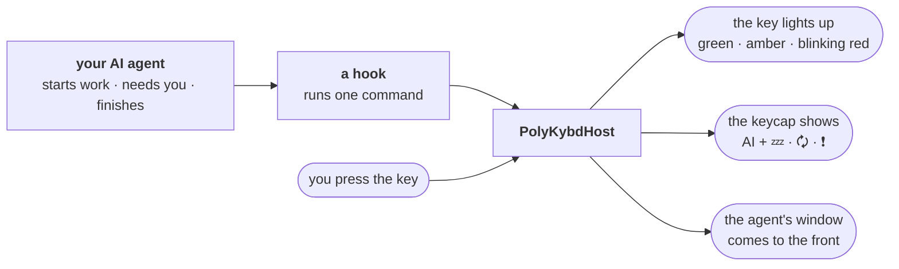
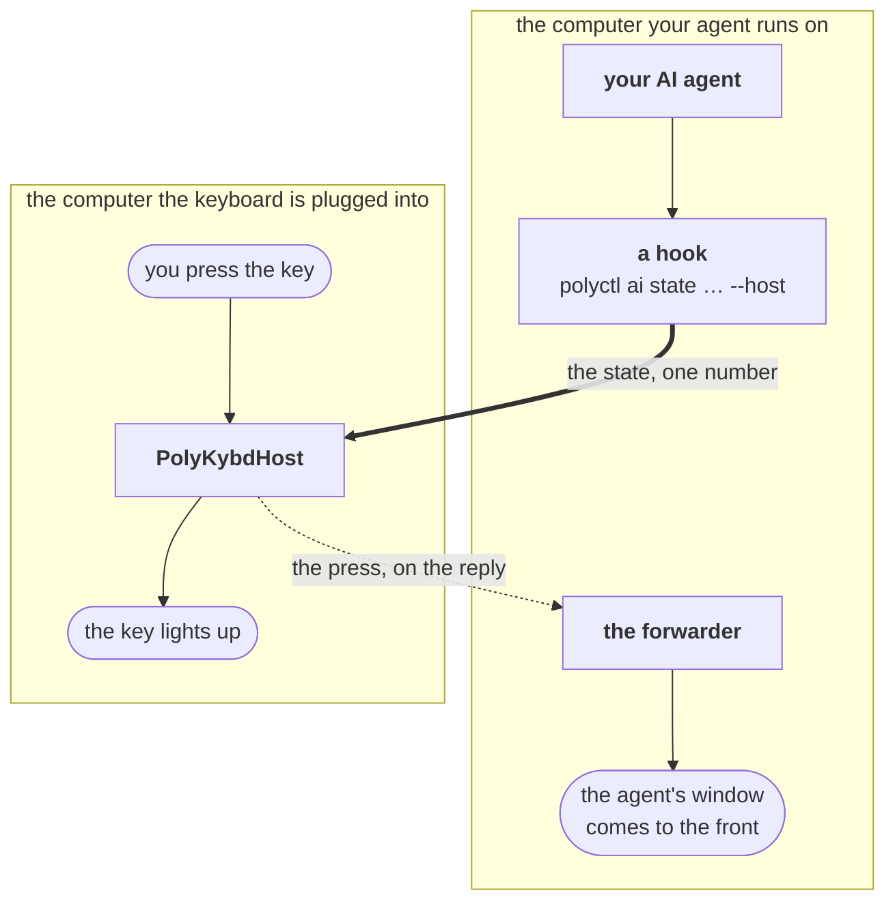

import { Aside } from '@astrojs/starlight/components';
import SupportedSince from '../../../components/SupportedSince.astro';

<SupportedSince protocol={18} />

Working with an AI agent means glancing at a window to find out whether it is still busy or
waiting on you. The **AI key** puts that answer on the keyboard: the key lights up in the colour
of the agent's state, spells the state out on its keycap, and brings the agent's window back to
the front when you press it.



## What the key shows

| State | The light | The keycap |
|---|---|---|
| **off** | your normal [RGB lighting](/using/rgb-lighting/), untouched | `AI` |
| **idle** | steady green, fading out after a minute | `AI` over 💤 sleeping |
| **busy** | breathing amber, for as long as it takes | `AI` over 🗘 turning arrows |
| **needs you** | blinking red, fading out after a minute | `AI` over ❗ |

Only the red state blinks. A light that blinks all the time is just a light — the blink is what
is meant to pull your eye back to the keyboard, so it is spent on the one state that wants you.

**Green and red go out after a minute; amber does not.** Idle and "needs you" are states an agent
can sit in for hours, so once you have seen the light it has done its job and the keyboard goes
back to looking like a keyboard. Busy is bounded by the work itself, and it is the one state
where a glance across the desk has to answer *is it still going?* — so the amber stays until the
agent says otherwise. The keycap keeps showing the state either way, and any change of state
lights the key again.

The keycap spells the state out as well as lighting it, so the key still answers the question on
a split42 (which has no RGB matrix) and without relying on colour vision.

<Aside type="note" title="Where the key is">
Nowhere, until you put it somewhere. The stock keymap does not spend a key on this — the
feature is off by default, so a shipped AI key would sit there doing nothing on most
keyboards. Assign it to whichever key you can spare with the
[Keymap Editor](/using/keymap-editor/); it works on any layer and any base layout, and the
status light follows it there.
</Aside>

## Setting it up

<Aside type="note" title="You need the release that carries it">
The AI key arrived with firmware **protocol v18** and the matching host app. On anything older
there is no AI key at all — that position is still whatever it was before, and `polyctl ai`
reports that the firmware is too old for the status light. Update the host app from the tray
(**Updates → Check for updates**), then the keyboard from the same menu; the key and the commands
that drive it arrive together.
</Aside>

### 1. Turn the feature on

The AI key ships **off**. Until you switch it on the key's light stays dark, its keycap reads
`AI`, and a press is noted in the log and raises nothing — because a light that can never change
is worse than no light at all.

```
polyctl settings set ai_key_enabled true
```

<Aside type="note" title="On a multi-machine setup, turn it on in both places">
The keyboard machine needs it for the light and the press; the machine your agent runs on needs
it for the window the press raises. See [Across two computers](#across-two-computers) below.
</Aside>

### 2. Say which window the key should raise

The target is a piece of the window title, matched without regard to case. Write it as `/…/` if
you want a regular expression instead.

```
polyctl ai target "Claude Code"
polyctl ai status
```

`status` prints the state the keyboard is showing, the target, and every window matching it right
now — which is the quickest way to check the pattern before you rely on it.

### 3. Have your agent report its state

Everything is driven by one command, so anything that can run a command can drive the key:

```
polyctl ai state busy
polyctl ai state attention
polyctl ai state idle
polyctl ai state off
```

`busy`, `running`, `done`, `ready`, `waiting`, `ask` and `input` are understood too, so a script
can use its own vocabulary.

Most agents can run a command when something happens, and PolyKybdHost ships one adapter that
understands the common shapes — `contrib/ai-hooks/polykybd_ai_hook.py`.

**Claude Code** reports all three states. In `~/.claude/settings.json`:

```json
{
  "hooks": {
    "UserPromptSubmit": [{"hooks": [{"type": "command",
       "command": "python3 ~/PolyKybdHost/contrib/ai-hooks/polykybd_ai_hook.py"}]}],
    "Notification":     [{"hooks": [{"type": "command",
       "command": "python3 ~/PolyKybdHost/contrib/ai-hooks/polykybd_ai_hook.py"}]}],
    "Stop":             [{"hooks": [{"type": "command",
       "command": "python3 ~/PolyKybdHost/contrib/ai-hooks/polykybd_ai_hook.py"}]}]
  }
}
```

`Notification` is the event that turns the key red — it fires when Claude Code wants a permission
answer or your input.

**OpenAI Codex CLI** has a single notification event, `agent-turn-complete`, so it can turn the
key green when a turn ends but cannot report "busy" or "needs you" on its own. In
`~/.codex/config.toml`:

```toml
notify = ["python3", "/home/you/PolyKybdHost/contrib/ai-hooks/polykybd_ai_hook.py"]
```

…and set the other two states where you start it:

```sh
polyctl ai state busy && codex ; polyctl ai state idle
```

**Anything else** — call `polyctl ai state <state>` from wherever that tool lets you run
something. No adapter needed.

## Pressing the key

One press raises the window your target matches. Press it again and the next matching window
comes forward instead, so several agent sessions at once still works — each press walks one step
through the list.

<Aside type="caution" title="Three things that look like a broken key">
**Nothing set.** With no target the press cannot know what to raise; the app says so in a
notification rather than doing nothing quietly.

**A Wayland session.** Native Wayland gives no way for an application to raise another
application's window, so the press is received and nothing comes forward. This is the same limit
that stops window tracking working there — an X11 (or XWayland) session does not have it.

**Mid-update.** While the keyboard is being flashed, presses are not received. Press again once
the update finishes.
</Aside>

## Across two computers

Agents are often not on the machine the keyboard is plugged into — a work laptop beside a desktop,
a headless box you drive over a remote desktop. The AI key crosses that gap using the same
[multi-machine](/using/multi-machine/) setup the rest of PolyKybd uses: PolyKybdHost runs on the
keyboard machine, the **forwarder** runs on the machine you are working on.



Both halves ride the forwarder's existing authenticated connection, so there is nothing new to
open on the machine your agent runs on — the press comes back as the answer to a window report
the forwarder is sending anyway.

**On the keyboard machine**, alongside the normal multi-machine setup:

```
polyctl settings set ai_key_enabled true
polyctl settings set window_report_network_enabled true
```

**On the machine your agent runs on**, run the forwarder with `--report-rpc`, then:

```
polyctl settings set ai_key_enabled true
polyctl ai target "Claude Code"
```

…and point your hook at the keyboard machine:

```
polyctl ai state busy --host 192.168.1.20
```

<Aside type="note" title="The target belongs to the machine that has the window">
`ai target` is set on the machine the **agent** runs on, because that is where the window is.
`ai state --host` goes the other way, to the machine the **keyboard** is on. Getting these the
wrong way round is the one thing that reads as a broken key here — `polyctl ai status` on each
machine tells you which is which.
</Aside>

While an agent is reporting a state the forwarder checks in about once a second, so a press
arrives within a second or so. The rest of the time it keeps its usual quiet 15-second rhythm.

## What it does not do

**Agents that live in a browser tab.** The key raises a *window*, and a hosted agent — Claude Code
on the web, ChatGPT, anything in a container you reach through a browser — is a tab, not a window.
A press brings the browser forward if your target matches its title, and stops there: it will not
switch tabs, and a hook running inside a hosted container has no route back to your keyboard. The
key is built for an agent running on a computer you control, locally or through the forwarder
above.

**Remember anything.** The keyboard is told a state — it never asks for one, and it holds no
memory of it. A keyboard reboot leaves the key dark until the next report; the host re-sends the
last state it knew when the keyboard comes back.

Nothing about your agent, your prompts or your window titles is sent anywhere. The state is a
single number, the window matching happens on the machine the window is on, and across two
computers the only thing that crosses is that number in one direction and a press count in the
other.
