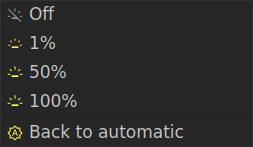
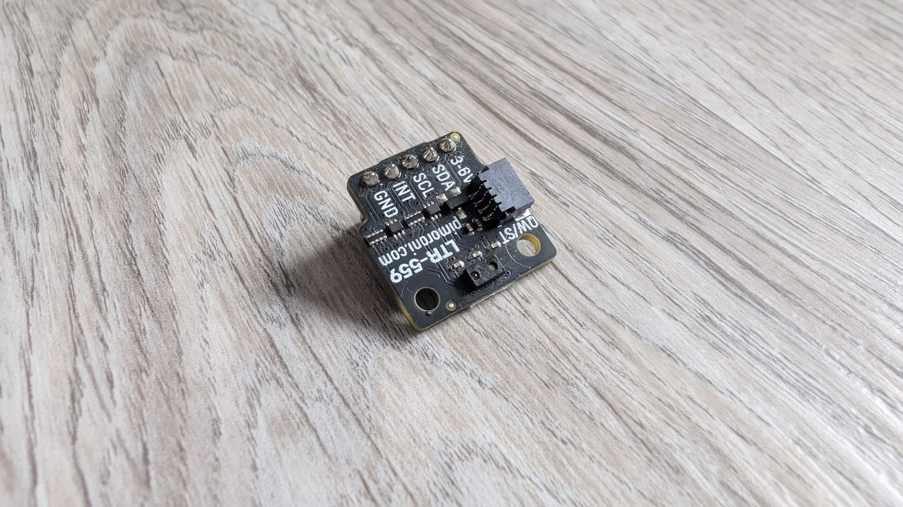

import { Aside } from '@astrojs/starlight/components';

The per-key OLEDs can be dimmed and brightened three different ways. Whichever you use, a
**manual** change always wins until you re-enable automatic mode.

## Manual

- **On the keyboard** — the brightness preset keys step the keycap OLEDs up and down.
- **In PolyKybdHost** — pick a level from the tray's **Brightness** submenu, or set one
  under **Settings → Brightness**.
- **Command line** — `polyctl brightness <0–100>`.

A manual set switches automatic mode off, so the board holds exactly the level you picked.

### Going back to automatic

A manual level sticks until something turns automatic mode back on — the keyboard will
not do it by itself, not even after the sun comes up. To hand control back, choose
**Brightness → Back to automatic** in the tray (or run `polyctl brightness --auto`).

If adaptive daylight brightness is switched off in Settings, that entry reads **Clear
manual override** instead: there is no automatic source to return to, so it just puts
the keyboard back on its own stored level.

## Adaptive (daylight)

PolyKybdHost can follow the sun: with location access enabled it computes the solar
irradiance for your position and time of day and drifts the brightness up during the day and
down in the evening. Enable it under **Settings → Brightness**. It refreshes roughly every ten
minutes.

## On-board light sensor (optional)

The **Split72** has an expansion port for an optional ambient-light + proximity sensor
(Pimoroni LTR-559). If one is fitted, the keyboard drives its **own** brightness from the
measured light level — much faster than the host's daylight estimate (roughly twice a second)
— and overrides the host's daylight value while automatic mode is on.

The same sensor reads **proximity**: reach toward the keyboard and the displays wake before you
even press a key.

<Aside type="note">
The sensor is entirely optional and side-agnostic — it works on whichever half it's soldered
to, and a keyboard without one simply uses the manual/daylight paths above. It is a Split72-only
feature (the Split42 has no expansion port).
</Aside>

<Aside type="tip">
Fitting the sensor is the **very first** assembly step — it does not fit through the plate hole,
so it can't be added later without a near-complete teardown. See the soldering instructions in the
[Step-by-Step Build Guide](/assembly/step-by-step/) and the [Parts List](/assembly/parts-list/#ambient-light--proximity-sensor-highly-recommended).
</Aside>

<Aside type="tip">
A manual brightness change (preset keys or an explicit set) always takes over from any automatic
source until you turn automatic mode back on or reboot — so you're never fighting the sensor.
</Aside>
