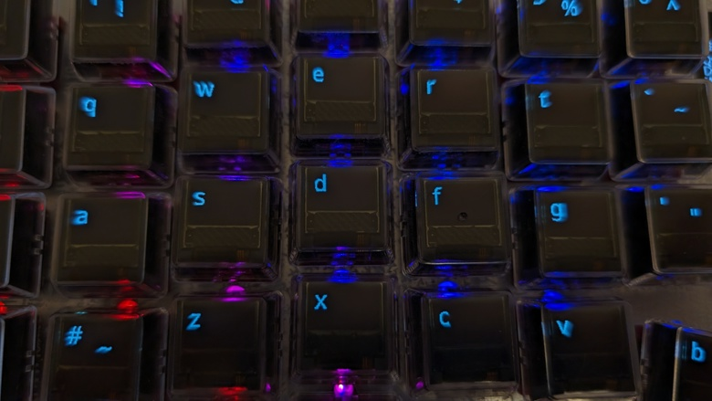

import { Aside } from '@astrojs/starlight/components';
import SupportedSince from '../../../components/SupportedSince.astro';

OLED pixels that show the same legend for hours can burn in. To prevent that, PolyKybd moves
through a few states while you're away and wakes instantly the moment you come back.

## The idle sequence

1. **Awake** — normal, full-brightness legends.
2. **Fade** — after an idle timeout the keycaps dim.
3. **Idle** — the displays run an anti-burn-in animation (see below).
4. **Off** — after a longer timeout the keycaps switch off entirely.

Any key press wakes them — and if the optional [light sensor](/using/brightness/#on-board-light-sensor-optional)
is fitted, so does reaching toward the board.

## Idle styles

| Style | What it does |
|---|---|
| **Pulse** *(default)* | Each key gently "breathes" its brightness out of phase with its neighbours. The lit pixels don't move — simple, and the legend stays glanceable. |
| **Jitter** | Keeps the breathing, but each key also relocates its legend to a fresh random spot whenever its own pulse dims it to black. The lit pixels migrate per key, so no pixel stays lit in one place. |
| **Eden** | A full-screen screensaver: a procedural "comet field" streams across all keycaps, with the key legend drifting over it as a dim overlay. Pretty rather than glanceable — the moving pixels give strong burn-in protection. |
| **DOOM (IDDQD)** | Plays the DOOM easter-egg's attract demo across the keycaps as a screensaver. Needs the DOOM egg installed first (see the caveat below) — otherwise selecting it has no effect. |

Pulse and jitter keep the dimmed legend readable so you can glance down and resume typing;
jitter adds stronger burn-in protection by moving the lit pixels. Eden and DOOM trade that
glanceability for a full moving picture — they're screensavers, so the pixels never rest in
one place. Any key press dismisses them instantly.

<Aside type="note">
The **Eden** screensaver runs on the **split72** keyboard only. On the split42 it falls back
to Pulse. You can also replay the Eden animation once (as a boot-style intro rather than a
loop) from the host or the `EDEN` keycode.
</Aside>

<Aside type="caution" title="DOOM needs the easter egg installed">
Unlike the other three, the **DOOM (IDDQD)** screensaver isn't built into the standard
firmware — it only works once you've set up the DOOM easter egg: flash the **DOOM-pack
firmware**, then install the game data (`polyctl doom install doom1.whx`) and the engine pack
(`polyctl doom install-pack doom_pack_v2.plyx`). The shareware game data is a free download
(`keyboards/polykybd/doom/tools/dl-doom-data.sh`, or grab it from a release). Without the game
data the demo falls back to a placeholder fire animation; on firmware without the DOOM pack,
choosing this style simply does nothing.
</Aside>

## Choosing a style

<SupportedSince protocol={4} note="selectable idle style" />

- **Tray menu** — right-click the PolyKybdHost tray icon → **Idle Anti-Burn-In** →
  *Pulse*, *Jitter*, *IDDQD*, or *Eden*.
- **Command line** — `polyctl idle-style pulse` (or `jitter`, `iddqd`, `eden`).

Your choice is saved on the keyboard and persists across reboots.

<Aside type="note">
Each half runs its own idle animation on its own keys — only the *style* (pulse, jitter,
Eden or DOOM) crosses the split link. See [Display power states](/development/system-model/#display-power-states)
for the full state machine.
</Aside>
