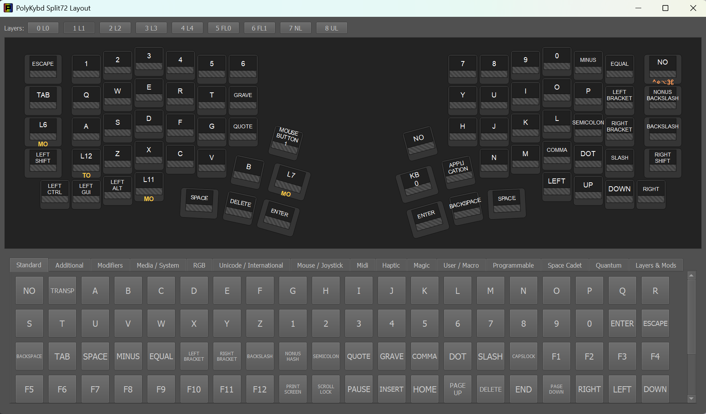

import { Aside } from '@astrojs/starlight/components';

The Layout Editor in PolyKybdHost lets you remap any key on any layer directly, without recompiling or reflashing firmware. Changes take effect immediately and are stored in the keyboard's flash memory.

## Opening the editor

Right-click the PolyKybdHost tray icon → **Layout Editor**.

## Using the editor

1. Select a layer using the layer tabs at the top of the editor window. All key labels update to reflect the selected layer.
2. Click a key to select it. The key is highlighted.
3. Choose a new keycode from the keycode browser panel.
4. The change is written immediately to the keyboard over HID. The key label updates on both the editor and the physical key display.

## How it works

PolyKybdHost uses the QMK `ID_DYNAMIC_KEYMAP_SET_KEYCODE` protocol to write individual key assignments directly to the keyboard. It does not write a full layer — only the changed key is updated, making it instant.

The dynamic keymap stored in the keyboard persists across power cycles **and across a normal firmware reflash** — it lives in the keyboard's EEPROM, a separate flash region from the firmware image. It only reverts to the compiled defaults if a firmware update changes the on-keyboard EEPROM layout, or you explicitly clear the EEPROM. To make a remap the *shipped* default, edit the firmware source — see [Edit the Keymap](/howto/edit-keymap/).

## Limitations

- The editor cannot add new layers beyond those defined in the firmware
- Macro and tap-dance assignments require firmware changes (see [Firmware Development](/development/firmware/))
- Some advanced QMK features (like layer-tap) may not be available from the keycode browser UI but can be entered as raw keycodes

<Aside type="tip">
To make permanent changes that survive firmware reflashing, edit `keymap.c` directly. See [Keymaps & Layers](/using/keymaps/) for instructions.
</Aside>
