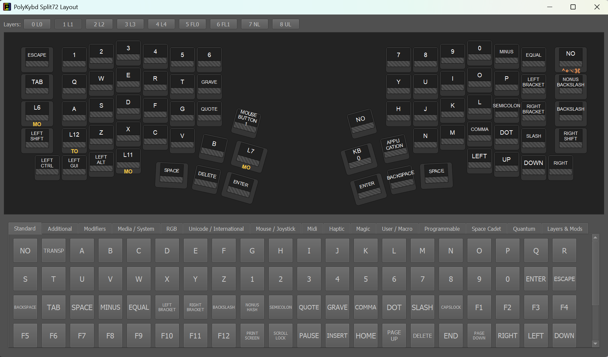
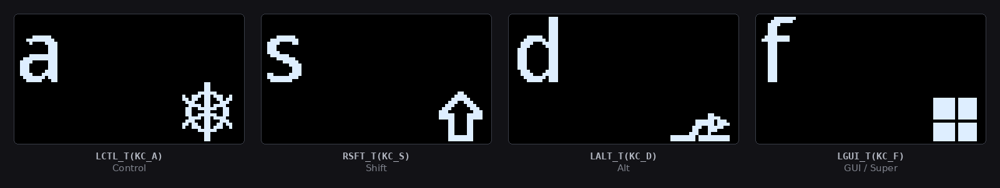
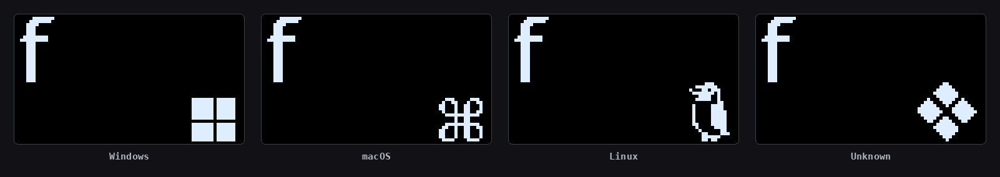
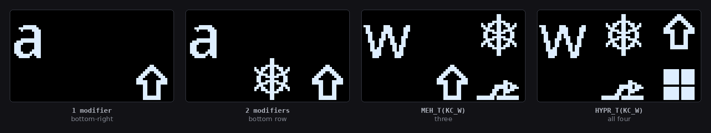

import SupportedSince from '../../../components/SupportedSince.astro';

import { Aside } from '@astrojs/starlight/components';

The Layout Editor in PolyKybdHost lets you remap any key on any layer directly, without recompiling or reflashing firmware. Changes take effect immediately and are stored in the keyboard's flash memory.

## Opening the editor

Right-click the PolyKybdHost tray icon → **Configure Keymap**.

## Using the editor

1. Select a layer using the layer tabs at the top of the editor window. All key labels update to reflect the selected layer.

   The tab labels come from the keyboard itself, so they name what each layer actually is — `Qwerty`, `ColemkDH`, `Fn`, `Numpad` and so on. Older firmware doesn't report them, and the editor then falls back to a list shipped with the host, which shows the shorter internal names instead.
   <SupportedSince protocol={14} note="layer names reported by the keyboard" />
2. Click a key to select it. The key is highlighted.
3. Choose a new keycode from the keycode browser panel.
4. The change is written immediately to the keyboard over HID. The key label updates on both the editor and the physical key display.

## Dual-function keys (tap one thing, hold another)

The keycode browser has a **behaviour** section for keys that do two different things depending on how long you press them — a *mod-tap* (`MT`) taps a normal key but acts as a modifier when held, and a *layer-tap* (`LT`) taps a key but switches layer when held. Pick the behaviour from the dropdown, tick the modifiers (or choose the layer), pick which key it taps, and choose whether the modifier is the left or the right one.

A classic use is turning a home-row key into a modifier you never have to reach for: `MT` + Shift + `A` gives you `a` on a tap and Shift on a hold.

### What the keycap shows

The key still shows its **tap letter** as the normal legend — that's what you get when you press it, so it stays the main thing on the display. The modifier is only what *holding* does, so it appears as a small mark in the **bottom-right corner**, using the same symbols the dedicated modifier keycaps use:

The GUI mark follows whichever operating system the keyboard has detected, exactly as the real GUI keycap does:

If you assign more than one modifier, the marks fill a small grid that grows up and to the left from that corner, so a single modifier always sits in the corner and the letter always has room:

<Aside type="note">
The marks are drawn at half size, so a four-modifier key (`HYPR`) is a busy keycap. One or two modifiers is where this reads best — which is also how mod-taps are normally used.
</Aside>

## How it works

PolyKybdHost uses the QMK `ID_DYNAMIC_KEYMAP_SET_KEYCODE` protocol to write individual key assignments directly to the keyboard. It does not write a full layer — only the changed key is updated, making it instant.

The dynamic keymap stored in the keyboard persists across power cycles **and across a normal firmware reflash** — it lives in the keyboard's EEPROM, a separate flash region from the firmware image. It only reverts to the compiled defaults if a firmware update changes the on-keyboard EEPROM layout, or you explicitly clear the EEPROM. To make a remap the *shipped* default, edit the firmware source — see [Edit the Keymap](/howto/edit-keymap/).

## Limitations

- The editor cannot add new layers beyond those defined in the firmware
- Macro and tap-dance assignments require firmware changes (see [Firmware Development](/development/firmware/))
- The behaviour picker covers the common composed keycodes — layer switching, mod-tap, layer-tap, one-shot modifiers, modified keys. Anything outside that set can still be entered as a raw keycode

<Aside type="tip">
To make permanent changes that survive firmware reflashing, edit `keymap.c` directly. See [Keymaps & Layers](/using/keymaps/) for instructions.
</Aside>
