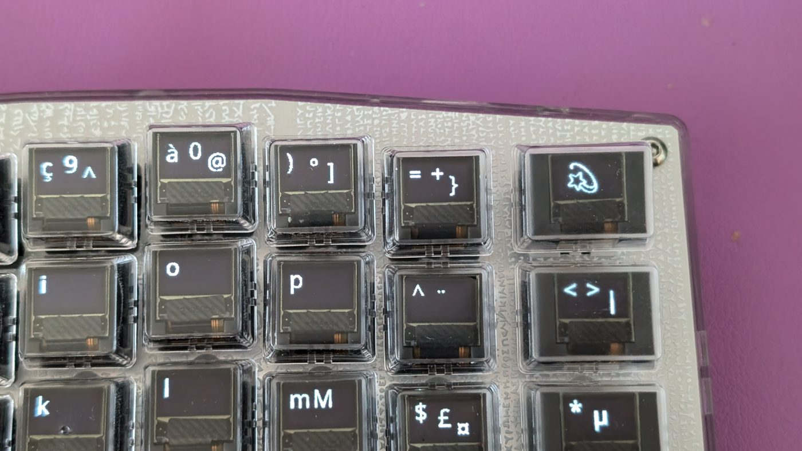
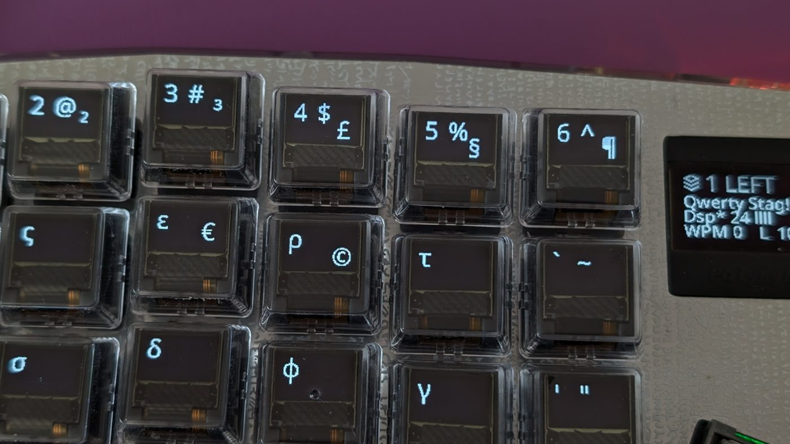
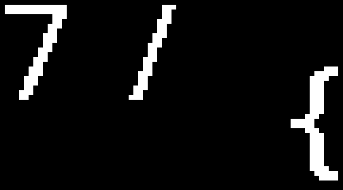
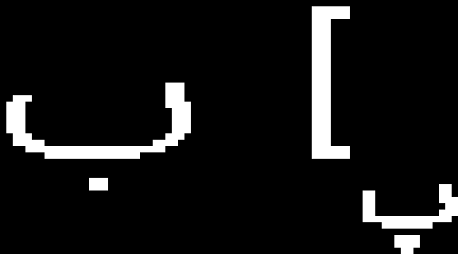
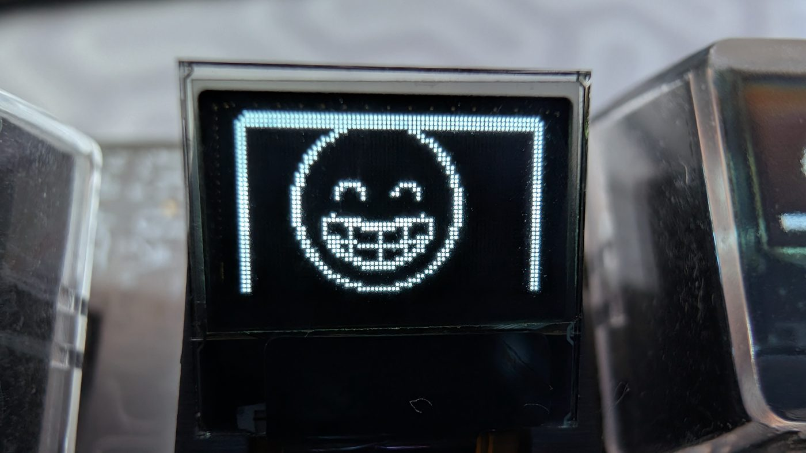

import { Aside, Tabs, TabItem } from '@astrojs/starlight/components';

PolyKybd does two related things with languages: it can **switch its on-screen keyboard layout**
between ~156 languages, and it can **type Unicode characters** (emoji, accented letters) on any OS.

## The language layer

PolyKybd ships with around **156 keyboard-language layouts**. Press the **Language/Globe** key
[ 🌐 ] to open the language picker. On this layer each key shows a **country flag** and its
**`xx-YY` language code** (for example `de-DE`, `fr-FR`, `es-MX`), with a frame drawn around the
currently selected language.

Switching the layout re-renders every keycap, accents and AltGr symbols included — these are real
keycaps, not a diagram:



The same keys after switching to a Greek layout — a different script entirely, no hardware change:



Pick a language and PolyKybd does two things at once:

- **Switches the keycap legends** so every key shows the characters for that layout.
- **Tells the host OS to switch input language**, so what you type matches what the keys show.

Your selection persists across reboots. Because the language list is shared by both hardware
variants, [split72 and split42](/firmware/variants/) support the same set of languages.

<Aside type="tip">
The layouts cover everything from US/UK/DE/FR/ES variants to minority and regional locales. Some are
folds (same physical layout, different OS locale), others are full distinct layouts with their own
AltGr legends.
</Aside>

<Aside type="note">
Want to restyle the legends themselves — Tengwar, runes, Braille — without changing what the keys
type? That's a separate, cosmetic feature: [Glyph Scripts](/using/glyph-scripts/).
</Aside>

## What a keycap shows

A single keycap carries up to three things at once, in fixed places:



- The **main legend**, large and to the left — what the key types on its own.
- The **Shift preview**, small in the upper right — what you get holding Shift.
- The **AltGr hint**, small in the lower right — what you get holding AltGr.

The two small ones are previews, so you can find a symbol without hunting for it. They appear
only when the key actually has something to show: on most layouts a plain letter has no Shift
preview, because its capital is no surprise.

<Aside type="tip" title="Crowded scripts get a smaller AltGr hint">
Since firmware **0.17.3**, on layouts whose letters are wide — Arabic and several Indic scripts —
the AltGr hint is drawn at half size so it does not crowd the letter or run into the Shift preview:



A hint that is only a combining mark stays full size — halving one of those would leave a dot.
</Aside>

## The Intl layer: accented letters on demand

Switching your whole layout is the right move when you *write* in another language. When you only
need the occasional accented letter — a name, a loanword, a single `ñ` in an English sentence —
there is the **Intl layer**. Hold the **Intl** key [ İñțł ] and the letters that have accented
forms show one:

| Hold Intl, press… | You get |
|---|---|
| `a` | `à` (or whichever variation you picked for `a`) |
| `s` | `ș` |
| `e` | `é` |

Press the letter and PolyKybd types that character — no dead keys, no compose sequence, no layout
switch. **Every letter of the alphabet** carries variations — 549 in all, covering every accented
form Unicode has a single character for. `o` has the most at 36, then `a` and `u` at 30 and `e`
at 25; even `q` and `x` have a couple.

<Aside type="note">
Upper and lower case are chosen separately, so `Á` and `á` can be set to different accents. Hold
Shift (or turn on Caps Lock) to work on the capital.
</Aside>

### Choosing which accent a letter types

Each letter remembers **one** variation at a time — the one on its keycap. To change it, use the
picker on the number row.

1. Hold **Intl**.
2. Press the letter you want to change, so the keyboard knows which one you mean.
3. Tap **Ctrl** [ Á»Æ ]. The Ctrl keycap turns **inverted** — dark legend on a lit key — to show
   the picker is armed, and the number row fills with that letter's variations.
4. If the letter has more than a row's worth, step through them with the **page arrows** at either
   end of the picker row.
5. Press the key under the accent you want.

That becomes the letter's variation from then on, and it survives a reboot. The picker closes as
soon as you pick, and reopens on the first page.


### Giving one letter several keys

The picker chooses another *form* of the letter a key already hosts, so it can only ever give you
one accent per key. French wants `è` `é` and `ê` at the same time — three forms of one letter, and
only one `e` key to put them on.

So a key can be **reassigned to host a different letter**:

1. Hold **Intl**.
2. Tap the **remap** key [ à»ñ ], next to the picker's Ctrl. It **inverts**, and the board blanks
   down to just the keys you are allowed to choose from.
3. Press the key you want to change. It inverts too.
4. Press the letter it should host.

That key now carries the chosen letter's variations, and its own picker works exactly as before —
so you can give each of them a different accent. `q` and `j` are good candidates: they have one and
two variations of their own, which makes them close to dead keys on this layer otherwise.


**Punctuation keys can host a letter too** — `` ` `` `'` `,` `.` `/` `;` `[` `]` `=` on split72, and
`;` `,` `.` `/` on split42. Which ones you get is decided by the layout: a key that isn't on the
Intl layer simply never offers itself. An unmapped punctuation key keeps typing its own symbol, so
nothing changes until you deliberately remap it.

<Aside type="note">
The remap **latches** — tap it, don't hold it. Releasing **Intl** leaves the mode at any point, so
that is always the way out. Tapping the remap key again backs out too.
</Aside>

<Aside type="tip">
Two ways back. Re-assigning a key to **its own letter** clears just that key (for a punctuation key,
press the highlighted key a second time). **Shift + remap** clears every assignment at once — worth
knowing, because once the board is remapped the Intl legends no longer match the letters printed on
your keycaps.
</Aside>

### When a letter needs more than one row

The picker row holds 12 variations at a time on split72 and 10 on split42, so the richest letters
span several pages. The two **page arrows** sit at the **outer ends** of the row — back on the far
left of the left half, forward on the far right of the right half — the same places the emoji and
language layers put theirs, so paging is one gesture everywhere. They **wrap** in both
directions — past the last page returns to the first, before the first returns to the last — so you
can never get stranded partway through a letter.

| | Letters that page | Most pages |
|---|---|---|
| split72 (12 per row) | `a` `e` `i` `o` `u` | 3 (`o`) |
| split42 (10 per row) | `a` `e` `i` `n` `o` `s` `t` `u` `y` | 4 (`o`) |

Every other letter fits on a single row, and there the arrows stay **blank** — if you see no arrows,
you are already looking at all of them.

<Aside type="note">
What gets stored is the accent itself, not where it sat on the row. Your choices therefore follow
you from a split72 to a split42 unchanged — though with 12 variations per page against 10, the same
accent may well turn up on a different page and a different key there.
</Aside>

<Aside type="tip">
The picker **latches**, so you don't have to hold Ctrl down. Tap it to arm, tap it again to close
it without changing anything — leaving the Intl layer closes it too. While it's armed you can press
a different letter to switch which one you're setting, and add or release Shift to flip between the
capital and lower-case rows; the number row re-renders each time.
</Aside>

The inverted Ctrl keycap is the thing to look for: if it's lit, the number row is a picker and the
digits won't type numbers.

### Romanian and the comma-below letters

Romanian's `ș` and `ț` use a **comma** below the letter, not a cedilla — `ș` is a genuinely
different character from `ş`, and using the wrong one is a spelling error in Romanian. Both cases of
both letters are available as variations of `s` and `t`.

### What the full set adds

The picker now carries every accented letter that Unicode encodes as a **single character**. These
are the writing systems that gained the most from that — the middle column is what was missing
before, not the whole of what each one uses:

| Language or system | Letters it gained |
|---|---|
| Welsh | `ẁ ẃ ẅ ỳ` — the grave, acute and diaeresis forms of `w` and `y` (the circumflex `ŵ ŷ` were already there) |
| Irish | the séimhiú dotted consonants `ḃ ċ ḋ ḟ ġ ṁ ṗ ṡ ṫ` |
| Guaraní | `Ẽ` and `Ỹ`, the capitals that had no partner for the existing lower-case forms |
| Vietnamese | the horned vowels `ơ ư`, including their tone combinations |
| Pinyin | 3rd-tone carons and the full `ü` set |
| African reference alphabet | the hook letters `ɓ ɗ ƙ ƴ` and relatives |

<Aside type="caution">
A letter is only available here if Unicode gives it its own character. Guaraní's `g̃` is the one
that catches people out: it has no character of its own — it is a `g` followed by a combining tilde
— so the picker cannot produce it, and Guaraní still needs a compose key or a layout switch for
that one letter.
</Aside>

<Aside type="caution">
The Intl layer types its letters as **Unicode**, the same path the emoji layer uses — so it needs
your OS input mode set up first. If Intl letters produce nothing (or the wrong thing), that is the
usual cause: see [Unicode input](#unicode-input) below.
</Aside>

<Aside type="note">
The Intl key is on the [split72](/firmware/variants/) keymap. It is not currently bound on split42,
whose smaller key count leaves no obvious home for it — you can add it yourself in the
[keymap editor](/using/keymap-editor/), and the layer behind it is ready: split42 carries the full
10-slot picker row and its page arrows.
</Aside>

## Emoji layer

PolyKybd also has a dedicated **emoji layer** that turns the keycaps into a visual emoji picker —
each key previews an emoji, grouped into categories along the top row, so you choose one by sight
instead of memorising a codepoint. Your most-recently-used emoji are kept close at hand.


Close up, a single 72×40 px keycap rendering one emoji:



## Unicode input

PolyKybd also supports Unicode input for emoji, accented characters (Æ, Ç, È, …), and any other
Unicode codepoint. Because each OS handles Unicode input differently, you must first tell the
keyboard which mode to use.

### Selecting your OS input mode

Press the Language/Globe key [ 🌐 ] to reach the OS selection. Choose the entry matching your
operating system and preferred input method:

| Key label | Use on |
|---|---|
| Mac | macOS — requires setup below |
| Lnx | Linux with IBus and compatible apps/window managers |
| BSD | BSD (currently unimplemented in QMK) |
| Emcs | Emacs (untested) |
| Win | Windows, unicode up to U+FFFF (no emoji) — requires registry edit below |
| WinC | Windows with WinCompose installed — full unicode including emoji |

Your selection is saved to the keyboard and persists across reboots.

### Per-OS setup

<Tabs>
  <TabItem label="macOS">
    Follow the QMK macOS unicode setup guide:

    1. Open **System Settings → Keyboard → Text Input → Input Sources**
    2. Add the **Unicode Hex Input** input source
    3. Select it when you want to type unicode characters

    Then press **Mac** on the PolyKybd language selector.
  </TabItem>
  <TabItem label="Linux">
    IBus must be installed and running as your input method framework. Most major desktop
    environments (GNOME, KDE) support this.

    Press **Lnx** on the PolyKybd language selector.
  </TabItem>
  <TabItem label="Windows (basic)">
    Windows supports unicode input up to code point U+FFFF (this excludes emoji). First enable hex
    numpad input:

    ```bat
    reg add "HKCU\Control Panel\Input Method" -v EnableHexNumpad -t REG_SZ -d 1
    ```

    Log out and back in (or reboot) after running this.

    Then press **Win** on the PolyKybd language selector.

    <Aside>
    This method does not support emoji or characters above U+FFFF. For full unicode support on
    Windows, use WinCompose instead.
    </Aside>
  </TabItem>
  <TabItem label="Windows (WinCompose)">
    WinCompose adds a compose key mechanism to Windows with full unicode support including emoji.

    1. Download and install [WinCompose](/software/wincompose/) — we maintain a fork of Sam Hocevar's original, since it is no longer actively developed
    2. Launch it — it runs in the system tray
    3. Press **WinC** on the PolyKybd language selector
  </TabItem>
</Tabs>

### Typing unicode characters

Once your OS mode is set, press any key that has a unicode character assigned in the keymap (such as
an emoji or accented character). The keyboard sends the appropriate input sequence for your OS
automatically.

Unicode character assignments are configured in the QMK keymap source. See
[Keymaps & Layers](/using/keymaps/) for how to modify them.
