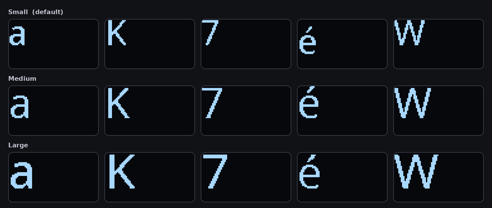
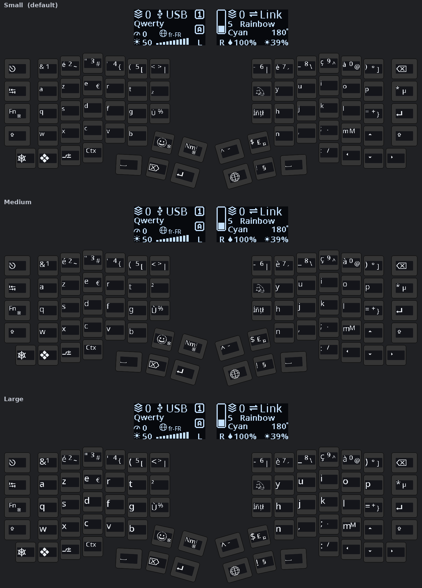
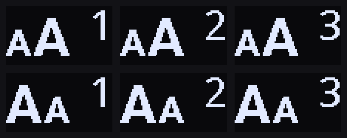

import { Aside } from '@astrojs/starlight/components';
import SupportedSince from '../../../components/SupportedSince.astro';

<SupportedSince protocol={13} />

Every keycap display draws one **main legend** — the character that key produces — and, where the
layout has them, small previews of what you get with **Shift** and **AltGr**. The main legend can
now be drawn at three sizes.

| Size | Cap height | Notes |
|---|---|---|
| **Small** | 20 px | The face PolyKybd has always used, and still the default. |
| **Medium** | 24 px | About a fifth larger. |
| **Large** | 27 px | As large as the 40 px-tall display allows. |

Only the **main legend** changes size. The Shift and AltGr previews stay small, and so does
everything else the keycap draws — app overlays, shortcut hints, the language layer, layer
badges. A keycap has room for one big thing, and this is the setting that picks it.

The larger faces cover the **Latin alphabet, Cyrillic and Greek** — see
[Which letters grow](#which-letters-grow) for what that means on a layout written in another
script.

Here is a whole keyboard — a split72 on the French (AZERTY) layout, at each size. The letters
and digits grow; the small **Shift** and **AltGr** previews beside them, every icon key
(modifiers, arrows, layer keys) and both **status displays** stay exactly as they are.

## Changing the size

- **On the keyboard** — one key on the **utility layer**, beside the other things you reach
  for while working. It carries the standard bigger symbol rather than any text, so it reads
  the same in every language, and the digit in its corner is the size you are currently on.
  Each tap steps up a size and wraps round from Large back to Small; **hold Shift** and the
  symbol flips to the smaller one and the steps run the other way.

  

- **Tray menu** — right-click the PolyKybdHost tray icon → **Keycap Size** → pick a size.
- **Command line** — `polyctl glyph-size large` (or `medium`, `small`; omit the size to print
  the current one).

Your choice is saved on the keyboard and persists across reboots.

## Which letters grow

The larger faces are **Latin, Cyrillic and Greek**: the plain letters and digits, the accented
Latin letters, the currency symbols. Every layout written in one of those three scripts grows
completely — English, French, German, the Nordics, Czech, Polish, Russian, Ukrainian, Greek and
the rest.

**A legend outside those three keeps its normal size.** Japanese, Korean, Chinese, Arabic,
Hebrew, Devanagari, Thai, Armenian, Georgian, Ethiopic and Cherokee keycaps all draw exactly as
they did before, whatever you select. Nothing blanks and nothing is clipped — the key simply
shows the largest face it has.

<Aside type="caution">
**On a layout written in another script, expect a mixed board.** Most such layouts still put
plain digits and punctuation on the number row and the right-hand keys, and *those* are Latin —
so they grow while the letters do not. On a Korean layout at **Large**, for instance, the ten
digits and thirteen punctuation keys take the bigger face and the twenty-six Hangul keys are
unchanged. That is the setting working as intended, not a fault; if you would rather the board
stayed uniform, leave the size on **Small**.
</Aside>

Widening this to more scripts is possible but not automatic — the display is 40 px tall and
several scripts already fill most of it, so there is simply no room to grow. If the layout you
use every day would benefit, say so on the [issue tracker](https://github.com/thpoll83/qmk_firmware/issues)
and it can be looked at script by script.

<Aside type="note">
Not every character grows by the same amount. A capital with an accent stacked on top — **É**,
**Ç**, **Ф** — is already close to filling the display at the normal size, so those grow less
than a plain letter does before they run out of room. That is a property of the letters, not a
setting; it keeps them from being clipped.
</Aside>

## Requirements

The larger faces are drawn from a **`latinbig` font-pack bundle** that PolyKybdHost flashes to
the keyboard automatically the first time it connects (see
[Font Packs & Resources](/firmware/font-packs/)). Until that bundle is present the keyboard keeps
drawing at the normal size whatever you select, so nothing breaks if it hasn't been flashed yet —
and the setting takes effect on its own once the bundle lands.

<Aside type="tip">
Pairing this with a [glyph script](/using/glyph-scripts/)? They are independent settings, but a
glyph script draws its own faces at its own size — the legend size applies to the normal
letter and digit legends, not to a script override.
</Aside>
