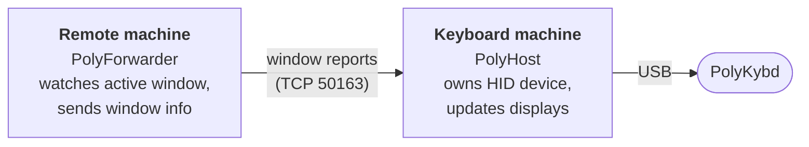

import { Aside } from '@astrojs/starlight/components';

PolyKybdHost supports a forwarder mode that lets a single PolyKybd serve multiple computers. The keyboard is physically connected to one machine, but the key displays reflect the active window on whichever machine you are currently working on.

## How it works



- **Keyboard machine**: running PolyKybdHost in normal mode, physically connected to the keyboard
- **Remote machine(s)**: running PolyKybdHost in forwarder mode (`--host <IP>`), no keyboard attached

When focus changes on a remote machine, it sends the window title and app info to the keyboard machine, which then updates the key displays.

## Before you start

Two things are easy to miss, and each one on its own makes the whole setup look silently broken.

**The network transport is off by default.** PolyKybdHost does not listen for window reports until you turn the listener on — step 1 below. Without it the forwarder just logs a connection error every few seconds.

**You need a `remote` entry in your overlay mapping.** The keyboard machine only uses a forwarded window while its *own* focused window is an app marked `remote` in `overlay-mapping.poly.yaml` — normally the remote-desktop client you are viewing the other machine through. The shipped mapping already covers NoMachine:

```yaml
nxplayer:
  remote: true
  title: .*NoMachine.*
```

Add an entry the same way for whichever client you use. While that window has focus, the keycaps follow the app focused *inside* the remote session; when you switch back to a local window, they follow that local window again.

## Setup

### 1. Turn on the window-report listener (keyboard machine)

```bash
polyctl settings set window_report_network_enabled true
```

Then **restart PolyKybdHost** — the setting is read once at startup, so it does not take effect until the daemon comes back up.

Allow inbound TCP on **port 50163** in the keyboard machine's firewall.

<Aside type="caution">
  The listener is only started by the background daemon, not by a GUI running with `--no-daemon`. Daemon mode is the default; if you have turned it off, check with `polyctl settings get daemon_mode` and switch it back on for this feature.
</Aside>

After the restart the log should contain:

```
Window-report network listener on 0.0.0.0:50163 (auth-gated, 'window.report' only)
```

### 2. Copy the authentication key to the remote machine

The connection is authenticated with a shared key, so the remote machine needs a copy of the keyboard machine's key file. It is created the first time the listener starts, so do this **after** step 1.

The file is called **`polykybd-winreport.authkey`** and lives in PolyKybdHost's config folder — reachable from the tray menu under **Help & About → Open config folder**, or directly:

| Platform | Location |
|---|---|
| Windows | `%LOCALAPPDATA%\PolyHost\PolyHost\polykybd-winreport.authkey` |
| macOS | `~/Library/Application Support/PolyHost/polykybd-winreport.authkey` |
| Linux | `~/.config/PolyHost/polykybd-winreport.authkey` |

Copy it to each remote machine. It can live anywhere there — you pass its path on the command line in the next step.

<Aside type="note">
  This key is deliberately separate from PolyKybdHost's local control key. It only ever unlocks window reports: the listener that accepts it cannot reach brightness, language, keymaps, firmware flashing or the bootloader. Sharing it with your other machines does not hand them control of the keyboard.
</Aside>

### 3. Run the forwarder (remote machine)

```bash
python -m polyhost --host 192.168.1.100 --report-rpc --report-authkey-file /path/to/polykybd-winreport.authkey
```

Or use a file containing the IP, if the address changes:

```bash
python -m polyhost --host-file /path/to/host.txt --report-rpc --report-authkey-file /path/to/polykybd-winreport.authkey
```

If you moved the listener to another port, add `--report-port <n>` to match.

<Aside type="caution">
  `--report-authkey-file` is not optional across machines. Leave it out and the forwarder falls back to its *own* local key, which the keyboard machine will not accept — it logs `Using this machine's local window-report authkey` and every report then fails.
</Aside>

## Checking that it works

Focus a window on the remote machine and watch the two logs.

The forwarder reports which window it saw:

```
Active App: 'Document1 - Word' winword 12345678
```

The keyboard machine's log — the **Daemon Log** tab in the log viewer — shows the matching change once the remote-desktop client is focused:

```
Remote App Changed: "winword", Title: "Document1 - Word"  Handle: 12345678
```

If the forwarder logs windows but the keyboard machine never mentions them, the reports are not arriving — see below.

## Website-aware overlays for a forwarded browser

A forwarded browser can match on its **website**, not just its window title. Install the
[browser extension](/using/website-detection/) on the **remote** machine — it reports to
`127.0.0.1` there, so it needs no special configuration — and the forwarder sends the
focused tab's URL along with the window. Your `urls-contains` entries then apply to
forwarded browsers just as they do locally, including an in-app navigation that never
changes the window title.

This rides the authenticated path only: it needs the `--report-rpc` setup above, and the
legacy relay in the next section does not carry the URL.

## If it does not work

| What you see | What it means | Fix |
|---|---|---|
| Forwarder: `Window-report RPC to … failed: timed out` | Nothing is listening, or a firewall is dropping the connection | Confirm step 1 on the keyboard machine (`polyctl settings get window_report_network_enabled`), that it was restarted afterwards, and that port 50163 is allowed |
| Forwarder: `Using this machine's local window-report authkey` | `--report-authkey-file` was omitted | Add it, pointing at the key copied in step 2 |
| Forwarder: `control protocol mismatch … restart so versions match` | The two machines run incompatible PolyKybdHost versions | Update both to the same version |
| Forwarder: `Connection timed out` on port 50162 | The forwarder is still using the legacy relay | Add `--report-rpc` (and the key file), or see the legacy section below |
| Keyboard machine: `Remote overlay entries are configured but the legacy plaintext window relay (TCP 50162) is disabled` | Same as above, seen from the other side | As above |
| Both logs look fine, keycaps do not change | The keyboard machine's focused window is not a `remote` mapping entry | Focus your remote-desktop client, and check it has a `remote: true` entry (see [Before you start](#before-you-start)) |
| A forwarded browser matches its title but never a `urls-contains` entry | The URL is not reaching the keyboard machine | Check the extension is installed on the **remote** machine and its Options page reports *Connected*, and that the forwarder runs with `--report-rpc` (the legacy relay never carries the URL) |

Collecting the evidence is one click on each side: the forwarder's tray menu has the
same **Report a Problem…** and **Collect logs…** entries as the keyboard machine's, and
a forwarder report says so on its first line. Because the two halves run on different
computers, a bundle from one never contains the other's log — collect from **both**.
See [Reporting a Problem](/software/reporting-problems/).

## Legacy plaintext relay (port 50162)

Older versions relayed window reports over a plaintext TCP socket on **port 50162** with no authentication, accepting connections from anywhere on the network. That relay is **disabled by default** since PolyKybdHost 0.10.5 and has been replaced by the authenticated path above.

If you have an existing setup built on it and want it back for now, enable it on the keyboard machine and restart:

```bash
polyctl settings set dev_legacy_plaintext_relay true
```

The forwarder then needs no extra flags — plain `--host <IP>` uses it. In the settings dialog the option only appears when [developer mode](/software/usage/#developer-mode) is on.

<Aside type="caution">
  Anything that can reach port 50162 on the keyboard machine can inject window reports, and there is no way to restrict who. Prefer the authenticated setup above; use this only on a network you trust, and as a stepping stone rather than a destination.
</Aside>

## Use case

A common setup: a desktop (with the keyboard) and a laptop, with the laptop on screen through a remote-desktop client. As you move between applications in that session, the forwarder on the laptop reports each focus change to the desktop, and the keycaps show the overlays for the app you are actually working in — all while the keyboard stays physically on the desk connected to the desktop.
