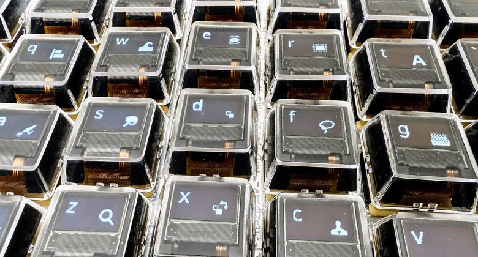

import { Aside } from '@astrojs/starlight/components';

The signature PolyKybd feature: every key's OLED shows an image ("overlay") that matches
**whatever app you're currently in**. Switch from your browser to your editor and all 72
keycaps re-label themselves to that app's shortcuts, with no action from you.

Overlays are driven by [PolyKybdHost](/software/overview/) — the keyboard on its own shows the
static legends baked into the firmware; the host is what makes them dynamic.

## How it works

1. PolyKybdHost watches which window is focused on your computer.
2. When the active app changes, it looks up the overlay set for that app and pushes the
   keycap images to the keyboard over USB HID (compressed, so a full re-label is quick).
3. The **master** half decompresses the images into its display memory and relays them to
   the **slave** half over the split link, so both hands show the same thing.

<Aside type="tip">
Frequently-used apps are cached (the **MRU** — most-recently-used — cache), so returning to a
recent app replays from cache instead of re-sending every image. `polyctl mru save` persists
that cache between sessions.
</Aside>

## Modifier variants

An overlay isn't a single image per key — each key stores **9 variants**, one per modifier
combination (bare, Ctrl, Shift, Ctrl+Shift, Alt, Ctrl+Alt, Alt+Shift, Ctrl+Alt+Shift, GUI).
Hold a modifier and the keycaps update to show what each key does *with that modifier down*,
so a shortcut layer is visible before you commit to it.

## What you need

- **PolyKybdHost running** on the machine you're typing on (or relayed from another machine —
  see [Multi-Machine Setup](/using/multi-machine/)).
- An overlay set for the app. PolyKybdHost ships overlays for common apps; you can add your own.

<Aside type="note">
Want the technical version — the exact HID commands, the compression path, and how both
halves stay in sync? See [System Model & Data Flow](/development/system-model/#overlay-data-path--an-app-switch)
and the [HID Protocol Reference](/reference/hid-protocol/#overlay-addressing).
</Aside>
