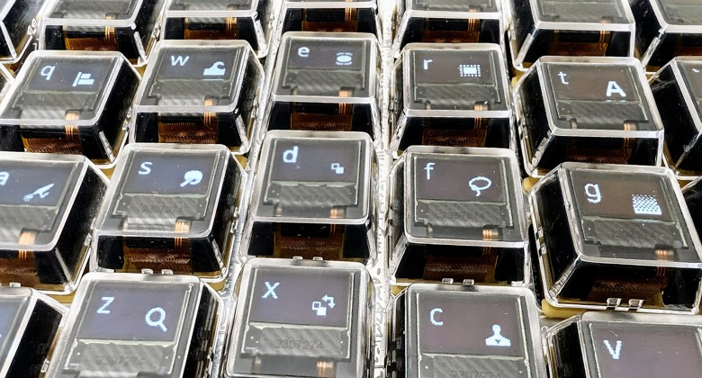

import { Aside } from '@astrojs/starlight/components';

The signature PolyKybd feature: every key's OLED shows an image ("overlay") that matches
**whatever app you're currently in**. Switch from your browser to your editor and all 72
keycaps re-label themselves to that app's shortcuts, with no action from you.

Overlays are driven by [PolyKybdHost](/software/overview/) — the keyboard on its own shows the
static legends baked into the firmware; the host is what makes them dynamic.

## How it works

1. PolyKybdHost watches which window is focused on your computer.
2. When the active app changes, it looks up the overlay set for that app and pushes the
   keycap images to the keyboard over USB HID (compressed, so a full re-label is quick).
3. The **master** half decompresses the images into its display memory and relays them to
   the **slave** half over the split link, so both hands show the same thing.

<Aside type="tip">
Frequently-used apps are cached (the **MRU** — most-recently-used — cache), so returning to a
recent app replays from cache instead of re-sending every image. The cache lives in
PolyKybdHost and is rebuilt when the keyboard reconnects.
</Aside>

## Modifier variants

An overlay isn't a single image per key — each key stores **16 variants**, one for every
combination of Ctrl, Shift, Alt and GUI (Command on macOS, Win elsewhere). Hold a modifier and
the keycaps update to show what each key does *with that modifier down*, so a shortcut layer is
visible before you commit to it.

<Aside type="tip">
**GUI combinations work now.** Older releases showed the GUI key on its own, but folded every
`GUI+…` chord onto it — so holding `Cmd+Shift` drew the plain `Cmd` icons rather than the right
ones. That mattered most on macOS, where `Cmd+Shift` chords are everywhere. All sixteen
combinations are addressable now, so an overlay can cover them.
</Aside>

## What you need

- **PolyKybdHost running** on the machine you're typing on (or relayed from another machine —
  see [Multi-Machine Setup](/using/multi-machine/)).
- An overlay set for the app. PolyKybdHost ships overlays for a range of common apps, and
  adding one is a plain image plus a one-line mapping entry —
  [Create App Overlays](/howto/app-overlays/) walks through it.

## Same app, different platform

Which shortcuts an app uses depends on the platform it runs on: Sublime Text binds `Cmd+P` on
macOS and `Ctrl+P` on Windows and Linux. A single set of artwork therefore can't be right
everywhere, so where an app has per-OS overlays the host picks the one matching your OS —
`Cmd` artwork on macOS, `Ctrl` artwork elsewhere — with nothing to configure.

<Aside type="tip">
This follows the machine the **app** runs on, not the one your keyboard is plugged into. If you
drive the keyboard from a Mac over a [multi-machine setup](/using/multi-machine/), you still get
the Mac artwork.
</Aside>

<Aside type="tip">
Browsers are a special case: many web apps share one browser process, so matching on the app
name alone isn't enough. [Website-Aware Overlays](/using/website-detection/) match the overlay
to the focused tab's **URL** instead, so Gmail, Jira and Figma each get their own layer.
</Aside>

<Aside type="note">
Want the technical version — the exact HID commands, the compression path, and how both
halves stay in sync? See [System Model & Data Flow](/development/system-model/#overlay-data-path--an-app-switch)
and the [HID Protocol Reference](/reference/hid-protocol/#overlay-addressing).
</Aside>
